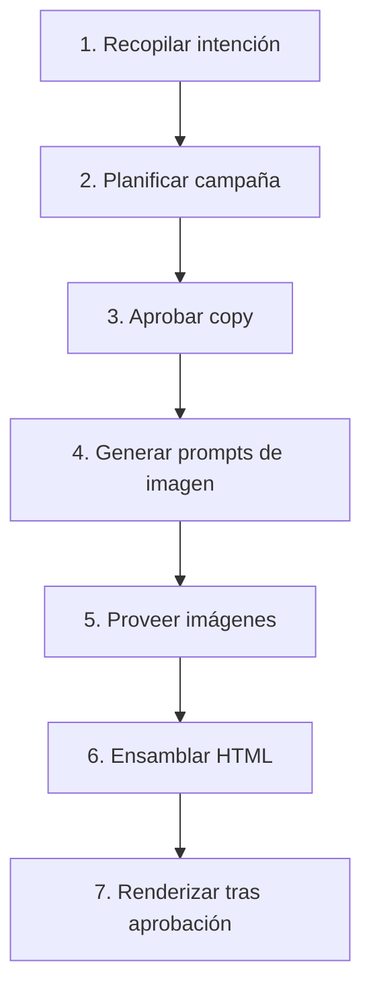

# Xending Design Generator Skill

Este skill automatiza la creación de campañas de marketing visual para dos marcas: **Xending** (pagos internacionales, USA) y **Xending Capital** (financiamiento SOFOM, México). El agente guía al usuario a través de un flujo completo de 7 pasos, desde la idea hasta el PNG final listo para publicar.

---

## 🎯 Objetivo

Crear campañas de marketing completas:
1. Planificar copy on-brand con validación de compliance
2. Generar prompts optimizados para GPT Image 2
3. Ensamblar piezas HTML con templates por plataforma
4. Renderizar a PNG pixel-perfect con Puppeteer
5. Personalizar por promotor cuando se requiera

---

## 🏷️ Detección de Marca

El agente DEBE confirmar la marca con el usuario antes de proceder. Las keywords sirven como sugerencia, nunca como selección automática.

### Xending (USA — Pagos Internacionales)
**Keywords**: payments, FX, pagos, transferencias, tipo de cambio, produce, USA, Estados Unidos, Texas, California, dólares, internacional, remesas, cobertura

**Producto**: Plataforma de pagos internacionales enfocada en la industria del produce en USA.

### Xending Capital (México — Financiamiento SOFOM)
**Keywords**: crédito, financiamiento, factoraje, SOFOM, México, línea de crédito, capital de trabajo, liquidez, aprobación crediticia, Lemad Capital

**Producto**: Líneas de crédito y factoraje para empresas mexicanas. Marca comercial de Lemad Capital SAPI de CV SOFOM ENR.

> [!IMPORTANT]
> Siempre preguntar: "¿Para qué marca es esta campaña: Xending o Xending Capital?" incluso si las keywords sugieren una marca específica.

---

## 🔄 Flujo de Campaña (7 Pasos)



### Paso 1: Recopilar Intención

Preguntar al usuario:
- **Marca**: Xending o Xending Capital
- **Tema de campaña**: ¿Qué quieres comunicar?
- **Audiencia**: ¿A quién va dirigido?
- **Objetivo**: ¿Awareness, conversión, educación, evento?
- **Tipo de contenido**: Breaking News, Market Update, Corporate, Stat of the Day, Tip/Educational, Event/Special
- **Plataformas**: Instagram Story, Instagram Post, Facebook, LinkedIn, Banner
- **Partner**: Monex USA, Ping Pong, o ninguno

### Paso 2: Planificar Campaña

Generar **15-20 propuestas de copy** organizadas por ángulo de marketing:

**Ángulos Xending**: velocidad, ahorro, cobertura, confianza, proceso
**Ángulos Xending Capital**: financiamiento, factoraje, rapidez, liquidez, proceso

Cada propuesta incluye:
- Headline (titular principal)
- Subcopy (texto de apoyo)
- CTA (llamada a acción)
- Ángulo de marketing

> [!NOTE]
> Consultar `references/copy-library.md` para frases pre-aprobadas por ángulo. Adaptar al brief del usuario.
> Validar TODO el copy contra `references/brand-rules.md` antes de presentar.

### Paso 3: Aprobar Copy

Presentar las propuestas al usuario con opciones de aprobar (✓) o rechazar (✗) cada una.

- Si el usuario rechaza propuestas, generar reemplazos manteniendo calidad y compliance
- Repetir el ciclo proponer → seleccionar → reemplazar hasta que el usuario tenga su set aprobado
- El usuario decide cuántas piezas producir del set aprobado

### Paso 4: Generar Prompts de Imagen

Para cada pieza aprobada, crear un prompt optimizado para GPT Image 2:

1. Consultar `references/gpt-image-prompt-guide.md` para el sistema de dos pasos
2. Inyectar la paleta de colores de la marca automáticamente
3. Especificar composición con espacio negativo para overlay de texto
4. Instruir al modelo a NO incluir texto en la imagen (el texto va en la capa HTML)
5. Adaptar el tono visual al ángulo de campaña

### Paso 5: Proveer Imágenes

Ofrecer tres opciones al usuario:
1. **Stock existente**: Buscar en la librería de assets de la marca por tags/tema
2. **Generar nueva**: Usar el prompt del paso 4 con la API de GPT Image 2
3. **Subir manualmente**: El usuario provee su propia imagen

Para campañas multi-pieza, permitir asignación individual o auto-asignación por tags.

### Paso 6: Ensamblar HTML

Construir las piezas HTML usando los templates del proyecto `renderer/`:

```
renderer/templates/{content-type}/{platform-format}.html
```

Cada pieza ensamblada incluye:
- Dimensiones exactas por plataforma (ver Visual System)
- Copy aprobado (headline, subcopy, CTA)
- Imagen seleccionada
- Brand lockup (con sublabel "CAPITAL" si aplica)
- Disclaimer obligatorio de la marca
- Badge de partner (si aplica)
- Slot de personalización de promotor (oculto por defecto)

### Paso 7: Renderizar tras Aprobación

1. Presentar el HTML al usuario para preview
2. Permitir modificaciones de copy, layout o imagen
3. Solo renderizar a PNG después de aprobación explícita

**Comandos de renderizado** (ejecutar desde `renderer/`):

```bash
# Renderizar una pieza individual
npm run render -- path/to/piece.html

# Renderizar batch (múltiples piezas)
npm run render-batch -- path/to/directory/

# Limpiar output
npm run clean-output
```

Los PNGs se guardan en `renderer/output/` con nombre descriptivo:
`{brand}_{campaign}_{platform}_{promoter?}.png`

---

## 📁 Estructura del Proyecto Generator

```
renderer/
├── package.json              # Puppeteer, scripts de render
├── .env                      # OPENAI_API_KEY (gitignored)
├── templates/                # HTML por content-type × platform
│   ├── breaking-news/        # 5 formatos por tipo
│   ├── market-update/
│   ├── corporate/
│   ├── stat-of-the-day/
│   ├── tip-educational/
│   └── event-special/
├── assets/
│   ├── xending/              # Assets marca Xending
│   │   ├── images/
│   │   ├── descriptions.json
│   │   └── logo/
│   ├── xending-capital/      # Assets marca Capital
│   │   ├── images/
│   │   ├── descriptions.json
│   │   └── logo/
│   └── shared/
│       ├── partners.json     # Monex USA, Ping Pong, None
│       ├── partners/         # Logos de partners
│       ├── promoters.json    # Registro de promotores
│       ├── promoters/photos/ # Fotos de promotores
│       └── fonts/            # Fraunces, Inter, JetBrains Mono
├── scripts/
│   ├── render.js             # HTML → PNG individual
│   ├── render-batch.js       # Batch HTML → PNG
│   └── clean-output.js       # Limpiar output/
└── output/                   # PNGs renderizados (gitignored)
```

---

## 📐 Selección de Tipo de Contenido

| Tipo | Cuándo Usar | Campos Requeridos |
|------|-------------|-------------------|
| **Breaking News** | Eventos urgentes: decisiones de Fed, anuncios Banxico, cambios regulatorios | headline, data point, fecha, fuente |
| **Market Update** | Tasas FX, movimientos de divisas, resúmenes de mercado | par de divisas, tasa, cambio %, fecha, tendencia |
| **Corporate** | Comunicaciones formales, one-pagers, papelería | título, cuerpo, contacto, badge partner |
| **Stat of the Day** | Destacar una métrica o logro clave | número grande, etiqueta contexto, período |
| **Tip / Educational** | Compartir conocimiento o tips de producto | headline del tip, explicación, CTA |
| **Event / Special** | Días festivos, eventos de industria, hitos | mensaje, fecha, tema visual |

> [!TIP]
> Consultar `references/layout-picker.md` para recomendaciones de qué template usar según el ángulo de marketing y la plataforma destino.

---

## 👥 Personalización por Promotor

Cuando el usuario solicita piezas personalizadas:

1. Preguntar qué promotores incluir (nombres específicos o "todos")
2. Seleccionar la pieza base aprobada
3. Generar N variantes (una por promotor) inyectando:
   - Foto del promotor (recorte circular)
   - Nombre completo
   - Rol/título
   - Contacto (email y/o teléfono)
4. Ofrecer preview de una variante antes del batch completo
5. Renderizar todas las variantes en batch

Los promotores se configuran en `renderer/assets/shared/promoters.json`.
Las fotos van en `renderer/assets/shared/promoters/photos/`.

---

## 🤝 Partners

Los partners disponibles se configuran en `renderer/assets/shared/partners.json`.

| Partner | Badge | Cuándo Usar |
|---------|-------|-------------|
| Monex USA | "Powered by Monex USA" | Piezas de FX/pagos que usan infraestructura Monex |
| Ping Pong | "Powered by Ping Pong" | Piezas de pagos que usan infraestructura Ping Pong |
| None | Sin badge | Piezas solo de marca Xending/Capital |

> [!NOTE]
> Consultar `resources/partners/monex-usa/rules.md` y `resources/partners/ping-pong/rules.md` para reglas de co-branding específicas.

Para agregar un nuevo partner: añadir logo en `assets/shared/partners/` y entrada en `partners.json`. No requiere cambios en templates.

---

## 📚 Referencias del Skill

| Documento | Contenido |
|-----------|-----------|
| `references/brand-rules.md` | Reglas de compliance completas por marca |
| `references/copy-library.md` | Headlines pre-aprobados por ángulo (15+ por marca) |
| `references/visual-system.md` | Colores, tipografía, gradientes, espaciado |
| `references/layout-picker.md` | Qué template para qué ángulo y plataforma |
| `references/gpt-image-prompt-guide.md` | Sistema de prompts de dos pasos para GPT Image 2 |

---

## 💡 Notas para el Agente

### Sobre el copy
- SIEMPRE validar contra brand-rules.md antes de presentar al usuario
- Si el usuario pide copy que viola las reglas, explicar la razón regulatoria y ofrecer alternativa
- Usar copy-library.md como base y adaptar al brief específico

### Sobre las imágenes
- Los prompts de imagen NUNCA deben pedir texto dentro de la imagen
- Siempre inyectar la paleta de colores de la marca en el prompt
- Dejar espacio negativo para overlay de texto en la composición

### Sobre el renderizado
- Ejecutar scripts desde el directorio `renderer/`
- Los PNGs salen a `renderer/output/`
- Si falla un render en batch, el script continúa con los demás y reporta errores al final

### Sobre compliance
- Xending Capital: NUNCA usar términos de FX (tipo de cambio, conversión de divisas, etc.)
- Xending Capital: plazos NUNCA mayores a 45 días
- Xending: garantías absolutas SIEMPRE con "hasta" o "hábil"
- SIEMPRE incluir el disclaimer obligatorio en cada pieza

---

## 📋 Checklist de Campaña

```markdown
- [ ] Marca seleccionada y confirmada
- [ ] Brief de campaña recopilado (tema, audiencia, objetivo)
- [ ] Tipo de contenido seleccionado
- [ ] Plataformas destino seleccionadas
- [ ] Partner seleccionado (o ninguno)
- [ ] Copy generado y validado contra brand rules
- [ ] Copy aprobado por el usuario
- [ ] Prompts de imagen generados
- [ ] Imágenes provistas (stock, generadas, o manuales)
- [ ] HTML ensamblado y previewed
- [ ] HTML aprobado por el usuario
- [ ] PNG renderizado
- [ ] Personalización por promotor (si aplica)
```
