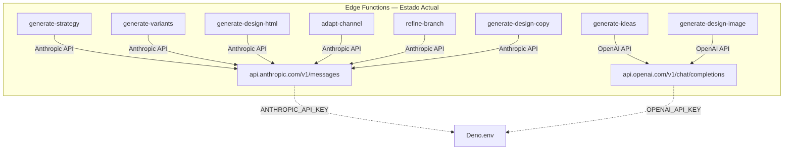
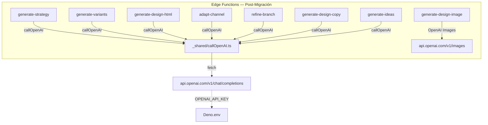
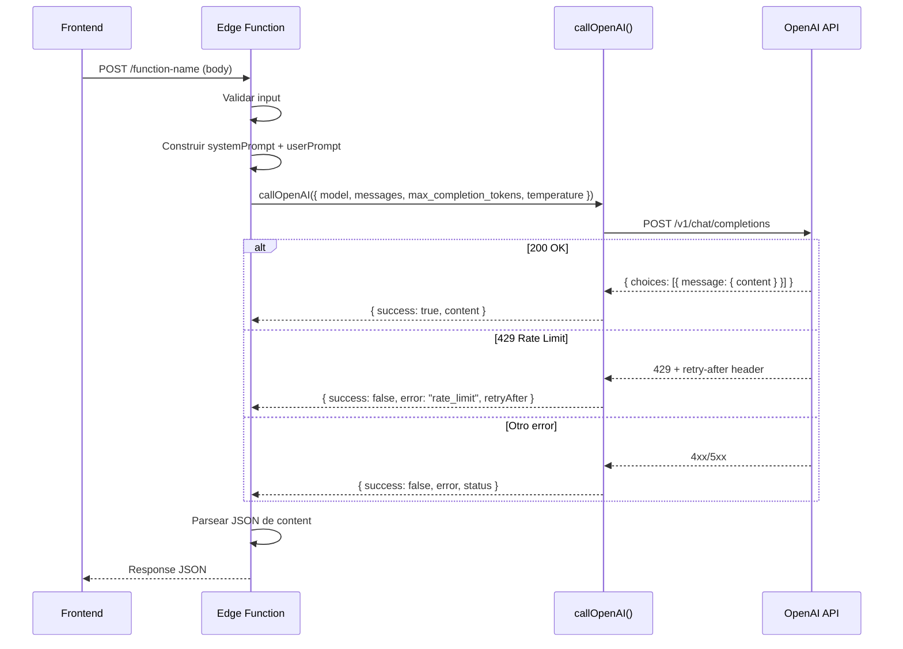

# Documento de Diseño: Migración API Anthropic → OpenAI

## Overview

Este documento describe la migración de 6 Supabase Edge Functions del API de Anthropic Claude (`claude-sonnet-4-20250514`) al API de OpenAI (`gpt-5.4-mini`). El objetivo es unificar el proveedor de LLM en un solo API key (`OPENAI_API_KEY`), eliminando la dependencia de `ANTHROPIC_API_KEY`.

Las funciones a migrar son: `generate-strategy`, `generate-variants`, `generate-design-html`, `adapt-channel`, `refine-branch` y `generate-design-copy`. Las 3 funciones restantes (`generate-ideas`, `generate-design-image`, `render-design-png`) ya usan OpenAI o no requieren LLM.

La migración es **backward-compatible**: no cambian interfaces de entrada/salida, prompts de sistema, ni lógica de negocio. Solo cambia la capa de transporte HTTP hacia el LLM.

## Architecture

### Estado Actual (Antes)



### Estado Objetivo (Después)



## Diagrama de Secuencia — Flujo de una Llamada



## Components and Interfaces

### Componente Principal: `_shared/callOpenAI.ts`

**Propósito**: Utilidad compartida que encapsula toda la comunicación con el API de OpenAI. Reemplaza las llamadas directas a `fetch('https://api.anthropic.com/...')` y las funciones `fetchWithRetry()` duplicadas en cada función.

**Interfaz**:

```typescript
// _shared/callOpenAI.ts

export interface CallOpenAIOptions {
  model?: string;                    // default: 'gpt-5.4-mini'
  messages: OpenAIMessage[];
  max_completion_tokens: number;
  temperature?: number;              // default: 0.7
  timeoutMs?: number;                // default: 120_000
}

export interface OpenAIMessage {
  role: 'system' | 'user' | 'assistant';
  content: string | OpenAIContentPart[];
}

export interface OpenAIContentPart {
  type: 'text' | 'image_url';
  text?: string;
  image_url?: { url: string };
}

export interface CallOpenAISuccess {
  success: true;
  content: string;
}

export interface CallOpenAIError {
  success: false;
  error: 'rate_limit' | 'auth_error' | 'content_policy' | 'network_error' | 'api_error';
  message: string;
  status?: number;
  retryAfter?: number;
}

export type CallOpenAIResult = CallOpenAISuccess | CallOpenAIError;

export async function callOpenAI(options: CallOpenAIOptions): Promise<CallOpenAIResult>;
```

**Responsabilidades**:
- Obtener `OPENAI_API_KEY` de `Deno.env.get()`
- Ejecutar `fetch` con timeout configurable
- Retry automático (1 intento) en errores de red
- Mapear códigos de error HTTP a tipos de error tipados
- Extraer `choices[0].message.content` de la respuesta

### Componentes Migrados (6 Edge Functions)

Cada función mantiene su lógica de negocio intacta. Solo cambia:
1. `Deno.env.get('ANTHROPIC_API_KEY')` → eliminado (lo maneja `callOpenAI`)
2. Llamada directa a Anthropic → `callOpenAI()`
3. Parseo de `data.content[0].text` → ya viene en `result.content`

## Data Models

### Mapeo de Request Body: Anthropic → OpenAI

```typescript
// ANTES (Anthropic)
interface AnthropicRequest {
  model: 'claude-sonnet-4-20250514';
  max_tokens: number;
  system: string;                    // System prompt separado
  messages: Array<{
    role: 'user' | 'assistant';
    content: string | AnthropicContent[];
  }>;
  temperature?: number;
}

// DESPUÉS (OpenAI)
interface OpenAIRequest {
  model: 'gpt-5.4-mini';
  max_completion_tokens: number;     // Renombrado de max_tokens
  messages: Array<{
    role: 'system' | 'user' | 'assistant';  // system es un message
    content: string | OpenAIContentPart[];
  }>;
  temperature?: number;
}
```

**Reglas de transformación**:
| Campo Anthropic | Campo OpenAI | Notas |
|---|---|---|
| `model: 'claude-sonnet-4-20250514'` | `model: 'gpt-5.4-mini'` | Cambio directo |
| `max_tokens: N` | `max_completion_tokens: N` | Renombrado |
| `system: "..."` | `messages[0]: { role: 'system', content: "..." }` | System prompt se mueve al array de messages |
| `messages: [{ role: 'user', content }]` | `messages[1+]: [{ role: 'user', content }]` | Se mantiene igual, solo se desplaza el índice |

### Mapeo de Response: Anthropic → OpenAI

```typescript
// ANTES (Anthropic response)
interface AnthropicResponse {
  content: Array<{ type: 'text'; text: string }>;
  // ...
}
// Acceso: data.content[0].text

// DESPUÉS (OpenAI response)
interface OpenAIResponse {
  choices: Array<{
    message: { role: 'assistant'; content: string };
    finish_reason: string;
  }>;
  // ...
}
// Acceso: data.choices[0].message.content
```

## Pseudocódigo Algorítmico

### Algoritmo: callOpenAI (utilidad compartida)

```typescript
export async function callOpenAI(options: CallOpenAIOptions): Promise<CallOpenAIResult> {
  const apiKey = Deno.env.get('OPENAI_API_KEY');
  if (!apiKey) {
    return { success: false, error: 'auth_error', message: 'OPENAI_API_KEY missing', status: 500 };
  }

  const {
    model = 'gpt-5.4-mini',
    messages,
    max_completion_tokens,
    temperature = 0.7,
    timeoutMs = 120_000,
  } = options;

  return await fetchWithRetry(apiKey, { model, messages, max_completion_tokens, temperature }, timeoutMs);
}

async function fetchWithRetry(
  apiKey: string,
  body: object,
  timeoutMs: number,
  retryCount = 0,
): Promise<CallOpenAIResult> {
  try {
    const controller = new AbortController();
    const timeoutId = setTimeout(() => controller.abort(), timeoutMs);

    const response = await fetch('https://api.openai.com/v1/chat/completions', {
      method: 'POST',
      headers: {
        'Authorization': `Bearer ${apiKey}`,
        'Content-Type': 'application/json',
      },
      body: JSON.stringify(body),
      signal: controller.signal,
    });

    clearTimeout(timeoutId);

    if (response.ok) {
      const data = await response.json();
      const content = data.choices?.[0]?.message?.content ?? '';
      return { success: true, content };
    }

    // --- Mapeo de errores ---
    if (response.status === 429) {
      const retryAfter = parseInt(response.headers.get('retry-after') || '30', 10);
      return { success: false, error: 'rate_limit', message: 'Demasiadas solicitudes.', retryAfter, status: 429 };
    }

    if (response.status === 401 || response.status === 403) {
      return { success: false, error: 'auth_error', message: 'Service unavailable', status: response.status };
    }

    if (response.status === 400) {
      const errorBody = await response.text();
      if (errorBody.includes('content_policy') || errorBody.includes('safety')) {
        return { success: false, error: 'content_policy', message: 'Rechazado por políticas de contenido.', status: 400 };
      }
      return { success: false, error: 'api_error', message: `API error: ${errorBody}`, status: 400 };
    }

    const errorText = await response.text();
    return { success: false, error: 'api_error', message: `API error: ${response.status}`, status: response.status };

  } catch (err) {
    // Network timeout — retry una vez con backoff exponencial
    if (retryCount < 1) {
      const backoffMs = (retryCount + 1) * 2000;
      await new Promise((resolve) => setTimeout(resolve, backoffMs));
      return fetchWithRetry(apiKey, body, timeoutMs, retryCount + 1);
    }

    return { success: false, error: 'network_error', message: 'Error de conexión. Intenta de nuevo.', status: 500 };
  }
}
```

**Precondiciones:**
- `OPENAI_API_KEY` debe existir en el entorno
- `messages` debe tener al menos 1 elemento
- `max_completion_tokens` debe ser > 0

**Postcondiciones:**
- Si `success === true`: `content` contiene el texto generado por el modelo
- Si `success === false`: `error` identifica el tipo de fallo, `message` es user-friendly
- Máximo 1 retry en errores de red (total 2 intentos)
- Timeout respetado (abort controller)

**Invariantes de loop:**
- `retryCount` nunca excede 1
- Cada retry incrementa backoff: `(retryCount + 1) * 2000ms`

## Funciones Clave con Especificaciones Formales

### Función: Migración de una Edge Function (patrón genérico)

```typescript
// ANTES — Patrón Anthropic (ejemplo: generate-strategy)
const anthropicApiKey = Deno.env.get('ANTHROPIC_API_KEY');
if (!anthropicApiKey) { /* error response */ }

const response = await fetch('https://api.anthropic.com/v1/messages', {
  method: 'POST',
  headers: {
    'x-api-key': anthropicApiKey,
    'anthropic-version': '2023-06-01',
    'Content-Type': 'application/json',
  },
  body: JSON.stringify({
    model: 'claude-sonnet-4-20250514',
    max_tokens: 8000,
    system: systemPrompt,
    messages: [{ role: 'user', content: userContent }],
    temperature: 0.8,
  }),
  signal: controller.signal,
});

if (!response.ok) { /* error handling */ }
const data = await response.json();
const content = data.content?.[0]?.text;
```

```typescript
// DESPUÉS — Patrón OpenAI con callOpenAI()
import { callOpenAI } from '../_shared/callOpenAI.ts';

const result = await callOpenAI({
  messages: [
    { role: 'system', content: systemPrompt },
    { role: 'user', content: userContent },
  ],
  max_completion_tokens: 8000,
  temperature: 0.8,
});

if (!result.success) {
  return new Response(
    JSON.stringify({ error: result.error, message: result.message, retryAfter: result.retryAfter }),
    { status: result.status || 500, headers: { ...corsHeaders, 'Content-Type': 'application/json' } }
  );
}

const content = result.content;
```

**Precondiciones:**
- `systemPrompt` es string no vacío
- `userContent` es string o array de content parts
- La función de negocio ya validó el input del request

**Postcondiciones:**
- El output JSON parseado es idéntico al que producía Anthropic (mismos prompts → misma estructura)
- Los códigos de error HTTP devueltos al cliente son los mismos
- No hay cambios en la interfaz de respuesta al frontend

## Ejemplo de Uso — Migración Completa de `generate-strategy`

### Antes (Anthropic):

```typescript
serve(async (req) => {
  // ...validación...
  
  const anthropicApiKey = Deno.env.get('ANTHROPIC_API_KEY');
  if (!anthropicApiKey) {
    return new Response(
      JSON.stringify({ error: 'auth_error', message: 'Service unavailable' }),
      { status: 500, headers: { ...corsHeaders, 'Content-Type': 'application/json' } }
    );
  }

  // ...construir systemPrompt...

  const controller = new AbortController();
  const timeoutId = setTimeout(() => controller.abort(), 150000);

  const response = await fetch('https://api.anthropic.com/v1/messages', {
    method: 'POST',
    headers: {
      'x-api-key': anthropicApiKey,
      'anthropic-version': '2023-06-01',
      'Content-Type': 'application/json',
    },
    body: JSON.stringify({
      model: 'claude-sonnet-4-20250514',
      max_tokens: 8000,
      system: systemPrompt,
      messages: [{ role: 'user', content: context }],
      temperature: 0.8,
    }),
    signal: controller.signal,
  });

  clearTimeout(timeoutId);

  if (!response.ok) {
    if (response.status === 429) {
      return new Response(
        JSON.stringify({ error: 'rate_limit', message: 'Demasiadas solicitudes.' }),
        { status: 429, headers: { ...corsHeaders, 'Content-Type': 'application/json' } }
      );
    }
    return new Response(
      JSON.stringify({ error: 'api_error', message: `Error de API: ${response.status}` }),
      { status: response.status, headers: { ...corsHeaders, 'Content-Type': 'application/json' } }
    );
  }

  const data = await response.json();
  const content = data.content?.[0]?.text;
  // ...parsear JSON...
});
```

### Después (OpenAI con callOpenAI):

```typescript
import { callOpenAI } from '../_shared/callOpenAI.ts';

serve(async (req) => {
  // ...validación (sin cambios)...
  // ...construir systemPrompt (sin cambios)...

  const result = await callOpenAI({
    messages: [
      { role: 'system', content: systemPrompt },
      { role: 'user', content: context },
    ],
    max_completion_tokens: 8000,
    temperature: 0.8,
    timeoutMs: 150_000,
  });

  if (!result.success) {
    return new Response(
      JSON.stringify({ error: result.error, message: result.message }),
      { status: result.status || 500, headers: { ...corsHeaders, 'Content-Type': 'application/json' } }
    );
  }

  const content = result.content;
  // ...parsear JSON (sin cambios)...
});
```

## Correctness Properties

### Property 1: Interfaces de entrada inmutables
Para toda función migrada f: `f.inputInterface_antes === f.inputInterface_después`. Las interfaces de entrada no cambian — el frontend no requiere modificaciones.

### Property 2: Interfaces de salida inmutables
Para toda función migrada f: `f.outputInterface_antes === f.outputInterface_después`. Las interfaces de salida no cambian — la estructura JSON de respuesta es idéntica.

### Property 3: Prompts de sistema preservados
Para toda función migrada f: `f.systemPrompt_antes === f.systemPrompt_después`. Los prompts de sistema son idénticos — solo cambia el transporte, no el contenido.

### Property 4: Códigos de error consistentes
Para todo error e ∈ {rate_limit, auth_error, content_policy, network_error}: el código HTTP devuelto al cliente es el mismo antes y después de la migración.

### Property 5: Retry acotado
`callOpenAI(opts).retryCount ≤ 1` — Nunca se hacen más de 2 intentos totales (1 original + 1 retry en error de red).

### Property 6: Timeout respetado
`callOpenAI(opts).duration ≤ opts.timeoutMs` — El abort controller siempre aborta la conexión dentro del timeout configurado.

## Error Handling

### Mapeo de Códigos de Error: Anthropic → OpenAI

| Escenario | Anthropic (antes) | OpenAI (después) | Acción |
|---|---|---|---|
| Rate limit | HTTP 429 | HTTP 429 | Devolver `rate_limit` + `retryAfter` |
| Servidor sobrecargado | HTTP 529 | HTTP 429 (OpenAI no tiene 529) | Devolver `rate_limit` |
| Auth inválido | HTTP 401/403 | HTTP 401/403 | Devolver `auth_error` |
| Content policy | HTTP 400 + body contiene "content_policy" | HTTP 400 + body contiene "content_policy" | Devolver `content_policy` |
| Timeout de red | AbortError (catch) | AbortError (catch) | Retry 1 vez, luego `network_error` |
| Error genérico | HTTP 4xx/5xx | HTTP 4xx/5xx | Devolver `api_error` + status |

### Diferencia clave eliminada: HTTP 529

Anthropic usa HTTP 529 para "overloaded". OpenAI no tiene este código — usa 429 para todo rate limiting. El helper `callOpenAI` simplifica esto: solo maneja 429.

### Escenario: `generate-design-html` con contenido multimodal

**Condición**: Esta función envía imágenes al LLM para análisis visual (posicionamiento de floating elements).
**Impacto**: OpenAI usa formato diferente para imágenes en messages.
**Solución**: Mapear el formato de content parts:

```typescript
// ANTES (Anthropic multimodal)
content: [
  { type: 'image', source: { type: 'url', url: imageUrl } },
  { type: 'text', text: '...' }
]

// DESPUÉS (OpenAI multimodal)
content: [
  { type: 'image_url', image_url: { url: imageUrl } },
  { type: 'text', text: '...' }
]
```

## Testing Strategy

### Unit Testing

- Testear `callOpenAI` con mocks de `fetch` para cada código de error
- Verificar que el retry solo ocurre en errores de red
- Verificar que el timeout aborta correctamente

### Property-Based Testing

**Librería**: No aplica (Deno edge functions sin framework de PBT disponible)

### Integration Testing

- Llamar cada función migrada con el mismo input y verificar que la estructura de respuesta es idéntica
- Test de smoke: cada función responde 200 con un input válido mínimo
- Test de error: cada función responde correctamente cuando `OPENAI_API_KEY` no existe

## Consideraciones de Performance

| Función | `max_tokens` Anthropic | `max_completion_tokens` OpenAI | Timeout |
|---|---|---|---|
| `generate-strategy` | 8000 | 8000 | 150s |
| `generate-variants` | 4096 | 4096 | 60s |
| `generate-design-html` | 8000 | 8000 | 120s |
| `adapt-channel` | 4000 | 4000 | 60s |
| `refine-branch` | 2048 | 2048 | 120s |
| `generate-design-copy` | 4096 | 4096 | 60s |

Los valores de `max_completion_tokens` y timeout se mantienen idénticos a los actuales.

## Consideraciones de Seguridad

- `OPENAI_API_KEY` se obtiene exclusivamente de `Deno.env.get()` — nunca hardcodeado
- Después de la migración, `ANTHROPIC_API_KEY` puede eliminarse del entorno de Supabase
- No se exponen API keys en logs ni respuestas de error
- El helper `callOpenAI` no loguea el contenido de los prompts (solo errores de status)

## Dependencias

- **Sin nuevas dependencias** — usa `fetch()` nativo de Deno
- **API externa**: `https://api.openai.com/v1/chat/completions`
- **Variable de entorno requerida**: `OPENAI_API_KEY` (ya existe en el proyecto)
- **Variable de entorno a eliminar** (post-migración): `ANTHROPIC_API_KEY`

## Checklist de Migración por Función

| # | Función | Tiene `fetchWithRetry` propio | Usa multimodal | Notas |
|---|---|---|---|---|
| 1 | `generate-strategy` | No (inline) | No | Timeout 150s |
| 2 | `generate-variants` | Sí (local) | No | — |
| 3 | `generate-design-html` | No (inline) | Sí (imagen URL) | Mapear content parts |
| 4 | `adapt-channel` | Sí (local) | No | — |
| 5 | `refine-branch` | No (inline) | No | — |
| 6 | `generate-design-copy` | Sí (local) | No | — |

### Pasos por función:

1. Agregar `import { callOpenAI } from '../_shared/callOpenAI.ts';`
2. Eliminar `Deno.env.get('ANTHROPIC_API_KEY')` y su validación
3. Eliminar `fetchWithRetry()` local (si existe)
4. Eliminar `AbortController` + `setTimeout` manuales
5. Reemplazar bloque de `fetch('https://api.anthropic.com/...')` por `callOpenAI()`
6. Reemplazar `data.content[0].text` por `result.content`
7. Adaptar error handling al formato `CallOpenAIResult`
8. Para `generate-design-html`: mapear content parts multimodal

## Estrategia de Rollback

Si la migración causa problemas en producción:

1. **Rollback inmediato**: Cada función se migra en un commit separado. Revertir el commit de la función problemática.
2. **Coexistencia temporal**: `ANTHROPIC_API_KEY` NO se elimina del entorno hasta que todas las funciones estén validadas en producción por al menos 48 horas.
3. **Feature flag** (opcional): Si se requiere rollback granular, agregar un env var `USE_OPENAI=true` que el helper pueda consultar. No recomendado por complejidad innecesaria.

### Orden de migración recomendado (menor a mayor riesgo):

1. `generate-design-copy` — Legacy, menor uso
2. `refine-branch` — Baja complejidad, sin retry propio
3. `generate-variants` — Tiene retry propio, buen caso de prueba
4. `generate-strategy` — Timeout largo, validar performance
5. `adapt-channel` — Pipeline V2, validar con flujo completo
6. `generate-design-html` — Multimodal, mayor complejidad de mapeo
