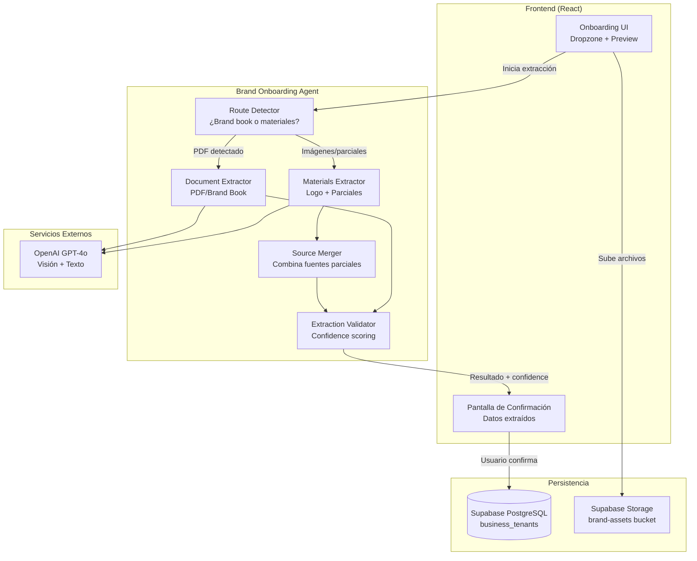
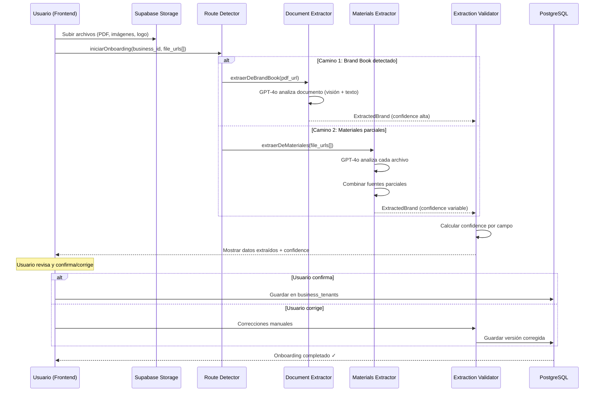
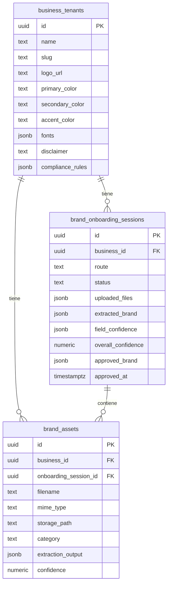

# Documento de Diseño: Brand Onboarding Agent

## Overview

Este documento define la arquitectura técnica para el **Brand Onboarding Agent** — un sistema que permite incorporar nuevos negocios a la plataforma SCORY Design extrayendo automáticamente su identidad de marca a partir de documentos proporcionados por el cliente. El sistema soporta dos caminos de onboarding:

1. **Camino 1 — Brand Book completo**: El cliente sube un PDF/documento con su manual de marca. El agente extrae colores, tipografías, logo, disclaimer, reglas de compliance y tono de comunicación.

2. **Camino 2 — Materiales parciales**: El cliente no tiene brand book formal pero sube materiales como logo, tarjetas de presentación, screenshots de su web/redes, o papelería. El agente infiere la identidad de marca combinando múltiples fuentes.

En ambos casos, el resultado final es un `business_tenants` completamente poblado y listo para que el Creative OS Pipeline genere contenido. El operador de SCORY Design **no define manualmente** la identidad de marca — el sistema la extrae del material del cliente.

## Architecture



## Flujo de Onboarding — Secuencia Completa



## Components and Interfaces

### Componente 1: Route Detector

**Propósito**: Determinar automáticamente qué camino de extracción seguir basándose en los archivos subidos.

**Interface**:
```typescript
interface RouteDetector {
  detectRoute(input: OnboardingInput): OnboardingRoute
}

interface OnboardingInput {
  business_id: string
  files: UploadedFile[]
}

interface UploadedFile {
  url: string
  filename: string
  mime_type: string       // application/pdf, image/png, image/jpeg, image/svg+xml
  size_bytes: number
  category?: FileCategory // Opcional: el usuario puede etiquetar
}

type FileCategory = 
  | 'brand_book'         // PDF/documento completo de marca
  | 'logo'              // Logo en cualquier formato
  | 'business_card'     // Tarjeta de presentación
  | 'stationery'        // Papelería (factura, hoja membretada)
  | 'website_screenshot' // Screenshot de su sitio web
  | 'social_screenshot'  // Screenshot de redes sociales
  | 'other'             // Otro material visual

type OnboardingRoute = 
  | { type: 'brand_book'; pdf_url: string; supplementary: UploadedFile[] }
  | { type: 'materials'; files: UploadedFile[] }

// Lógica de detección:
// - Si hay al menos 1 PDF con más de 3 páginas → brand_book
// - Si hay PDF de 1-2 páginas → podría ser tarjeta o flyer, tratar como material
// - Si solo hay imágenes → materials
```

---

### Componente 2: Document Extractor (Camino 1)

**Propósito**: Extraer identidad de marca completa de un brand book PDF usando GPT-4o con visión.

**Interface**:
```typescript
interface DocumentExtractor {
  extractFromBrandBook(input: BrandBookInput): Promise<ExtractedBrand>
}

interface BrandBookInput {
  business_id: string
  pdf_url: string
  // Archivos suplementarios (logo en alta resolución, etc.)
  supplementary_files?: UploadedFile[]
}

// El extractor envía las páginas del PDF como imágenes a GPT-4o
// con un prompt estructurado que pide extraer cada campo específico.
// Prompt strategy:
// 1. Enviar primeras 10-15 páginas como imágenes
// 2. Pedir extracción estructurada en JSON
// 3. Si el PDF tiene más páginas, hacer segunda pasada para compliance/legales
```

---

### Componente 3: Materials Extractor (Camino 2)

**Propósito**: Inferir identidad de marca a partir de materiales parciales (logo, tarjetas, screenshots, etc.).

**Interface**:
```typescript
interface MaterialsExtractor {
  extractFromMaterials(input: MaterialsInput): Promise<ExtractedBrand>
}

interface MaterialsInput {
  business_id: string
  files: UploadedFile[]
}

// Estrategia por tipo de material:
// 
// Logo → colores dominantes, detectar tipografía del logotipo
// Tarjeta de presentación → paleta completa, fonts, layout, datos de contacto
// Screenshot web → colores, fonts (via CSS visible), tono, disclaimer del footer
// Screenshot redes → estilo visual, tono de comunicación, uso de colores
// Papelería → colores corporativos, logo, disclaimer legal
//
// El extractor analiza cada archivo individualmente y luego
// el Merger combina los resultados ponderando por confiabilidad:
// - Logo: alta confianza para colores primarios
// - Tarjeta: alta confianza para paleta y fonts
// - Web: media confianza (puede tener colores de terceros)
// - Redes: baja confianza (filtros, templates de plataforma)
```

---

### Componente 4: Source Merger

**Propósito**: Combinar extracciones parciales de múltiples fuentes en una identidad de marca unificada, resolviendo conflictos por prioridad.

**Interface**:
```typescript
interface SourceMerger {
  merge(partials: PartialExtraction[]): ExtractedBrand
}

interface PartialExtraction {
  source: FileCategory
  confidence: number          // 0-1
  extracted: Partial<ExtractedBrand>
}

// Prioridad de fuentes (de mayor a menor confianza):
// 1. brand_book (0.95) — fuente definitiva
// 2. business_card (0.85) — muy confiable para paleta y fonts
// 3. stationery (0.80) — confiable para colores y disclaimer
// 4. logo (0.75) — confiable para color primario
// 5. website_screenshot (0.60) — puede tener ruido
// 6. social_screenshot (0.40) — mucho ruido de plataforma
//
// Resolución de conflictos:
// - Si dos fuentes dan colores diferentes, usar la de mayor confianza
// - Si hay consenso entre 2+ fuentes, aumentar confidence del resultado
// - Campos sin dato en ninguna fuente → marcar como "needs_input"
```

---

### Componente 5: Extraction Validator

**Propósito**: Calcular un score de confianza por campo y determinar qué necesita confirmación del usuario.

**Interface**:
```typescript
interface ExtractionValidator {
  validate(extracted: ExtractedBrand): ValidationResult
}

interface ValidationResult {
  brand: ExtractedBrand
  overall_confidence: number    // 0-1 promedio ponderado
  field_confidence: Record<string, FieldConfidence>
  needs_user_input: string[]    // Campos que no se pudieron extraer
  suggestions: Suggestion[]     // Sugerencias para campos faltantes
}

interface FieldConfidence {
  field: string
  value: any
  confidence: number
  source: FileCategory | 'inferred'
  alternatives?: any[]          // Otros valores posibles detectados
}

interface Suggestion {
  field: string
  message: string               // "No encontramos disclaimer. ¿Tienes uno?"
  default_value?: string        // Valor sugerido basado en industria
}
```

---

### Componente 6: Modelo de datos compartido

```typescript
interface ExtractedBrand {
  // Identidad visual
  logo_url: string | null
  colors: {
    primary: string             // Hex
    secondary: string           // Hex
    accent: string              // Hex
    extended?: string[]         // Colores adicionales detectados
  }
  fonts: {
    display: string             // Font para títulos
    body: string                // Font para cuerpo
    mono: string                // Font monospace (o fallback)
  }
  
  // Contenido legal/compliance
  disclaimer: string | null
  short_disclaimer: string | null
  compliance_rules: {
    forbidden_terms: string[]
    required_qualifiers: string[]
    max_values: Record<string, string>
  } | null
  
  // Metadata de marca
  name: string
  industry: string | null
  tone: string | null           // "profesional y confiable", etc.
  
  // Tracking de extracción
  extraction_metadata: {
    route: 'brand_book' | 'materials'
    sources: string[]           // URLs de archivos usados
    overall_confidence: number
    extracted_at: string
    model_used: string          // "gpt-4o-2024-08-06"
  }
}
```

## Data Models

### Modelo 1: brand_onboarding_sessions

```sql
CREATE TABLE brand_onboarding_sessions (
  id UUID PRIMARY KEY DEFAULT gen_random_uuid(),
  business_id UUID NOT NULL REFERENCES business_tenants(id),
  
  -- Route & Status
  route TEXT NOT NULL,           -- 'brand_book' | 'materials'
  status TEXT NOT NULL DEFAULT 'pending',
  
  -- Input files
  uploaded_files JSONB NOT NULL DEFAULT '[]',
  
  -- Extraction result
  extracted_brand JSONB,
  field_confidence JSONB,
  overall_confidence NUMERIC(3,2),
  needs_user_input TEXT[] DEFAULT '{}',
  
  -- User corrections (what they changed after seeing extraction)
  user_corrections JSONB DEFAULT '{}',
  
  -- Final approved brand (after user confirmation)
  approved_brand JSONB,
  
  -- Timestamps
  created_at TIMESTAMPTZ DEFAULT now(),
  extracted_at TIMESTAMPTZ,
  approved_at TIMESTAMPTZ,
  
  CONSTRAINT valid_onboarding_status CHECK (status IN (
    'pending', 'extracting', 'awaiting_confirmation',
    'confirmed', 'failed'
  )),
  CONSTRAINT valid_route CHECK (route IN ('brand_book', 'materials'))
);

ALTER TABLE brand_onboarding_sessions ENABLE ROW LEVEL SECURITY;
CREATE POLICY "Users can manage own business onboarding"
  ON brand_onboarding_sessions FOR ALL
  USING (business_id IN (
    SELECT business_id FROM user_business_memberships
    WHERE user_id = auth.uid()
  ));

CREATE INDEX idx_brand_onboarding_business
  ON brand_onboarding_sessions(business_id);
```

### Modelo 2: brand_assets (archivos subidos para onboarding)

```sql
CREATE TABLE brand_assets (
  id UUID PRIMARY KEY DEFAULT gen_random_uuid(),
  business_id UUID NOT NULL REFERENCES business_tenants(id),
  onboarding_session_id UUID REFERENCES brand_onboarding_sessions(id),
  
  -- File info
  filename TEXT NOT NULL,
  mime_type TEXT NOT NULL,
  size_bytes INTEGER NOT NULL,
  storage_path TEXT NOT NULL,   -- Path en Supabase Storage
  category TEXT NOT NULL,       -- 'brand_book', 'logo', 'business_card', etc.
  
  -- Extraction from this specific file
  extraction_output JSONB,
  confidence NUMERIC(3,2),
  
  created_at TIMESTAMPTZ DEFAULT now(),
  
  CONSTRAINT valid_asset_category CHECK (category IN (
    'brand_book', 'logo', 'business_card', 'stationery',
    'website_screenshot', 'social_screenshot', 'other'
  ))
);

ALTER TABLE brand_assets ENABLE ROW LEVEL SECURITY;
CREATE POLICY "Users can manage own business assets"
  ON brand_assets FOR ALL
  USING (business_id IN (
    SELECT business_id FROM user_business_memberships
    WHERE user_id = auth.uid()
  ));

CREATE INDEX idx_brand_assets_business
  ON brand_assets(business_id);

CREATE INDEX idx_brand_assets_session
  ON brand_assets(onboarding_session_id);
```

### Storage Bucket

```sql
-- Bucket para brand assets (logos, PDFs, screenshots)
INSERT INTO storage.buckets (id, name, public)
VALUES ('brand-assets', 'brand-assets', false);

-- RLS: solo miembros del business pueden acceder
CREATE POLICY "Business members can manage brand assets"
  ON storage.objects FOR ALL
  USING (
    bucket_id = 'brand-assets'
    AND (storage.foldername(name))[1] IN (
      SELECT bt.id::text FROM business_tenants bt
      INNER JOIN user_business_memberships ubm ON ubm.business_id = bt.id
      WHERE ubm.user_id = auth.uid()
    )
  );
```

## Diagrama de Datos — Relaciones



## GPT-4o Prompt Strategy

### Prompt para Camino 1 (Brand Book)

```
Analiza este brand book/manual de identidad corporativa y extrae la siguiente información en formato JSON:

1. COLORES: Identifica la paleta de colores principal. Busca:
   - Color primario (el más prominente/representativo)
   - Color secundario
   - Color de acento
   - Colores extendidos si los hay
   Devuelve valores hexadecimales exactos (#RRGGBB).

2. TIPOGRAFÍAS: Identifica las familias tipográficas:
   - Display/títulos (la más prominente en headers)
   - Body/cuerpo (la usada en texto corrido)
   - Mono (si existe, sino sugiere una compatible)

3. LOGO: Describe el logo y confirma si se puede extraer como asset.

4. DISCLAIMER/LEGALES: Busca textos legales, disclaimers, avisos regulatorios.

5. REGLAS DE COMPLIANCE:
   - Términos prohibidos (palabras que no deben usarse)
   - Calificadores requeridos (frases que deben acompañar ciertas afirmaciones)
   - Valores máximos (límites numéricos que no deben excederse en comunicación)

6. TONO DE COMUNICACIÓN: Describe el tono en 2-3 adjetivos.

7. INDUSTRIA: Identifica el sector/industria del negocio.

Responde SOLO con JSON válido siguiendo este schema exacto:
{
  "colors": { "primary": "#...", "secondary": "#...", "accent": "#...", "extended": [] },
  "fonts": { "display": "...", "body": "...", "mono": "..." },
  "disclaimer": "..." | null,
  "short_disclaimer": "..." | null,
  "compliance_rules": { "forbidden_terms": [], "required_qualifiers": [], "max_values": {} } | null,
  "tone": "...",
  "industry": "..."
}
```

### Prompt para Camino 2 (Materiales parciales)

```
Analiza esta imagen de [CATEGORY: logo/tarjeta de presentación/screenshot web/etc.] 
y extrae la identidad visual que puedas detectar:

1. COLORES: ¿Qué colores corporativos identificas? (hex exactos)
   - ¿Cuál parece ser el primario?
   - ¿Cuál el secundario?
   - ¿Hay un color de acento?

2. TIPOGRAFÍAS: ¿Puedes identificar las familias tipográficas usadas?
   - Para títulos/headers
   - Para texto de cuerpo

3. ESTILO VISUAL: ¿Qué tono transmite? (moderno, clásico, premium, etc.)

4. TEXTOS LEGALES: ¿Hay algún disclaimer o texto legal visible?

Responde SOLO con JSON válido:
{
  "colors": { "primary": "#..." | null, "secondary": "#..." | null, "accent": "#..." | null },
  "fonts": { "display": "..." | null, "body": "..." | null },
  "tone": "..." | null,
  "disclaimer": "..." | null,
  "confidence": 0.0-1.0
}

Si no puedes determinar un campo con certeza, usa null.
Indica tu nivel de confianza general (0.0 = pura especulación, 1.0 = certeza total).
```

## Edge Function: brand-onboarding

```typescript
// Supabase Edge Function: supabase/functions/brand-onboarding/index.ts

interface BrandOnboardingRequest {
  action: 'start' | 'confirm' | 'correct'
  business_id: string
  // Para 'start':
  file_urls?: string[]
  file_categories?: FileCategory[]
  // Para 'confirm':
  session_id?: string
  // Para 'correct':
  session_id?: string
  corrections?: Partial<ExtractedBrand>
}

interface BrandOnboardingResponse {
  session_id: string
  status: 'extracting' | 'awaiting_confirmation' | 'confirmed' | 'failed'
  extracted_brand?: ExtractedBrand
  field_confidence?: Record<string, FieldConfidence>
  needs_user_input?: string[]
  suggestions?: Suggestion[]
  error?: string
}
```

## Correctness Properties

### Property 1: Aislamiento de tenant en onboarding

*Para toda* `brand_onboarding_session` S y todo `business_id` B, si S.business_id ≠ B entonces ningún usuario de B puede leer ni modificar S ni sus brand_assets asociados.

### Property 2: Integridad de extracción

*Para toda* `brand_onboarding_session` con status `confirmed`, el campo `approved_brand` contiene un JSON válido con al menos: colors.primary, colors.secondary, colors.accent, y fonts.display. Ninguna sesión puede confirmarse sin estos campos mínimos.

### Property 3: Idempotencia de confirmación

*Para toda* sesión confirmada, invocar `confirm` nuevamente no modifica `business_tenants` ni crea registros duplicados. La operación es idempotente.

### Property 4: Trazabilidad de fuentes

*Para todo* campo en `approved_brand`, existe un registro en `field_confidence` que indica la fuente (archivo) de donde se extrajo y el nivel de confianza. Las correcciones del usuario se registran en `user_corrections`.

### Property 5: Consistencia con business_tenants

*Para toda* sesión con status `confirmed`, los campos de `business_tenants` para ese business_id reflejan exactamente los valores de `approved_brand`. No hay divergencia entre la sesión aprobada y la tabla de tenants.

## Error Handling

| Escenario | Condición | Acción | Reintentos |
|---|---|---|---|
| PDF corrupto | No se puede parsear | Informar al usuario, pedir re-upload | 0 |
| Imagen muy baja resolución | GPT-4o no puede leer | Warning + pedir mejor calidad | 0 |
| GPT-4o timeout | API timeout | Retry con backoff | 3 |
| GPT-4o rate limit | 429 | Esperar retry-after + retry | 3 |
| Extracción vacía | GPT-4o no detecta nada útil | Informar, sugerir otros materiales | 0 |
| Colores ambiguos | Múltiples paletas posibles | Mostrar alternativas al usuario | 0 |
| Font no identificable | GPT-4o no reconoce la tipografía | Sugerir fonts similares populares | 0 |

## Consideraciones de UX

### Pantalla de confirmación

Después de la extracción, el usuario ve:

```
┌─────────────────────────────────────────────────┐
│  ✓ Extracción completada                        │
│                                                 │
│  Logo:     [preview del logo]          ✓ 95%   │
│                                                 │
│  Colores:  ■ #2ED4C7  ■ #FF7A4A  ■ #0F1419    │
│            Confianza: 92%              [editar] │
│                                                 │
│  Fonts:    Display: Montserrat                  │
│            Body: Fraunces                       │
│            Mono: JetBrains Mono                 │
│            Confianza: 88%              [editar] │
│                                                 │
│  Disclaimer: "Xending® es una marca..."        │
│            Confianza: 95%              [editar] │
│                                                 │
│  Compliance:                                    │
│    Términos prohibidos: [lista]                 │
│    Calificadores: [lista]                       │
│            Confianza: 70%              [editar] │
│                                                 │
│  ⚠️ No pudimos detectar:                       │
│    • short_disclaimer — ¿Tienes uno?            │
│                                                 │
│  [Confirmar y guardar]    [Corregir campos]     │
└─────────────────────────────────────────────────┘
```

### Indicadores de confianza

- 🟢 90-100%: Alta confianza, probablemente correcto
- 🟡 60-89%: Media confianza, revisar
- 🔴 0-59%: Baja confianza, requiere validación manual
