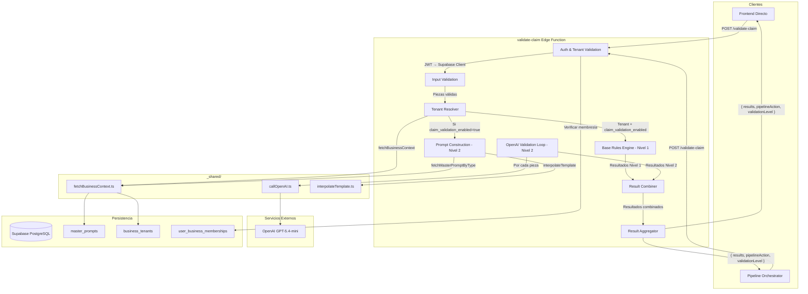
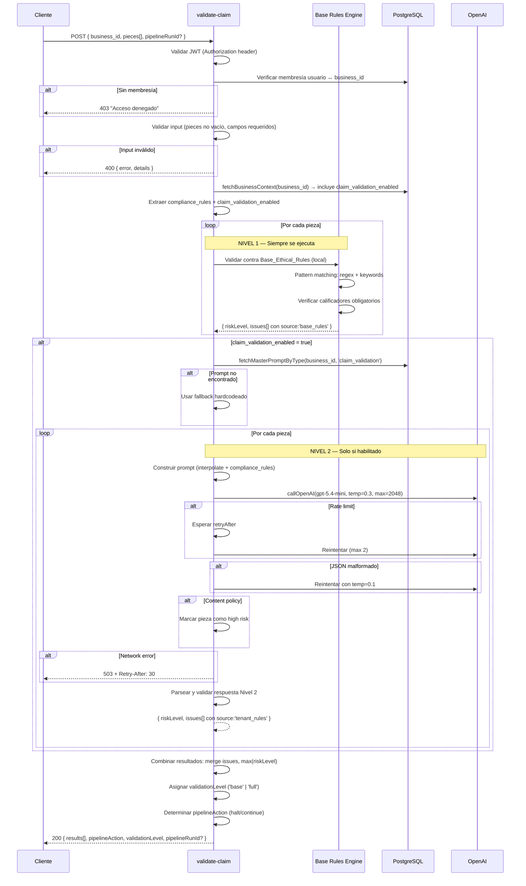
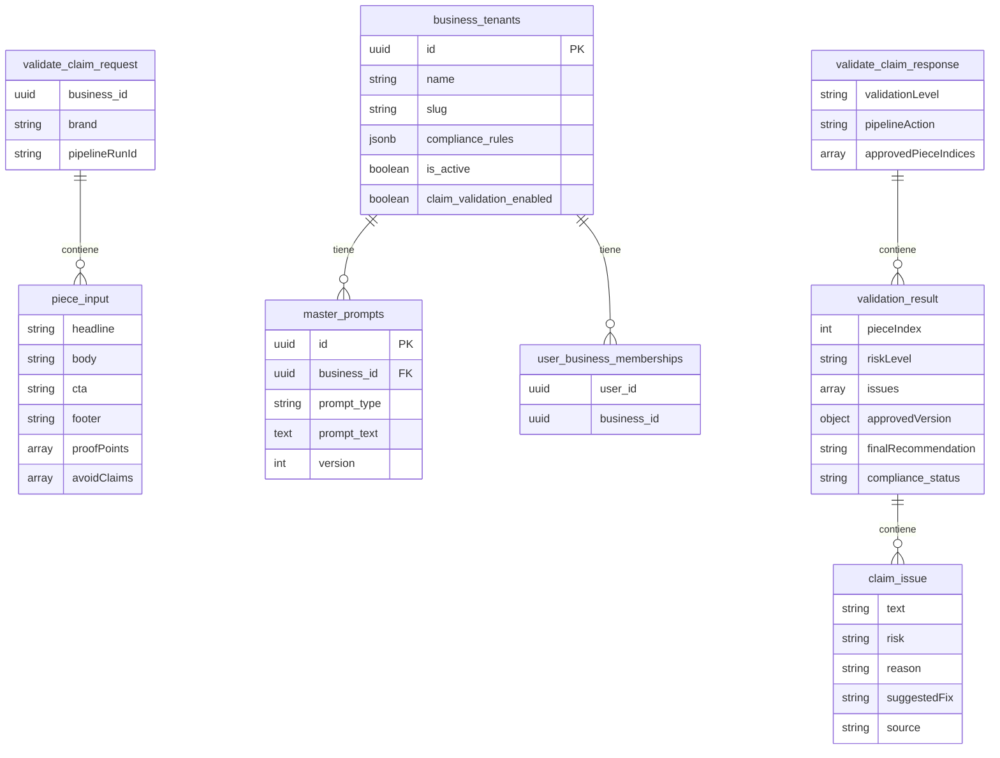

# Design Document: Claim Validator Edge Function

## Overview

El Claim Validator (`validate-claim`) es una Supabase Edge Function que actúa como compuerta obligatoria de compliance en el pipeline de generación de contenido de SCORY Design. Implementa un **modelo de validación de dos niveles**:

- **Nivel 1 (Reglas éticas base):** Validación local mediante pattern matching (regex + detección de keywords) contra reglas éticas universales hardcodeadas como constantes. No requiere llamadas a API. Siempre activa para todos los tenants. Detecta: retornos garantizados, promesas falsas, comparaciones engañosas, minimización de riesgos, falsa urgencia, discriminación. También verifica la presencia de calificadores obligatorios.
- **Nivel 2 (Reglas personalizadas del tenant vía OpenAI):** Validación semántica profunda usando `callOpenAI` (gpt-5.4-mini) con las `compliance_rules` específicas del tenant. Solo se ejecuta cuando `claim_validation_enabled: true` en el tenant.

**Decisiones de diseño clave:**

1. **Dos niveles con activación condicional**: Nivel 1 siempre corre (cero latencia de API, cero costo). Nivel 2 solo cuando el tenant lo habilita.
2. **Beneficio de rendimiento**: Cuando Nivel 2 está deshabilitado, la función es puramente local — sin latencia de API, sin costo.
3. **Procesamiento individual con resiliencia**: Cada pieza se valida independientemente. Si una falla en Nivel 2, las demás continúan.
4. **Combinación de resultados**: Issues de ambos niveles se fusionan con etiqueta de origen (`source`). El riskLevel final es el máximo de ambos niveles.
5. **Prompt dinámico con fallback**: El prompt de Nivel 2 se recupera de la DB por tipo `claim_validation`, con fallback al archivo hardcodeado.
6. **Dual-mode**: Funciona standalone (invocación directa) y como paso del pipeline (con `pipelineRunId`).
7. **Retry inteligente**: Reintentos diferenciados por tipo de error (rate_limit con backoff, malformed JSON con temperature más baja).

## Architecture



## Flujo de Ejecución — Secuencia



## Components and Interfaces

### Componente 1: Request Handler (Entry Point)

**Propósito**: Manejar CORS, autenticación, y routing del request HTTP.

```typescript
// supabase/functions/validate-claim/index.ts

import { serve } from "https://deno.land/std@0.168.0/http/server.ts";
import { createClient } from "https://esm.sh/@supabase/supabase-js@2.53.0";

const corsHeaders = {
  'Access-Control-Allow-Origin': '*',
  'Access-Control-Allow-Headers': 'authorization, x-client-info, apikey, content-type',
};

// Entry point: serve(async (req) => { ... })
```

**Responsabilidades**:
- Responder OPTIONS con CORS headers
- Extraer JWT del header Authorization
- Crear Supabase client con JWT del usuario (RLS activo)
- Delegar a la lógica de validación
- Capturar errores no manejados y retornar 500 genérico

---

### Componente 2: Input Validator

**Propósito**: Validar la estructura del request antes de procesar.

```typescript
interface ValidateClaimRequest {
  business_id?: string;       // UUID del tenant (preferido)
  brand?: string;             // Slug legacy (fallback)
  pieces: PieceInput[];       // Array de piezas a validar
  pipelineRunId?: string;     // ID del pipeline run (opcional)
}

interface PieceInput {
  headline: string;           // Requerido
  body: string;               // Requerido
  cta: string;                // Requerido
  footer?: string;            // Opcional
  proofPoints?: string[];     // Claims permitidos (opcional)
  avoidClaims?: string[];     // Claims a evitar (opcional)
}

interface ValidationError {
  error: 'validation_error';
  message: string;
  details?: {
    pieceIndex?: number;
    missingFields?: string[];
  };
}

function validateRequest(body: unknown): ValidateClaimRequest | ValidationError;
```

**Reglas de validación**:
1. `pieces` debe ser un array no vacío
2. Cada pieza debe tener `headline`, `body`, `cta` como strings no vacíos
3. Al menos uno de `business_id` o `brand` debe estar presente
4. Si ambos están presentes, se usa `business_id`

---

### Componente 3: Tenant Resolver

**Propósito**: Resolver el `business_id`, verificar acceso del usuario, y obtener el flag `claim_validation_enabled`.

```typescript
interface TenantResolution {
  businessId: string;
  claimValidationEnabled: boolean;  // Flag de activación de Nivel 2
  complianceRules: {
    forbidden_terms: string[];
    required_qualifiers: string[];
    max_values: Record<string, string>;
  };
  brandName: string;
}

async function resolveTenant(
  supabase: SupabaseClient,
  businessId?: string,
  brandSlug?: string,
  userId?: string,
): Promise<TenantResolution | { error: number; message: string }>;
```

**Lógica**:
1. Si `business_id` presente → usar directamente
2. Si solo `brand` → buscar en `business_tenants` por `slug`
3. Verificar que el usuario tiene membresía activa en el business
4. Leer `claim_validation_enabled` del tenant (default: `false`)
5. Retornar 403 si no tiene acceso

---

### Componente 4: Base Rules Engine (Nivel 1) — NUEVO

**Propósito**: Validar piezas contra reglas éticas universales usando pattern matching local. Sin dependencia de APIs externas.

```typescript
// Reglas hardcodeadas como constantes
const BASE_ETHICAL_RULES = {
  prohibitedPatterns: [
    { id: 'guaranteed_returns', patterns: [/garant[ií]z/i, /retorno seguro/i, /sin riesgo/i], riskLevel: 'high' as const },
    { id: 'false_promises', patterns: [/100%\s*(seguro|garantizado)/i, /nunca pierd/i], riskLevel: 'high' as const },
    { id: 'misleading_comparisons', patterns: [/mejor que.*banco/i, /supera.*mercado/i], riskLevel: 'high' as const },
    { id: 'risk_minimization', patterns: [/sin ning[uú]n riesgo/i, /riesgo cero/i], riskLevel: 'high' as const },
    { id: 'false_urgency', patterns: [/[uú]ltima oportunidad/i, /solo hoy/i, /oferta.*expira/i], riskLevel: 'high' as const },
    { id: 'discrimination', patterns: [/solo para (hombres|mujeres)/i, /exclu(ir|ye)/i], riskLevel: 'high' as const },
  ],
  requiredQualifiers: [
    { id: 'past_performance', trigger: /rendimiento|retorno|ganancia/i, qualifier: 'rendimientos pasados no garantizan resultados futuros' },
    { id: 'rate_change', trigger: /tasa|interés|APR/i, qualifier: 'las tasas pueden cambiar' },
    { id: 'capital_risk', trigger: /inver(tir|sión)|capital/i, qualifier: 'su capital está en riesgo' },
  ],
} as const;

interface BaseRulesResult {
  riskLevel: 'low' | 'medium' | 'high';
  issues: BaseRuleIssue[];
}

interface BaseRuleIssue {
  text: string;           // Texto que disparó la regla
  risk: 'medium' | 'high';
  reason: string;         // ID de la regla violada + descripción
  suggestedFix: string;   // Sugerencia genérica
  source: 'base_rules';   // Siempre 'base_rules'
}

function validatePieceBaseRules(piece: PieceInput): BaseRulesResult;
```

**Lógica**:
1. Concatenar todos los campos de texto de la pieza (headline + body + cta + footer)
2. Ejecutar cada patrón de `prohibitedPatterns` contra el texto
3. Si hay match → generar Issue con `riskLevel: 'high'` y `source: 'base_rules'`
4. Verificar si el texto contiene triggers de `requiredQualifiers`
5. Si hay trigger pero no está presente el qualifier → generar Issue con `riskLevel: 'medium'` y `source: 'base_rules'`
6. Retornar el riskLevel máximo encontrado y todos los issues

**Características clave**:
- **Sin I/O**: No hace llamadas a DB ni APIs
- **Determinista**: Mismo input → mismo output siempre
- **Rápido**: Solo operaciones de string/regex en memoria
- **Extensible**: Agregar reglas es agregar entradas al objeto constante

---

### Componente 5: Prompt Builder (Nivel 2)

**Propósito**: Construir el prompt de validación con contexto del tenant para Nivel 2.

```typescript
interface PromptBuildResult {
  systemPrompt: string;
  userPrompt: string;
}

async function buildValidationPrompt(
  supabase: SupabaseClient,
  businessId: string,
  piece: PieceInput,
  complianceRules: TenantResolution['complianceRules'],
  brandName: string,
): Promise<PromptBuildResult>;
```

**Lógica**:
1. Invocar `fetchMasterPromptByType(supabase, businessId, 'claim_validation')`
2. Si retorna `null` → usar fallback hardcodeado
3. Interpolar variables de la pieza en el template usando `interpolateTemplate`
4. Inyectar `forbidden_terms` como sección adicional de claims prohibidos
5. Inyectar `required_qualifiers` como calificadores obligatorios
6. Inyectar `max_values` como límites numéricos
7. Retornar system prompt + user prompt construidos

---

### Componente 6: OpenAI Validation Engine (Nivel 2)

**Propósito**: Ejecutar la validación semántica de cada pieza vía OpenAI con reintentos y manejo de errores.

```typescript
interface OpenAIValidationResult {
  pieceIndex: number;
  riskLevel: 'low' | 'medium' | 'high';
  issues: TenantRuleIssue[];
  approvedVersion: ApprovedVersion;
  finalRecommendation: string;
}

interface TenantRuleIssue {
  text: string;
  risk: string;
  reason: string;
  suggestedFix: string;
  source: 'tenant_rules';   // Siempre 'tenant_rules'
}

interface ApprovedVersion {
  headline: string;
  body: string;
  cta: string;
  footer: string;
}

async function validatePieceOpenAI(
  piece: PieceInput,
  pieceIndex: number,
  prompt: PromptBuildResult,
): Promise<OpenAIValidationResult | { error: string; pieceIndex: number }>;
```

**Lógica de reintentos**:
1. **Rate limit**: Esperar `retryAfter` ms, reintentar hasta 2 veces
2. **JSON malformado**: Reintentar 1 vez con `temperature: 0.1`
3. **Content policy**: No reintentar, marcar como `high` risk
4. **Network error**: No reintentar (ya lo hace `callOpenAI` internamente), propagar 503
5. **Auth error**: No reintentar, propagar 500

---

### Componente 7: Result Combiner — NUEVO

**Propósito**: Combinar los resultados de Nivel 1 y Nivel 2 en un resultado unificado por pieza.

```typescript
interface CombinedIssue {
  text: string;
  risk: string;
  reason: string;
  suggestedFix: string;
  source: 'base_rules' | 'tenant_rules';
}

interface CombinedPieceResult {
  pieceIndex: number;
  riskLevel: 'low' | 'medium' | 'high';
  issues: CombinedIssue[];
  approvedVersion: ApprovedVersion;
  finalRecommendation: string;
  compliance_status: 'approved' | 'rejected';
}

function combineResults(
  pieceIndex: number,
  piece: PieceInput,
  level1Result: BaseRulesResult,
  level2Result?: OpenAIValidationResult | { error: string; pieceIndex: number },
): CombinedPieceResult;
```

**Lógica de combinación**:
1. Fusionar `issues` de ambos niveles en un solo array, cada uno con su `source` tag
2. `riskLevel` final = `max(level1.riskLevel, level2.riskLevel)` usando orden: low < medium < high
3. Si solo Nivel 1 se ejecutó y no hay issues → `riskLevel: 'low'`, `approvedVersion` = pieza original
4. Si Nivel 2 se ejecutó → usar `approvedVersion` de Nivel 2
5. Si Nivel 2 tuvo error → tratar como `riskLevel: 'high'` para esa pieza
6. `compliance_status`: `'rejected'` si riskLevel es `'high'`, `'approved'` en caso contrario

---

### Componente 8: Result Aggregator

**Propósito**: Agregar resultados combinados de todas las piezas y determinar la acción del pipeline.

```typescript
interface ValidateClaimResponse {
  results: CombinedPieceResult[];
  pipelineAction: 'halt' | 'continue';
  approvedPieceIndices: number[];
  validationLevel: 'base' | 'full';
  pipelineRunId?: string;
}

function aggregateResults(
  results: CombinedPieceResult[],
  claimValidationEnabled: boolean,
  pipelineRunId?: string,
): ValidateClaimResponse;
```

**Reglas de agregación**:
1. `pipelineAction: 'halt'` si TODAS las piezas tienen `riskLevel: 'high'`
2. `pipelineAction: 'continue'` si al menos una pieza tiene `riskLevel` diferente de `high`
3. `approvedPieceIndices` contiene los índices de piezas con `compliance_status: 'approved'`
4. `validationLevel: 'full'` si `claimValidationEnabled` es `true`, `'base'` si es `false`
5. `pipelineRunId` se incluye solo si fue proporcionado en el request

## Data Models

### Input Schema

```typescript
// Request body
interface ValidateClaimRequest {
  business_id?: string;       // UUID - preferido
  brand?: string;             // Slug legacy - fallback
  pieces: PieceInput[];       // 1..N piezas
  pipelineRunId?: string;     // Trazabilidad pipeline
}

interface PieceInput {
  headline: string;
  body: string;
  cta: string;
  footer?: string;
  proofPoints?: string[];
  avoidClaims?: string[];
}
```

### Output Schema

```typescript
// Response body (HTTP 200)
interface ValidateClaimResponse {
  results: ValidationResult[];
  pipelineAction: 'halt' | 'continue';
  approvedPieceIndices: number[];
  validationLevel: 'base' | 'full';       // NUEVO: indica qué niveles se ejecutaron
  pipelineRunId?: string;
}

interface ValidationResult {
  pieceIndex: number;
  riskLevel: 'low' | 'medium' | 'high';
  issues: ClaimIssue[];
  approvedVersion: ApprovedVersion;
  finalRecommendation: string;
  compliance_status: 'approved' | 'rejected';
}

interface ClaimIssue {
  text: string;           // Texto problemático detectado
  risk: string;           // Nivel de riesgo del issue
  reason: string;         // Razón del problema
  suggestedFix: string;   // Sugerencia de corrección
  source: 'base_rules' | 'tenant_rules';  // NUEVO: origen del issue
}

interface ApprovedVersion {
  headline: string;
  body: string;
  cta: string;
  footer: string;
}
```

### Database Tables Referenced

```sql
-- Tabla: business_tenants (lectura)
-- Campos usados: id, slug, name, compliance_rules, is_active, claim_validation_enabled
SELECT id, name, slug, compliance_rules, claim_validation_enabled
FROM business_tenants
WHERE id = $1 AND is_active = true;

-- Resolución por slug (legacy)
SELECT id, claim_validation_enabled FROM business_tenants
WHERE slug = $1 AND is_active = true;

-- Tabla: master_prompts (lectura) — Solo para Nivel 2
-- Campos usados: prompt_text, business_id, prompt_type, version
SELECT prompt_text FROM master_prompts
WHERE business_id = $1 AND prompt_type = 'claim_validation'
ORDER BY version DESC LIMIT 1;

-- Tabla: user_business_memberships (lectura)
-- Verificación de acceso
SELECT 1 FROM user_business_memberships
WHERE user_id = $1 AND business_id = $2;
```

### Diagrama de Relaciones



## Correctness Properties

*A property is a characteristic or behavior that should hold true across all valid executions of a system — essentially, a formal statement about what the system should do. Properties serve as the bridge between human-readable specifications and machine-verifiable correctness guarantees.*

### Property 1: Input-output cardinality preservation

*For any* valid array of N pieces submitted to the validator, the response `results` array SHALL contain exactly N elements, one per input piece, regardless of individual piece validation outcomes or which validation levels were executed.

**Validates: Requirements 1.1**

### Property 2: Input validation detects missing required fields

*For any* piece missing one or more required fields (headline, body, cta), the validator SHALL return an HTTP 400 error that correctly identifies all missing field names and the piece's position in the array.

**Validates: Requirements 1.3, 1.4**

### Property 3: Base rules always execute regardless of tenant flag

*For any* valid request, the Base Rules Engine (Nivel 1) SHALL execute for every piece regardless of the value of `claim_validation_enabled`, and when `claim_validation_enabled` is `false` no calls to OpenAI SHALL be made.

**Validates: Requirements 2.1, 2.6, 3.2, 3.3**

### Property 4: Ethical violation detection and risk classification

*For any* piece containing text that matches a prohibited pattern from `BASE_ETHICAL_RULES.prohibitedPatterns`, the Base Rules Engine SHALL detect the violation and classify it as `riskLevel: 'high'`; and for any piece making financial claims without required qualifiers, it SHALL classify as `riskLevel: 'medium'`.

**Validates: Requirements 2.3, 2.4, 2.5**

### Property 5: validationLevel reflects executed levels

*For any* response, `validationLevel` SHALL be `'base'` if and only if `claim_validation_enabled` is `false`, and `'full'` if and only if `claim_validation_enabled` is `true`.

**Validates: Requirements 3.4, 3.5**

### Property 6: Compliance rules injection completeness

*For any* set of tenant compliance rules with non-empty `forbidden_terms`, `required_qualifiers`, and `max_values`, the constructed Nivel 2 validation prompt SHALL contain every term from `forbidden_terms`, every qualifier from `required_qualifiers`, and every key-value pair from `max_values`.

**Validates: Requirements 4.2, 4.3, 4.4, 6.3**

### Property 7: Forbidden terms force high risk

*For any* piece where any field (headline, body, cta, footer) contains a substring matching a prohibited pattern (Nivel 1) or a term in the tenant's `forbidden_terms` (Nivel 2), the final combined validation result SHALL have `riskLevel` of `'high'` as minimum.

**Validates: Requirements 2.3, 4.5**

### Property 8: Issue combination with source tagging

*For any* validation where both levels execute, the final `issues` array SHALL contain all issues from Nivel 1 tagged with `source: 'base_rules'` and all issues from Nivel 2 tagged with `source: 'tenant_rules'`, with no issues lost or duplicated.

**Validates: Requirements 5.1**

### Property 9: Risk level is maximum of both levels

*For any* piece validated by both levels, the final `riskLevel` SHALL equal the maximum of `level1.riskLevel` and `level2.riskLevel`, using the ordering low < medium < high.

**Validates: Requirements 5.2**

### Property 10: Pipeline ID pass-through

*For any* request containing a `pipelineRunId`, the response SHALL include that same `pipelineRunId` value unchanged.

**Validates: Requirements 8.2**

### Property 11: Rate limit retry with bounded attempts

*For any* rate_limit error from callOpenAI with a `retryAfter` value, the validator SHALL wait at least `retryAfter` seconds before retrying, and SHALL NOT exceed 2 total retry attempts per piece.

**Validates: Requirements 9.1**

### Property 12: Per-piece error isolation

*For any* array of pieces where callOpenAI fails for a subset of pieces (rate_limit exhausted, content_policy), the validator SHALL still return valid results for all other pieces that succeeded, and SHALL mark failed pieces with `riskLevel: 'high'` and an appropriate error issue.

**Validates: Requirements 9.5**

### Property 13: Risk-to-compliance-status mapping

*For any* validation result, `compliance_status` SHALL be `'rejected'` if and only if `riskLevel` is `'high'`, and `'approved'` if and only if `riskLevel` is `'low'` or `'medium'`.

**Validates: Requirements 11.1, 11.2**

### Property 14: Pipeline action determination

*For any* set of validation results, `pipelineAction` SHALL be `'halt'` if and only if ALL pieces have `riskLevel: 'high'`; otherwise it SHALL be `'continue'` with `approvedPieceIndices` containing exactly the indices of pieces with `compliance_status: 'approved'`.

**Validates: Requirements 11.3, 11.4**

### Property 15: Tenant access authorization

*For any* request where the authenticated user does NOT have an active membership in the requested `business_id`, the validator SHALL return HTTP 403 without processing any pieces or making any OpenAI calls.

**Validates: Requirements 10.2, 10.3**

## Error Handling

### Estrategia por Tipo de Error

| Error | Origen | Nivel | Acción | HTTP Status | Reintentos |
|-------|--------|-------|--------|-------------|------------|
| Array vacío | Input | — | Rechazar inmediatamente | 400 | 0 |
| Campos faltantes | Input | — | Rechazar con detalle | 400 | 0 |
| Sin business_id/brand | Input | — | Rechazar | 400 | 0 |
| Sin membresía | Auth | — | Denegar acceso | 403 | 0 |
| Tenant no encontrado | DB | — | Error | 404 | 0 |
| Violación ética base | Nivel 1 | 1 | Generar issue, continuar | — (por pieza) | 0 |
| Calificador faltante | Nivel 1 | 1 | Generar issue, continuar | — (por pieza) | 0 |
| Rate limit | OpenAI | 2 | Esperar retryAfter + retry | — (interno) | 2 |
| Network error | OpenAI | 2 | Propagar al cliente | 503 | 0 |
| Content policy | OpenAI | 2 | Marcar pieza high risk | — (por pieza) | 0 |
| Auth error | OpenAI | 2 | Error genérico | 500 | 0 |
| JSON malformado | OpenAI | 2 | Reintentar con temp=0.1 | — (interno) | 1 |
| Error inesperado | Sistema | — | Error genérico | 500 | 0 |

### Escenarios de Error Detallados

**Escenario 1: Solo Nivel 1 activo (claim_validation_enabled = false)**
- No hay posibilidad de errores de API
- Solo errores de input o auth pueden ocurrir
- Respuesta siempre rápida y determinista

**Escenario 2: Rate limit en medio del array (Nivel 2)**
- Pieza 1: Nivel 1 OK + Nivel 2 OK
- Pieza 2: Nivel 1 OK + Nivel 2 rate_limit → esperar retryAfter → reintentar (max 2)
- Si agota reintentos → combinar con resultado de Nivel 1, marcar pieza 2 como error en Nivel 2
- Continuar con pieza 3+

**Escenario 3: Network error total (Nivel 2)**
- Si callOpenAI retorna `network_error` (después de su retry interno) → retornar 503 al cliente
- Incluir header `Retry-After: 30`
- No procesar más piezas en Nivel 2 (el servicio está caído)
- Nota: Los resultados de Nivel 1 ya procesados se pierden en este caso (el cliente debe reintentar todo)

**Escenario 4: JSON malformado de OpenAI (Nivel 2)**
- Primer intento retorna texto no-JSON → reintentar con `temperature: 0.1`
- Si segundo intento también falla → marcar pieza con error en Nivel 2, combinar con Nivel 1

**Escenario 5: Violación detectada por Nivel 1**
- Base Rules Engine detecta "retorno garantizado" en headline
- Genera issue con `source: 'base_rules'`, `riskLevel: 'high'`
- Si Nivel 2 está activo, se ejecuta igualmente para obtener análisis semántico adicional
- Resultado final combina ambos: issues de ambos niveles, riskLevel = max(high, nivel2_risk) = high

### Seguridad en Errores

- **Nunca** incluir API keys, prompt content, o datos de otros tenants en mensajes de error
- Errores de auth de OpenAI → mensaje genérico "Error interno del servicio"
- Logs internos pueden incluir error codes pero no contenido sensible
- Cuando solo Nivel 1 está activo, no hay riesgo de filtración vía errores de API

## Testing Strategy

### Unit Tests (Vitest)

Tests específicos con ejemplos concretos:

1. **Input validation**: Piezas con campos faltantes, array vacío, tipos incorrectos
2. **Tenant resolution**: Resolución por business_id, por slug, prioridad cuando ambos presentes, lectura de `claim_validation_enabled`
3. **Base Rules Engine (Nivel 1)**:
   - Detección de cada tipo de patrón prohibido (retornos garantizados, promesas falsas, etc.)
   - Detección de calificadores faltantes
   - Piezas limpias retornan `riskLevel: 'low'` sin issues
   - Clasificación correcta: prohibitivas → high, calificadores → medium
4. **Prompt fallback (Nivel 2)**: Cuando DB retorna null, se usa el hardcoded
5. **Error mapping**: Cada tipo de error de callOpenAI produce la respuesta correcta
6. **Result combination**: Merge correcto de issues, cálculo de max riskLevel
7. **CORS handling**: OPTIONS retorna headers correctos
8. **Auth flow**: JWT inválido, usuario sin membresía
9. **Conditional execution**: Nivel 2 no se ejecuta cuando `claim_validation_enabled: false`

### Property-Based Tests (fast-check)

**Librería**: [fast-check](https://github.com/dubzzz/fast-check) para TypeScript

**Configuración**: Mínimo 100 iteraciones por propiedad.

Cada property test referencia su propiedad del diseño:

```typescript
// Tag format: Feature: claim-validator, Property N: <description>
```

**Properties a implementar**:

1. **Cardinality preservation** — Para arrays de 1-50 piezas válidas, `results.length === pieces.length`
2. **Missing fields detection** — Para piezas con subsets aleatorios de campos removidos, el error identifica correctamente los campos faltantes
3. **Base rules always execute** — Para cualquier valor de `claim_validation_enabled`, Nivel 1 siempre produce resultados; cuando es `false`, no hay llamadas a OpenAI
4. **Ethical violation detection** — Para piezas con patrones prohibidos inyectados, Nivel 1 siempre detecta y clasifica correctamente (high para prohibitivas, medium para calificadores)
5. **validationLevel correctness** — Para cualquier request, `validationLevel` corresponde exactamente al valor de `claim_validation_enabled`
6. **Compliance rules in prompt** — Para arrays aleatorios de forbidden_terms/required_qualifiers/max_values, todos aparecen en el prompt de Nivel 2
7. **Forbidden terms override** — Para piezas con forbidden terms inyectados (Nivel 1 o Nivel 2), riskLevel final siempre es 'high'
8. **Issue combination completeness** — Para resultados aleatorios de ambos niveles, el merge contiene todos los issues con source tags correctos
9. **Risk level max calculation** — Para todas las combinaciones de riskLevel de ambos niveles, el resultado final es el máximo
10. **Pipeline ID pass-through** — Para UUIDs aleatorios como pipelineRunId, el response lo incluye idéntico
11. **Rate limit bounded retries** — Para secuencias de rate_limit errors, nunca se exceden 2 reintentos
12. **Error isolation** — Para arrays con fallos en posiciones aleatorias, las demás piezas tienen resultados válidos
13. **Risk-to-status mapping** — Para cualquier riskLevel, compliance_status es determinístico
14. **Pipeline action logic** — Para arrays con distribuciones aleatorias de riskLevels, pipelineAction es correcto
15. **Tenant authorization** — Para usuarios sin membresía, siempre se retorna 403 sin procesar piezas

### Integration Tests

1. **Happy path E2E (solo Nivel 1)**: Request con `claim_validation_enabled: false` → respuesta rápida sin OpenAI
2. **Happy path E2E (ambos niveles)**: Request con `claim_validation_enabled: true` + mock de OpenAI → respuesta completa
3. **Pipeline contract**: Verificar que input/output cumple con `pipeline-types.ts`
4. **DB integration**: Verificar queries a `master_prompts`, `business_tenants` (incluyendo `claim_validation_enabled`), `user_business_memberships`
5. **Standalone vs pipeline mode**: Verificar ambos modos de invocación
6. **Result combination E2E**: Verificar que issues de ambos niveles se fusionan correctamente con source tags

### Test Structure

```
supabase/functions/validate-claim/
├── index.ts                    # Entry point
├── lib/
│   ├── validateInput.ts        # Input validation
│   ├── resolveTenant.ts        # Tenant resolution + auth + claim_validation_enabled
│   ├── baseRulesEngine.ts      # NUEVO: Nivel 1 - validación local
│   ├── baseEthicalRules.ts     # NUEVO: Constantes de reglas éticas
│   ├── buildPrompt.ts          # Nivel 2 - Prompt construction
│   ├── validatePieceOpenAI.ts  # Nivel 2 - Per-piece validation with retries
│   ├── validateClaimResponse.ts # OpenAI response validation
│   ├── combineResults.ts       # NUEVO: Combinar resultados de ambos niveles
│   ├── aggregateResults.ts     # Result aggregation + pipeline action
│   └── constants.ts            # Fallback prompt, config
└── __tests__/
    ├── validateInput.test.ts
    ├── baseRulesEngine.test.ts         # NUEVO
    ├── buildPrompt.test.ts
    ├── validatePieceOpenAI.test.ts
    ├── validateClaimResponse.test.ts
    ├── combineResults.test.ts          # NUEVO
    ├── aggregateResults.test.ts
    └── properties/
        ├── cardinality.prop.test.ts
        ├── inputValidation.prop.test.ts
        ├── baseRulesExecution.prop.test.ts    # NUEVO
        ├── ethicalViolation.prop.test.ts      # NUEVO
        ├── validationLevel.prop.test.ts       # NUEVO
        ├── promptConstruction.prop.test.ts
        ├── responseValidation.prop.test.ts
        ├── riskConsistency.prop.test.ts
        ├── issueCombination.prop.test.ts      # NUEVO
        ├── riskMaxCalculation.prop.test.ts    # NUEVO
        ├── complianceRules.prop.test.ts
        ├── forbiddenTerms.prop.test.ts
        ├── pipelineAction.prop.test.ts
        └── errorIsolation.prop.test.ts
```
