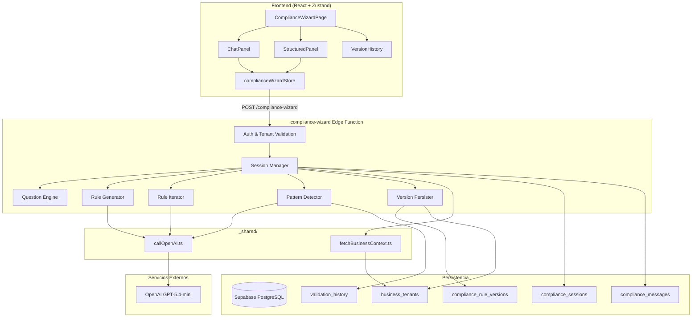
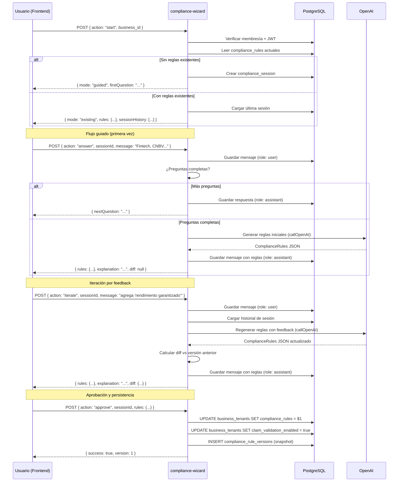
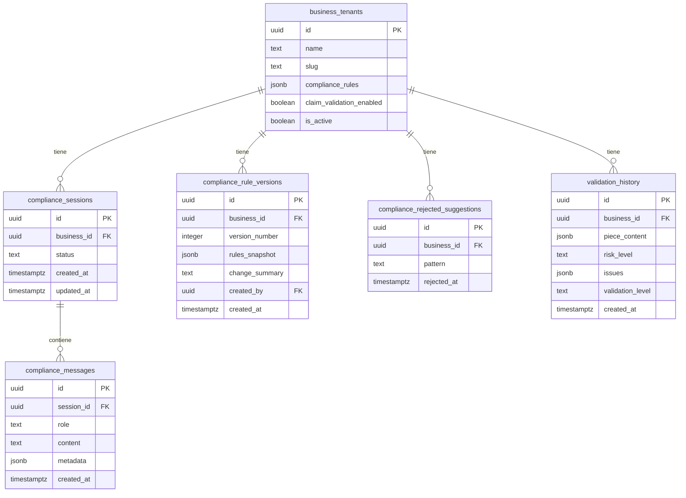

# Design Document: Compliance Wizard

## Overview

El Compliance Wizard es un sistema de IA conversacional que guía a los clientes en la configuración de reglas de compliance personalizadas (Nivel 2) para el Claim Validator. Implementa el patrón reutilizable de **Assisted Configuration Agent** — un módulo genérico que combina chat conversacional con panel estructurado para configuraciones complejas.

**Decisiones de diseño clave:**

1. **Patrón Assisted Configuration Agent**: La lógica conversacional se implementa como módulo genérico parametrizable (schema objetivo, preguntas guiadas, prompt de generación, tabla de destino). La lógica específica de compliance es una instanciación de este patrón.
2. **Interfaz híbrida**: Chat conversacional (lado izquierdo) + Panel estructurado (lado derecho). Ambos reflejan el mismo estado en tiempo real.
3. **Edge Function dedicada**: `compliance-wizard` como Supabase Edge Function que maneja la lógica conversacional, generación de reglas vía OpenAI, y persistencia.
4. **Versionado inmutable**: Cada persistencia crea un snapshot inmutable en `compliance_rule_versions`. Rollbacks crean nuevas versiones (nunca eliminan historial).
5. **Sugerencias proactivas**: Análisis de `validation_history` para detectar patrones recurrentes de rechazo y sugerir nuevas reglas.
6. **Reutilización de `callOpenAI`**: Usa la utilidad compartida existente para comunicación con OpenAI, consistente con el resto del pipeline.

## Architecture



## Flujo de Ejecución — Secuencia Principal



## Components and Interfaces

### Componente 1: Request Handler (Entry Point)

**Propósito**: Manejar CORS, autenticación, routing por `action`, y delegación.

```typescript
// supabase/functions/compliance-wizard/index.ts

interface ComplianceWizardRequest {
  action: 'start' | 'answer' | 'iterate' | 'approve' | 'rollback' | 
          'disable' | 'suggest' | 'accept_suggestion' | 'reject_suggestion' |
          'panel_edit';
  business_id: string;
  session_id?: string;
  message?: string;
  rules?: ComplianceRules;
  version_id?: string;
}
```

**Responsabilidades**:
- Responder OPTIONS con CORS headers
- Extraer JWT del header Authorization
- Crear Supabase client con JWT del usuario (RLS activo)
- Validar membresía del usuario en el business_id
- Delegar al handler correspondiente según `action`

---

### Componente 2: Session Manager

**Propósito**: Gestionar sesiones de conversación, crear nuevas, cargar existentes, y manejar el historial.

```typescript
interface ConversationSession {
  id: string;
  business_id: string;
  status: 'active' | 'completed';
  created_at: string;
  updated_at: string;
}

interface ConversationMessage {
  id: string;
  session_id: string;
  role: 'user' | 'assistant';
  content: string;
  metadata?: {
    type: 'question' | 'answer' | 'rules_generated' | 'rules_updated' | 'approval' | 'suggestion';
    rules_snapshot?: ComplianceRules;
    diff?: RulesDiff;
  };
  created_at: string;
}

async function getOrCreateSession(
  supabase: SupabaseClient,
  businessId: string,
): Promise<ConversationSession>;

async function loadSessionHistory(
  supabase: SupabaseClient,
  sessionId: string,
): Promise<ConversationMessage[]>;

async function saveMessage(
  supabase: SupabaseClient,
  sessionId: string,
  role: 'user' | 'assistant',
  content: string,
  metadata?: ConversationMessage['metadata'],
): Promise<ConversationMessage>;
```

---

### Componente 3: Question Engine

**Propósito**: Gestionar la secuencia de preguntas guiadas para la configuración inicial.

```typescript
interface GuidedQuestion {
  id: string;
  text: string;
  context: string;  // Contexto para el prompt de generación
  order: number;
}

// Preguntas hardcodeadas para compliance (instanciación específica)
const COMPLIANCE_GUIDED_QUESTIONS: GuidedQuestion[] = [
  {
    id: 'industry',
    text: '¿En qué industria opera tu negocio? (ej: fintech, seguros, inversiones, pagos internacionales)',
    context: 'industry_context',
    order: 1,
  },
  {
    id: 'regulator',
    text: '¿Qué regulador aplica a tu publicidad? (ej: CNBV, CONDUSEF, SEC, FCA, o "no estoy seguro")',
    context: 'regulator_context',
    order: 2,
  },
  {
    id: 'restrictions',
    text: '¿Hay términos o claims específicos que sabes que NO puedes usar en tu publicidad?',
    context: 'known_restrictions',
    order: 3,
  },
];

function getNextQuestion(
  answers: Record<string, string>,
  questions: GuidedQuestion[],
): GuidedQuestion | null;

function areQuestionsComplete(
  answers: Record<string, string>,
  questions: GuidedQuestion[],
): boolean;
```

---

### Componente 4: Rule Generator

**Propósito**: Generar reglas de compliance iniciales basadas en las respuestas del cliente usando OpenAI.

```typescript
interface RuleGenerationContext {
  industry: string;
  regulator: string;
  knownRestrictions: string;
  existingRules?: ComplianceRules;
}

interface RuleGenerationResult {
  rules: ComplianceRules;
  explanation: string;  // Explicación legible de cada regla
}

async function generateInitialRules(
  context: RuleGenerationContext,
  conversationHistory: ConversationMessage[],
): Promise<RuleGenerationResult>;
```

**Lógica**:
1. Construir system prompt con instrucciones de generación de compliance rules
2. Incluir contexto de industria, regulador y restricciones conocidas
3. Invocar `callOpenAI` con `model: 'gpt-5.4-mini'`, `temperature: 0.4`, `max_completion_tokens: 2048`
4. Parsear respuesta como JSON y validar contra schema de ComplianceRules
5. Si JSON inválido → reintentar con `temperature: 0.1`
6. Retornar reglas + explicación en lenguaje natural

---

### Componente 5: Rule Iterator

**Propósito**: Procesar feedback del cliente y regenerar reglas actualizadas.

```typescript
interface IterationContext {
  currentRules: ComplianceRules;
  feedback: string;
  conversationHistory: ConversationMessage[];
}

interface IterationResult {
  rules: ComplianceRules;
  explanation: string;
  diff: RulesDiff;
}

interface RulesDiff {
  added: {
    forbidden_terms: string[];
    required_qualifiers: string[];
    max_values: Record<string, string>;
  };
  removed: {
    forbidden_terms: string[];
    required_qualifiers: string[];
    max_values: Record<string, string>;
  };
  modified: {
    max_values: Array<{ key: string; old: string; new: string }>;
  };
}

async function iterateRules(
  context: IterationContext,
): Promise<IterationResult>;

function computeDiff(
  previous: ComplianceRules,
  current: ComplianceRules,
): RulesDiff;
```

**Lógica de `iterateRules`**:
1. Construir prompt con reglas actuales + historial completo + feedback nuevo
2. Instruir al modelo a retornar SOLO el JSON actualizado (no explicar cambios en el JSON)
3. Invocar `callOpenAI`
4. Parsear y validar respuesta
5. Computar diff entre reglas anteriores y nuevas
6. Retornar reglas actualizadas + explicación + diff

**Lógica de `computeDiff`**:
1. `added.forbidden_terms` = terms en current que no están en previous
2. `removed.forbidden_terms` = terms en previous que no están en current
3. Mismo patrón para `required_qualifiers`
4. Para `max_values`: comparar keys y valores

---

### Componente 6: Version Persister

**Propósito**: Persistir reglas aprobadas, crear versiones inmutables, y manejar rollbacks.

```typescript
interface RuleVersion {
  id: string;
  business_id: string;
  version_number: number;
  rules_snapshot: ComplianceRules;
  change_summary: string;
  created_by: string;  // user_id
  created_at: string;
}

async function persistRules(
  supabase: SupabaseClient,
  businessId: string,
  rules: ComplianceRules,
  changeSummary: string,
  userId: string,
): Promise<{ success: boolean; version: number; error?: string }>;

async function rollbackToVersion(
  supabase: SupabaseClient,
  businessId: string,
  versionId: string,
  userId: string,
): Promise<{ success: boolean; version: number; error?: string }>;

async function getVersionHistory(
  supabase: SupabaseClient,
  businessId: string,
): Promise<RuleVersion[]>;

async function disableValidation(
  supabase: SupabaseClient,
  businessId: string,
): Promise<{ success: boolean }>;
```

**Lógica de `persistRules`**:
1. Obtener el `version_number` más alto actual para el tenant
2. Insertar nueva fila en `compliance_rule_versions` con `version_number + 1`
3. Actualizar `business_tenants.compliance_rules` con las nuevas reglas
4. Actualizar `business_tenants.claim_validation_enabled = true`
5. Si cualquier paso falla → retornar error sin perder estado

**Lógica de `rollbackToVersion`**:
1. Leer el snapshot de la versión seleccionada
2. Llamar a `persistRules` con ese snapshot (crea nueva versión, no elimina historial)

---

### Componente 7: Pattern Detector

**Propósito**: Analizar historial de validaciones para detectar patrones recurrentes y sugerir nuevas reglas.

```typescript
interface ValidationPattern {
  pattern: string;           // Término o patrón detectado
  occurrences: number;       // Veces rechazado
  examples: string[];        // Ejemplos de contenido rechazado
  suggestedRule: {
    type: 'forbidden_term' | 'required_qualifier' | 'max_value';
    value: string;
    key?: string;            // Solo para max_value
  };
}

interface SuggestionResult {
  suggestions: ValidationPattern[];
  explanation: string;
}

async function detectPatterns(
  supabase: SupabaseClient,
  businessId: string,
): Promise<SuggestionResult>;

async function recordRejection(
  supabase: SupabaseClient,
  businessId: string,
  suggestionPattern: string,
): Promise<void>;

async function isAlreadyRejected(
  supabase: SupabaseClient,
  businessId: string,
  pattern: string,
): Promise<boolean>;
```

**Lógica de `detectPatterns`**:
1. Consultar `validation_history` del tenant (últimas 50 validaciones)
2. Filtrar solo resultados con `riskLevel: 'high'`
3. Agrupar issues por `reason` o término detectado
4. Filtrar grupos con 3+ ocurrencias
5. Excluir patrones ya rechazados por el cliente
6. Para cada patrón restante, generar sugerencia de regla vía OpenAI
7. Retornar sugerencias con evidencia

---

### Componente 8: Assisted Configuration Agent (Módulo Genérico)

**Propósito**: Módulo reutilizable que encapsula la lógica conversacional genérica, independiente del dominio.

```typescript
interface AgentConfig {
  // Schema del objeto de configuración objetivo
  targetSchema: {
    name: string;
    fields: Array<{
      key: string;
      type: 'string_array' | 'record_string_string';
      label: string;
    }>;
  };
  // Preguntas guiadas para configuración inicial
  guidedQuestions: GuidedQuestion[];
  // Prompt de generación de IA
  generationPrompt: string;
  // Prompt de iteración de IA
  iterationPrompt: string;
  // Tabla y campo de destino para persistencia
  persistenceTarget: {
    table: string;
    field: string;
    idField: string;
  };
  // Tabla de versiones
  versionTable: string;
}

// Instanciación para compliance
const COMPLIANCE_AGENT_CONFIG: AgentConfig = {
  targetSchema: {
    name: 'ComplianceRules',
    fields: [
      { key: 'forbidden_terms', type: 'string_array', label: 'Términos Prohibidos' },
      { key: 'required_qualifiers', type: 'string_array', label: 'Calificadores Requeridos' },
      { key: 'max_values', type: 'record_string_string', label: 'Valores Máximos' },
    ],
  },
  guidedQuestions: COMPLIANCE_GUIDED_QUESTIONS,
  generationPrompt: COMPLIANCE_GENERATION_PROMPT,
  iterationPrompt: COMPLIANCE_ITERATION_PROMPT,
  persistenceTarget: {
    table: 'business_tenants',
    field: 'compliance_rules',
    idField: 'id',
  },
  versionTable: 'compliance_rule_versions',
};
```

## Data Models

### ComplianceRules (existente — sin cambios)

```typescript
interface ComplianceRules {
  forbidden_terms: string[];
  required_qualifiers: string[];
  max_values: Record<string, string>;
}
```

### Nuevas Tablas

```sql
-- =============================================================================
-- compliance_sessions — Sesiones de conversación del wizard
-- =============================================================================
CREATE TABLE IF NOT EXISTS public.compliance_sessions (
  id uuid PRIMARY KEY DEFAULT gen_random_uuid(),
  business_id uuid NOT NULL REFERENCES public.business_tenants(id) ON DELETE CASCADE,
  status text NOT NULL DEFAULT 'active' CHECK (status IN ('active', 'completed')),
  created_at timestamptz DEFAULT now(),
  updated_at timestamptz DEFAULT now()
);

CREATE INDEX idx_compliance_sessions_business 
  ON public.compliance_sessions(business_id, status);

-- RLS: solo miembros del business pueden ver/crear sesiones
ALTER TABLE public.compliance_sessions ENABLE ROW LEVEL SECURITY;

CREATE POLICY "Members can manage compliance sessions"
  ON public.compliance_sessions
  FOR ALL
  TO authenticated
  USING (
    EXISTS (
      SELECT 1 FROM public.user_business_memberships ubm
      WHERE ubm.business_id = compliance_sessions.business_id
        AND ubm.user_id = auth.uid()
    )
  );


-- =============================================================================
-- compliance_messages — Mensajes individuales de cada sesión
-- =============================================================================
CREATE TABLE IF NOT EXISTS public.compliance_messages (
  id uuid PRIMARY KEY DEFAULT gen_random_uuid(),
  session_id uuid NOT NULL REFERENCES public.compliance_sessions(id) ON DELETE CASCADE,
  role text NOT NULL CHECK (role IN ('user', 'assistant')),
  content text NOT NULL,
  metadata jsonb DEFAULT '{}',
  created_at timestamptz DEFAULT now()
);

CREATE INDEX idx_compliance_messages_session 
  ON public.compliance_messages(session_id, created_at);

-- RLS: heredar acceso de la sesión padre
ALTER TABLE public.compliance_messages ENABLE ROW LEVEL SECURITY;

CREATE POLICY "Members can manage compliance messages"
  ON public.compliance_messages
  FOR ALL
  TO authenticated
  USING (
    EXISTS (
      SELECT 1 FROM public.compliance_sessions cs
      JOIN public.user_business_memberships ubm 
        ON ubm.business_id = cs.business_id
      WHERE cs.id = compliance_messages.session_id
        AND ubm.user_id = auth.uid()
    )
  );

-- =============================================================================
-- compliance_rule_versions — Historial inmutable de versiones de reglas
-- =============================================================================
CREATE TABLE IF NOT EXISTS public.compliance_rule_versions (
  id uuid PRIMARY KEY DEFAULT gen_random_uuid(),
  business_id uuid NOT NULL REFERENCES public.business_tenants(id) ON DELETE CASCADE,
  version_number integer NOT NULL,
  rules_snapshot jsonb NOT NULL,
  change_summary text NOT NULL DEFAULT '',
  created_by uuid NOT NULL REFERENCES auth.users(id),
  created_at timestamptz DEFAULT now(),
  UNIQUE (business_id, version_number)
);

CREATE INDEX idx_compliance_rule_versions_business 
  ON public.compliance_rule_versions(business_id, version_number DESC);

-- RLS: solo miembros del business
ALTER TABLE public.compliance_rule_versions ENABLE ROW LEVEL SECURITY;

CREATE POLICY "Members can view compliance rule versions"
  ON public.compliance_rule_versions
  FOR SELECT
  TO authenticated
  USING (
    EXISTS (
      SELECT 1 FROM public.user_business_memberships ubm
      WHERE ubm.business_id = compliance_rule_versions.business_id
        AND ubm.user_id = auth.uid()
    )
  );

CREATE POLICY "Admins can insert compliance rule versions"
  ON public.compliance_rule_versions
  FOR INSERT
  TO authenticated
  WITH CHECK (
    EXISTS (
      SELECT 1 FROM public.user_business_memberships ubm
      WHERE ubm.business_id = compliance_rule_versions.business_id
        AND ubm.user_id = auth.uid()
        AND ubm.role IN ('owner', 'admin')
    )
  );

-- =============================================================================
-- compliance_rejected_suggestions — Sugerencias rechazadas por el cliente
-- =============================================================================
CREATE TABLE IF NOT EXISTS public.compliance_rejected_suggestions (
  id uuid PRIMARY KEY DEFAULT gen_random_uuid(),
  business_id uuid NOT NULL REFERENCES public.business_tenants(id) ON DELETE CASCADE,
  pattern text NOT NULL,
  rejected_at timestamptz DEFAULT now(),
  UNIQUE (business_id, pattern)
);

ALTER TABLE public.compliance_rejected_suggestions ENABLE ROW LEVEL SECURITY;

CREATE POLICY "Members can manage rejected suggestions"
  ON public.compliance_rejected_suggestions
  FOR ALL
  TO authenticated
  USING (
    EXISTS (
      SELECT 1 FROM public.user_business_memberships ubm
      WHERE ubm.business_id = compliance_rejected_suggestions.business_id
        AND ubm.user_id = auth.uid()
    )
  );

-- =============================================================================
-- validation_history — Historial de validaciones del Claim Validator
-- (tabla referenciada por el Pattern Detector, creada por validate-claim)
-- =============================================================================
CREATE TABLE IF NOT EXISTS public.validation_history (
  id uuid PRIMARY KEY DEFAULT gen_random_uuid(),
  business_id uuid NOT NULL REFERENCES public.business_tenants(id) ON DELETE CASCADE,
  piece_content jsonb NOT NULL,
  risk_level text NOT NULL CHECK (risk_level IN ('low', 'medium', 'high')),
  issues jsonb NOT NULL DEFAULT '[]',
  validation_level text NOT NULL CHECK (validation_level IN ('base', 'full')),
  created_at timestamptz DEFAULT now()
);

CREATE INDEX idx_validation_history_business_recent 
  ON public.validation_history(business_id, created_at DESC);

ALTER TABLE public.validation_history ENABLE ROW LEVEL SECURITY;

CREATE POLICY "Members can view validation history"
  ON public.validation_history
  FOR SELECT
  TO authenticated
  USING (
    EXISTS (
      SELECT 1 FROM public.user_business_memberships ubm
      WHERE ubm.business_id = validation_history.business_id
        AND ubm.user_id = auth.uid()
    )
  );
```

### Modificación a tabla existente

```sql
-- Agregar claim_validation_enabled a business_tenants (si no existe)
ALTER TABLE public.business_tenants 
  ADD COLUMN IF NOT EXISTS claim_validation_enabled boolean DEFAULT false;
```

### Diagrama de Relaciones



## API Design — Edge Function Endpoints

### POST `/compliance-wizard`

Todas las acciones se manejan mediante un único endpoint con el campo `action` como discriminador.

#### Action: `start`

Inicia o reanuda una sesión del wizard.

**Request:**
```json
{
  "action": "start",
  "business_id": "uuid"
}
```

**Response (sin reglas existentes):**
```json
{
  "mode": "guided",
  "session_id": "uuid",
  "first_question": "¿En qué industria opera tu negocio?",
  "current_rules": null
}
```

**Response (con reglas existentes):**
```json
{
  "mode": "existing",
  "session_id": "uuid",
  "current_rules": { "forbidden_terms": [...], "required_qualifiers": [...], "max_values": {...} },
  "session_history": [...],
  "summary": "Tienes 5 términos prohibidos, 3 calificadores y 2 valores máximos configurados."
}
```

#### Action: `answer`

Responde a una pregunta guiada.

**Request:**
```json
{
  "action": "answer",
  "business_id": "uuid",
  "session_id": "uuid",
  "message": "Fintech, regulados por CNBV"
}
```

**Response (más preguntas):**
```json
{
  "next_question": "¿Qué regulador aplica a tu publicidad?",
  "questions_remaining": 1
}
```

**Response (preguntas completas → genera reglas):**
```json
{
  "rules": { "forbidden_terms": [...], "required_qualifiers": [...], "max_values": {...} },
  "explanation": "Basado en tu industria fintech regulada por CNBV, he generado...",
  "diff": null
}
```

#### Action: `iterate`

Procesa feedback del cliente para modificar reglas.

**Request:**
```json
{
  "action": "iterate",
  "business_id": "uuid",
  "session_id": "uuid",
  "message": "agrega 'rendimiento garantizado' a los términos prohibidos"
}
```

**Response:**
```json
{
  "rules": { "forbidden_terms": [...], "required_qualifiers": [...], "max_values": {...} },
  "explanation": "He agregado 'rendimiento garantizado' a los términos prohibidos.",
  "diff": {
    "added": { "forbidden_terms": ["rendimiento garantizado"], "required_qualifiers": [], "max_values": {} },
    "removed": { "forbidden_terms": [], "required_qualifiers": [], "max_values": {} },
    "modified": { "max_values": [] }
  }
}
```

#### Action: `approve`

Persiste las reglas aprobadas.

**Request:**
```json
{
  "action": "approve",
  "business_id": "uuid",
  "session_id": "uuid",
  "rules": { "forbidden_terms": [...], "required_qualifiers": [...], "max_values": {...} }
}
```

**Response:**
```json
{
  "success": true,
  "version": 3,
  "claim_validation_enabled": true,
  "message": "Reglas guardadas exitosamente. La validación de Nivel 2 está activa."
}
```

#### Action: `rollback`

Restaura una versión anterior.

**Request:**
```json
{
  "action": "rollback",
  "business_id": "uuid",
  "version_id": "uuid"
}
```

**Response:**
```json
{
  "success": true,
  "version": 4,
  "rules": { "forbidden_terms": [...], "required_qualifiers": [...], "max_values": {...} },
  "message": "Versión 2 restaurada como versión 4."
}
```

#### Action: `disable`

Desactiva la validación sin eliminar reglas.

**Request:**
```json
{
  "action": "disable",
  "business_id": "uuid"
}
```

**Response:**
```json
{
  "success": true,
  "claim_validation_enabled": false,
  "message": "Validación personalizada desactivada. Las reglas se conservan."
}
```

#### Action: `suggest`

Solicita sugerencias proactivas basadas en historial de validación.

**Request:**
```json
{
  "action": "suggest",
  "business_id": "uuid"
}
```

**Response:**
```json
{
  "suggestions": [
    {
      "pattern": "mejor que el banco",
      "occurrences": 5,
      "examples": ["Mejor que tu banco tradicional", "Mejor que cualquier banco"],
      "suggested_rule": { "type": "forbidden_term", "value": "mejor que.*banco" },
      "explanation": "Este patrón ha sido rechazado 5 veces por comparaciones engañosas."
    }
  ]
}
```

#### Action: `panel_edit`

Edición directa desde el panel estructurado (sin pasar por chat).

**Request:**
```json
{
  "action": "panel_edit",
  "business_id": "uuid",
  "session_id": "uuid",
  "rules": { "forbidden_terms": [...], "required_qualifiers": [...], "max_values": {...} }
}
```

**Response:**
```json
{
  "rules": { "forbidden_terms": [...], "required_qualifiers": [...], "max_values": {...} },
  "message": "Reglas actualizadas desde el panel."
}
```


## Frontend Component Design

### Página: ComplianceWizardPage

```typescript
// src/pages/ComplianceWizardPage.tsx
// Layout: Split panel — Chat (izquierda) + Panel estructurado (derecha)

interface ComplianceWizardPageProps {}

// Usa el store complianceWizardStore para estado compartido entre paneles
```

### Store: complianceWizardStore (Zustand)

```typescript
// src/store/complianceWizardStore.ts

interface ComplianceWizardState {
  // Session
  sessionId: string | null;
  mode: 'guided' | 'existing' | 'loading';
  
  // Chat
  messages: ConversationMessage[];
  isGenerating: boolean;
  
  // Rules (estado actual en edición)
  currentRules: ComplianceRules | null;
  lastApprovedRules: ComplianceRules | null;
  diff: RulesDiff | null;
  
  // Versions
  versions: RuleVersion[];
  
  // Suggestions
  suggestions: ValidationPattern[];
  
  // Actions
  startSession: (businessId: string) => Promise<void>;
  sendMessage: (message: string) => Promise<void>;
  approveRules: () => Promise<void>;
  rollbackToVersion: (versionId: string) => Promise<void>;
  disableValidation: () => Promise<void>;
  updateRulesFromPanel: (rules: ComplianceRules) => Promise<void>;
  fetchSuggestions: () => Promise<void>;
  acceptSuggestion: (pattern: string) => Promise<void>;
  rejectSuggestion: (pattern: string) => Promise<void>;
}
```

### Componentes UI

| Componente | Responsabilidad |
|-----------|----------------|
| `ComplianceChat` | Panel de chat conversacional con input y mensajes |
| `ComplianceStructuredPanel` | Panel con 3 secciones editables (forbidden, qualifiers, max_values) |
| `ComplianceVersionHistory` | Lista de versiones con opción de rollback |
| `ComplianceSuggestions` | Tarjetas de sugerencias proactivas con accept/reject |
| `RuleDiffBadge` | Indicador visual de cambios (added/removed) |

## Correctness Properties

*A property is a characteristic or behavior that should hold true across all valid executions of a system — essentially, a formal statement about what the system should do. Properties serve as the bridge between human-readable specifications and machine-verifiable correctness guarantees.*

### Property 1: Generated rules always conform to ComplianceRules schema

*For any* set of guided answers (industry, regulator, restrictions) and any conversation history, the rules generated by the Rule Generator SHALL always produce a valid `ComplianceRules` object with `forbidden_terms` as `string[]`, `required_qualifiers` as `string[]`, and `max_values` as `Record<string, string>`.

**Validates: Requirements 2.1, 2.4, 3.1**

### Property 2: Rule diff correctness

*For any* two valid `ComplianceRules` objects (previous and current), the `computeDiff` function SHALL produce a diff where: applying all additions to `previous` and removing all removals from `previous` yields exactly `current`.

**Validates: Requirements 3.2**

### Property 3: Panel edit state consistency

*For any* valid `ComplianceRules` state and any single add/remove/modify operation on one field (forbidden_terms, required_qualifiers, or max_values), the resulting state SHALL contain exactly the expected change and leave all other fields unchanged.

**Validates: Requirements 4.2**

### Property 4: Disable preserves rules

*For any* tenant with existing `ComplianceRules`, calling the `disable` action SHALL set `claim_validation_enabled` to `false` while the `compliance_rules` field remains identical to its value before the operation.

**Validates: Requirements 5.4**

### Property 5: Version creation on every persist

*For any* successful `approve` or `rollback` action, the `compliance_rule_versions` table SHALL contain a new row with `version_number` equal to the previous maximum + 1, and `rules_snapshot` matching the persisted rules exactly.

**Validates: Requirements 6.1, 6.4**

### Property 6: Rollback snapshot fidelity

*For any* version in `compliance_rule_versions`, restoring that version SHALL result in `business_tenants.compliance_rules` being deeply equal to the `rules_snapshot` of the selected version.

**Validates: Requirements 6.3**

### Property 7: Minimum version retention

*For any* tenant, the system SHALL never reduce the number of rows in `compliance_rule_versions` below 10 (when 10 or more versions exist).

**Validates: Requirements 6.5**

### Property 8: Pattern detection threshold

*For any* validation history where K distinct validations (K >= 3) contain issues with the same `reason` pattern, the Pattern Detector SHALL identify that pattern as a suggestion candidate.

**Validates: Requirements 7.1**

### Property 9: Rejected suggestions are not re-suggested

*For any* pattern that has been recorded in `compliance_rejected_suggestions` for a tenant, subsequent calls to `detectPatterns` SHALL NOT include that pattern in the returned suggestions.

**Validates: Requirements 7.4**

### Property 10: Unauthorized access denial

*For any* user-tenant pair where the user does NOT have an active membership in `user_business_memberships`, ALL actions on the compliance-wizard endpoint SHALL return HTTP 403 with a generic message, regardless of whether the tenant exists.

**Validates: Requirements 8.3**

### Property 11: Message persistence preserves metadata

*For any* message (user or assistant) saved via `saveMessage`, retrieving it from the database SHALL return the same `role`, `content`, and `created_at` timestamp (within 1 second precision).

**Validates: Requirements 1.2, 9.1**

### Property 12: Conversation history included in AI context

*For any* conversation session with N messages, the prompt sent to `callOpenAI` during `iterate` or `answer` actions SHALL include all N messages as context (or a summary if token limit is exceeded).

**Validates: Requirements 3.5, 9.4**

### Property 13: Generic agent schema independence

*For any* valid `AgentConfig` with a different `targetSchema` (not compliance), instantiating the Assisted Configuration Agent SHALL support the full flow (guided questions → generation → iteration → persistence) without code changes to the base agent module.

**Validates: Requirements 10.4**

## Error Handling

### Estrategia por Tipo de Error

| Error | Origen | Acción | HTTP Status | Reintentos |
|-------|--------|--------|-------------|------------|
| JWT inválido/ausente | Auth | Rechazar | 401 | 0 |
| Sin membresía en business | Auth | Denegar acceso genérico | 403 | 0 |
| business_id no encontrado | DB | Error | 404 | 0 |
| action inválida | Input | Rechazar con detalle | 400 | 0 |
| session_id no encontrado | DB | Error | 404 | 0 |
| Rate limit de OpenAI | callOpenAI | Esperar retryAfter + retry | — (interno) | 2 |
| Network error de OpenAI | callOpenAI | Informar al usuario | 503 | 0 |
| JSON malformado de OpenAI | callOpenAI | Reintentar con temp=0.1 | — (interno) | 1 |
| Content policy de OpenAI | callOpenAI | Informar al usuario | 200 + error en body | 0 |
| Error de escritura en DB | Supabase | Informar + ofrecer retry | 200 + error en body | 0 |
| Historial excede tokens | Interno | Resumir mensajes antiguos | — (transparente) | 0 |

### Escenarios de Error Detallados

**Escenario 1: OpenAI retorna JSON inválido durante generación de reglas**
- Primer intento con `temperature: 0.4` retorna texto no-JSON
- Reintentar con `temperature: 0.1` para forzar formato estructurado
- Si segundo intento también falla → retornar error al usuario con mensaje: "No pude generar las reglas. ¿Puedes reformular tu respuesta?"
- El estado de la sesión se preserva — el usuario puede reintentar

**Escenario 2: Error de escritura en DB durante `approve`**
- La escritura a `business_tenants` falla (ej: constraint violation)
- Retornar `{ success: false, error: "...", rules_preserved: true }`
- Las reglas en el estado del frontend NO se pierden
- El usuario puede reintentar sin re-generar

**Escenario 3: Historial de conversación excede límite de tokens**
- Calcular tokens del historial antes de enviar a OpenAI
- Si excede ~3000 tokens de contexto → resumir mensajes antiguos
- Preservar: últimas decisiones del cliente, reglas actuales, último feedback
- Descartar: preguntas guiadas iniciales, explicaciones largas del asistente

**Escenario 4: Rate limit durante iteración**
- `callOpenAI` retorna `rate_limit` con `retryAfter`
- Esperar el tiempo indicado, reintentar hasta 2 veces
- Si agota reintentos → informar al usuario: "El servicio está ocupado. Intenta en unos segundos."
- El mensaje del usuario ya está guardado en la sesión — no se pierde

### Seguridad en Errores

- **Nunca** incluir API keys, prompt content, o datos de otros tenants en mensajes de error
- Errores de auth → mensaje genérico "Acceso denegado" sin revelar si el tenant existe
- Logs internos pueden incluir error codes pero no contenido de conversaciones
- Las reglas de compliance de un tenant nunca aparecen en errores de otro tenant

## Testing Strategy

### Unit Tests (Vitest)

Tests específicos con ejemplos concretos:

1. **Input validation**: Actions inválidas, campos faltantes, UUIDs malformados
2. **Session management**: Crear sesión, cargar historial, guardar mensajes
3. **Question Engine**: Secuencia correcta de preguntas, detección de completitud
4. **Rule Generator**: Parseo de respuesta OpenAI, validación de schema, manejo de JSON inválido
5. **computeDiff**: Diff correcto para adiciones, eliminaciones, modificaciones, y sin cambios
6. **Version Persister**: Incremento de version_number, snapshot correcto, rollback crea nueva versión
7. **Pattern Detector**: Agrupación de issues, threshold de 3, exclusión de rechazados
8. **Auth flow**: JWT inválido, usuario sin membresía, acceso denegado genérico
9. **Token management**: Resumir historial cuando excede límite
10. **Panel edit**: Ediciones directas actualizan estado sin pasar por chat

### Property-Based Tests (fast-check)

**Librería**: [fast-check](https://github.com/dubzzz/fast-check) para TypeScript

**Configuración**: Mínimo 100 iteraciones por propiedad.

Cada property test referencia su propiedad del diseño:

```typescript
// Tag format: Feature: compliance-wizard, Property N: <description>
```

**Properties a implementar**:

1. **Schema conformance** (Property 1) — Para cualquier combinación de inputs al generador, el output siempre conforma al schema ComplianceRules
2. **Diff correctness** (Property 2) — Para cualquier par de ComplianceRules, aplicar el diff al anterior produce el actual
3. **Panel edit isolation** (Property 3) — Para cualquier operación en un campo, los demás campos permanecen iguales
4. **Disable preserves rules** (Property 4) — Para cualquier estado de reglas, disable no las modifica
5. **Version monotonicity** (Property 5) — Cada persist incrementa version_number en exactamente 1
6. **Rollback fidelity** (Property 6) — Restaurar una versión produce reglas idénticas al snapshot
7. **Retention floor** (Property 7) — Nunca se eliminan versiones por debajo de 10
8. **Pattern threshold** (Property 8) — 3+ ocurrencias similares siempre generan sugerencia
9. **Rejection exclusion** (Property 9) — Patrones rechazados nunca reaparecen en sugerencias
10. **Access denial** (Property 10) — Sin membresía → siempre 403 con mensaje genérico

### Integration Tests

1. **Flujo completo guiado**: start → answer × 3 → reglas generadas → iterate → approve
2. **Flujo con reglas existentes**: start (con reglas) → iterate → approve
3. **Rollback flow**: approve → approve → rollback a v1 → verificar v3 creada
4. **Sugerencias proactivas**: Crear validation_history con patrones → suggest → accept
5. **Multi-tenant isolation**: Dos tenants, verificar que no se cruzan datos
6. **Panel + Chat sync**: Editar desde panel → verificar estado → iterar desde chat → verificar panel

### Generadores para Property Tests (fast-check)

```typescript
// Generador de ComplianceRules válidas
const arbComplianceRules = fc.record({
  forbidden_terms: fc.array(fc.string({ minLength: 1, maxLength: 50 }), { maxLength: 20 }),
  required_qualifiers: fc.array(fc.string({ minLength: 1, maxLength: 100 }), { maxLength: 10 }),
  max_values: fc.dictionary(
    fc.string({ minLength: 1, maxLength: 30 }),
    fc.string({ minLength: 1, maxLength: 20 }),
    { maxKeys: 10 },
  ),
});

// Generador de mensajes de conversación
const arbMessage = fc.record({
  role: fc.constantFrom('user', 'assistant'),
  content: fc.string({ minLength: 1, maxLength: 500 }),
});

// Generador de operaciones de panel
const arbPanelOperation = fc.oneof(
  fc.record({ type: fc.constant('add_forbidden'), value: fc.string({ minLength: 1 }) }),
  fc.record({ type: fc.constant('remove_forbidden'), index: fc.nat() }),
  fc.record({ type: fc.constant('add_qualifier'), value: fc.string({ minLength: 1 }) }),
  fc.record({ type: fc.constant('remove_qualifier'), index: fc.nat() }),
  fc.record({ type: fc.constant('add_max_value'), key: fc.string({ minLength: 1 }), value: fc.string({ minLength: 1 }) }),
  fc.record({ type: fc.constant('remove_max_value'), key: fc.string({ minLength: 1 }) }),
);
```
