# Documento de Diseño: Creative OS Pipeline — Orquestación End-to-End

## Overview

Este documento define la arquitectura técnica para conectar los 7 agentes del pipeline de generación de campañas de SCORY Design en una cadena automatizada end-to-end. El sistema actual tiene agentes funcionales pero desconectados — cada uno se invoca manualmente. El objetivo es crear un **orquestador central** que ejecute la cadena completa (Strategy → Content → Image → Claim Validator → HTML Assembly → Render), incorpore **templates dinámicos** con variantes visuales, soporte **iteración de imágenes**, y sea **brand-agnostic** para cualquier nuevo negocio onboarded.

La arquitectura se basa en el principio de **contratos tipados entre agentes** (ya definidos en `pipeline-types.ts`) y un patrón de **event-driven orchestration** donde cada paso emite su resultado y el orquestador decide el siguiente paso basándose en el estado acumulado del pipeline run.

## Architecture

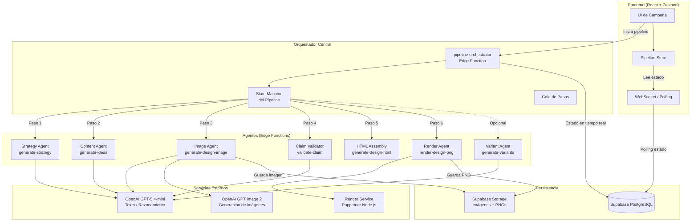

## Flujo de Orquestación — Secuencia Completa

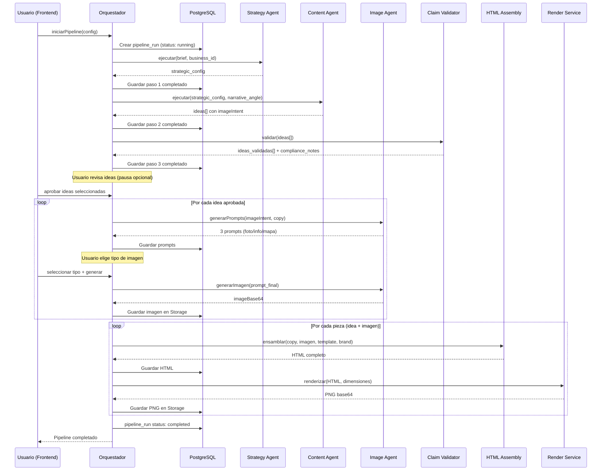


## Components and Interfaces

### Componente 1: Pipeline Orchestrator (Edge Function)

**Propósito**: Coordinar la ejecución secuencial de agentes, manejar estados intermedios, pausas para aprobación del usuario, y reintentos en caso de fallo.

**Interface**:
```typescript
interface PipelineOrchestrator {
  // Inicia un nuevo pipeline run
  startPipeline(input: StartPipelineInput): Promise<PipelineRun>
  
  // Reanuda un pipeline pausado (después de aprobación del usuario)
  resumePipeline(runId: string, action: ResumeAction): Promise<PipelineRun>
  
  // Cancela un pipeline en ejecución
  cancelPipeline(runId: string): Promise<void>
  
  // Reintenta un paso fallido
  retryStep(runId: string, stepId: string): Promise<PipelineRun>
}

interface StartPipelineInput {
  business_id: string
  brief: BriefInput
  options: PipelineOptions
}

interface BriefInput {
  // Puede venir del Strategy Agent o ser manual
  brand: string
  topic: string
  audience: string
  objective: string
  platforms: PlatformFormat[]
  // Dimensiones combinables (opcional)
  branch_id?: string
  vertical_id?: string
  moment_id?: string
  channel?: string
  angle?: string
  narrative_angle_id?: string
  funnel_stage?: FunnelStage
}

interface PipelineOptions {
  autoApprove: boolean          // Si true, no pausa para aprobación
  skipStrategy: boolean         // Si true, usa config manual en vez de Strategy Agent
  skipClaimValidation: boolean  // Si true, salta validación de compliance
  templatePreference?: string   // Template preferido (card, hero, dark, bold)
  templateVariant?: TemplateVariant  // Variante visual
  imageIterations?: number      // Máximo de iteraciones de imagen (default: 1)
  channels: PlatformFormat[]    // Plataformas destino
}

type ResumeAction = 
  | { type: 'approve_ideas'; selectedIds: string[] }
  | { type: 'select_image_type'; ideaId: string; imageType: ImageType }
  | { type: 'approve_image'; ideaId: string }
  | { type: 'iterate_image'; ideaId: string; feedback: string }
  | { type: 'approve_final'; pieceIds: string[] }
```

**Responsabilidades**:
- Crear y mantener el `pipeline_run` en la base de datos
- Ejecutar cada agente en secuencia respetando dependencias
- Pausar la ejecución cuando se requiere input del usuario
- Manejar errores y reintentos con backoff exponencial
- Emitir eventos de progreso para el frontend (via DB polling)

---

### Componente 2: Pipeline State Machine

**Propósito**: Definir los estados válidos del pipeline y las transiciones permitidas.

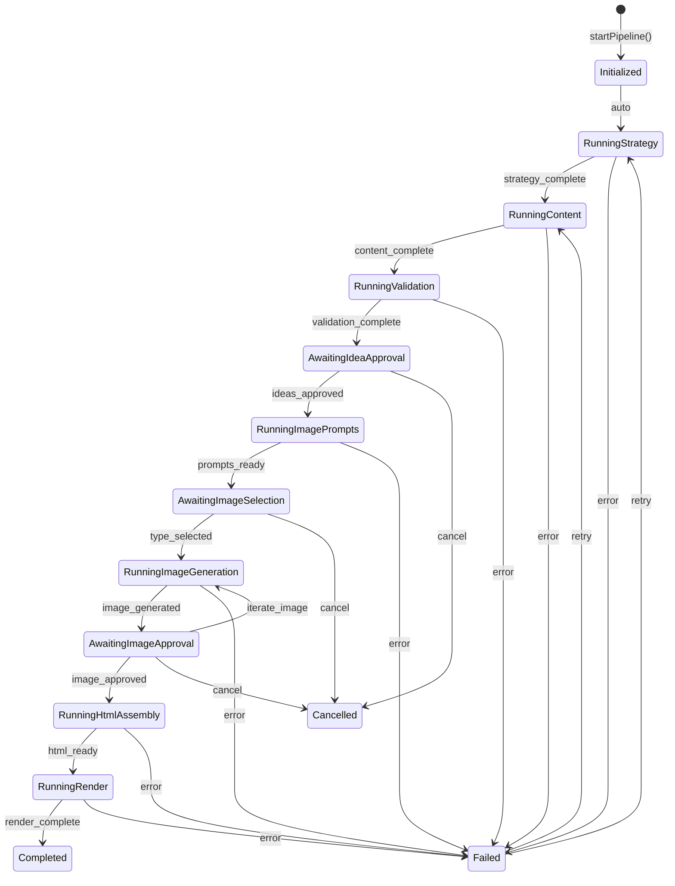

**Interface**:
```typescript
type PipelineStatus =
  | 'initialized'
  | 'running_strategy'
  | 'running_content'
  | 'running_validation'
  | 'awaiting_idea_approval'
  | 'running_image_prompts'
  | 'awaiting_image_selection'
  | 'running_image_generation'
  | 'awaiting_image_approval'
  | 'running_html_assembly'
  | 'running_render'
  | 'completed'
  | 'failed'
  | 'cancelled'

interface PipelineRun {
  id: string
  business_id: string
  status: PipelineStatus
  current_step: number
  total_steps: number
  brief: BriefInput
  options: PipelineOptions
  // Resultados acumulados de cada agente
  strategy_output: StrategyOutput | null
  content_output: ContentAgentOutput | null
  validation_output: ValidationOutput | null
  approved_ideas: string[]  // IDs de ideas aprobadas
  image_outputs: Record<string, ImageGenerateOutput>  // por idea_id
  html_outputs: Record<string, HtmlAssemblyOutput>    // por pieza_id
  render_outputs: Record<string, RenderedItem>        // por pieza_id
  // Metadata
  error: AgentError | null
  created_at: string
  updated_at: string
  completed_at: string | null
}
```

---

### Componente 3: Template Engine (Dinámico)

**Propósito**: Reemplazar el uso de LLM para ensamblaje HTML por un sistema de templates parametrizados con variantes visuales.

**Arquitectura de Templates**:
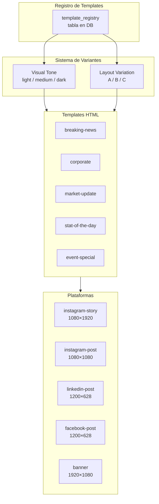

**Interface**:
```typescript
interface TemplateEngine {
  // Obtener template compilado con variantes
  getTemplate(params: TemplateParams): CompiledTemplate
  
  // Inyectar datos en un template
  hydrate(template: CompiledTemplate, data: TemplateData): string
  
  // Listar templates disponibles para un business
  listTemplates(businessId: string): TemplateMetadata[]
  
  // Registrar template custom para un business
  registerTemplate(businessId: string, template: CustomTemplate): void
}

interface TemplateParams {
  contentType: ContentType        // breaking-news, corporate, etc.
  platform: PlatformFormat        // instagram-story, linkedin-post, etc.
  visualTone: VisualTone          // light, medium, dark
  layoutVariation: LayoutVariation // A, B, C
  business_id: string             // Para resolver brand identity
}

type VisualTone = 'light' | 'medium' | 'dark'
type LayoutVariation = 'A' | 'B' | 'C'

interface CompiledTemplate {
  html: string                    // HTML con placeholders {{variable}}
  css: string                     // CSS específico de la variante
  slots: TemplateSlot[]           // Slots disponibles para datos
  dimensions: { width: number; height: number }
}

interface TemplateSlot {
  name: string                    // Nombre del placeholder
  type: 'text' | 'image' | 'component' | 'optional'
  maxLength?: number              // Para texto
  required: boolean
}

interface TemplateData {
  // Datos de copy
  headline: string
  subcopy: string
  cta: string
  footer?: string
  punchline?: string
  dataBadge?: string
  statusPill?: string
  // Datos visuales
  imageUrl: string
  // Brand identity (resuelto desde DB)
  brand: {
    name: string
    logoUrl: string
    colors: { primary: string; secondary: string; accent: string }
    fonts: { display: string; body: string; mono: string }
    disclaimer: string
  }
  // Opcionales
  partner?: { name: string; logoUrl: string; badgeText: string }
  promoter?: { name: string; role: string; photoUrl: string }
  date?: string
  source?: string
}
```

**Variantes Visuales — Detalle**:

| Visual Tone | Descripción | Fondo | Texto | Acentos |
|-------------|-------------|-------|-------|---------|
| `light` | Cream/blanco, profesional limpio | #F5F3F0 / #FFFFFF | #0F1419 | Coral + Turquesa suaves |
| `medium` | Gradientes mesh, vibrante | Mesh gradients | #0F1419 | Coral + Turquesa intensos |
| `dark` | Navy oscuro, financiero premium | #0F1419 | #FFFFFF | Turquesa brillante |

| Layout | Descripción | Composición |
|--------|-------------|-------------|
| `A` | Imagen arriba, copy abajo | Hero photo → Content → CTA |
| `B` | Card centrada con imagen interna | Logo → Card[Image + Copy] → Footer |
| `C` | Split lateral (imagen izq, copy der) | 50/50 o 60/40 split |

**Total combinaciones**: 5 tipos × 5 plataformas × 3 tonos × 3 layouts = **225 variantes** (generadas programáticamente, no 225 archivos).


---

### Componente 4: Brand Registry (Multi-Tenant)

**Propósito**: Centralizar toda la configuración de marca para que el pipeline sea brand-agnostic. Cualquier nuevo negocio onboarded tiene todo lo necesario para generar contenido sin código custom.

**Interface**:
```typescript
interface BrandRegistry {
  // Resolver identidad completa de marca para el pipeline
  resolveBrandIdentity(businessId: string): Promise<ResolvedBrand>
  
  // Validar que un business tiene configuración mínima para pipeline
  validatePipelineReadiness(businessId: string): Promise<ReadinessCheck>
}

interface ResolvedBrand {
  business_id: string
  name: string
  slug: string
  // Visual identity
  logo_url: string
  colors: { primary: string; secondary: string; accent: string }
  fonts: { display: string; body: string; mono: string }
  // Content rules
  disclaimer: string
  compliance: {
    forbidden_terms: string[]
    required_qualifiers: string[]
    max_values: Record<string, string>
  }
  // Pipeline config
  available_templates: string[]
  default_template: string
  cta_bank: string[]
  // Prompt context
  master_prompt: string
  tone_guidelines: string
}

interface ReadinessCheck {
  ready: boolean
  missing: string[]  // Campos faltantes para poder ejecutar pipeline
  warnings: string[] // Campos opcionales no configurados
}
```

---

### Componente 5: Image Iteration Engine

**Propósito**: Permitir mejorar una imagen generada basándose en feedback del usuario, manteniendo coherencia con las reglas de marca y el imageIntent original.

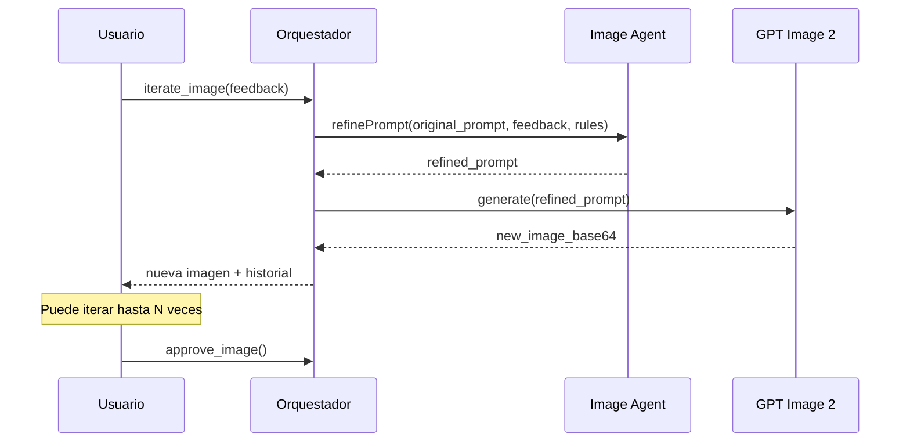

**Interface**:
```typescript
interface ImageIterationEngine {
  // Refinar prompt basado en feedback
  refineImagePrompt(input: RefineInput): Promise<RefinedPrompt>
  
  // Obtener historial de iteraciones
  getIterationHistory(ideaId: string): Promise<ImageIteration[]>
}

interface RefineInput {
  pipeline_run_id: string
  idea_id: string
  original_prompt: string
  original_image_base64: string
  user_feedback: string          // "Hazla más oscura", "Quiero más personas", etc.
  brand_rules: {
    visual_language: string[]
    restrictions: string[]
  }
  iteration_number: number       // Para limitar iteraciones
  max_iterations: number         // Default: 3
}

interface RefinedPrompt {
  prompt_final: string
  changes_applied: string[]      // Qué se cambió respecto al original
  negative_instructions: string
}

interface ImageIteration {
  iteration: number
  prompt_used: string
  image_base64: string
  user_feedback: string | null   // null para la primera
  created_at: string
}
```

---

### Componente 6: Render Service (Node.js + Puppeteer)

**Propósito**: Servicio independiente de renderizado HTML→PNG que puede ser invocado tanto desde Edge Functions como localmente.

**Arquitectura de Deployment**:
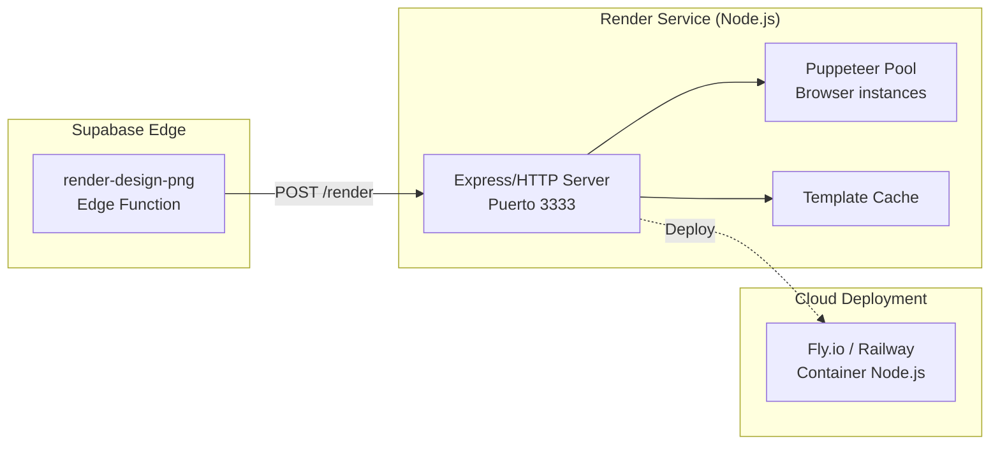

**Interface HTTP**:
```typescript
// POST /render
interface RenderRequest {
  html: string
  width: number
  height: number
  filename: string
  // Opciones avanzadas
  quality?: number        // 1-100, default 90
  format?: 'png' | 'webp'
  waitForFonts?: boolean  // Esperar carga de Google Fonts
}

interface RenderResponse {
  pngBase64: string
  filename: string
  renderTime: number      // ms
}

// POST /render-batch
interface BatchRenderRequest {
  items: RenderRequest[]
  concurrency?: number    // Máximo paralelo, default 3
}

interface BatchRenderResponse {
  results: (RenderResponse | { error: string; filename: string })[]
  totalTime: number
}

// GET /health
interface HealthResponse {
  status: 'ok' | 'degraded'
  puppeteer: boolean
  activePages: number
  uptime: number
}
```

## Data Models

### Modelo 1: pipeline_runs

```sql
CREATE TABLE pipeline_runs (
  id UUID PRIMARY KEY DEFAULT gen_random_uuid(),
  business_id UUID NOT NULL REFERENCES business_tenants(id),
  status TEXT NOT NULL DEFAULT 'initialized',
  current_step INTEGER NOT NULL DEFAULT 0,
  total_steps INTEGER NOT NULL DEFAULT 6,
  
  -- Input
  brief JSONB NOT NULL,
  options JSONB NOT NULL DEFAULT '{}',
  
  -- Outputs acumulados (cada agente escribe su resultado)
  strategy_output JSONB,
  content_output JSONB,
  validation_output JSONB,
  approved_idea_ids TEXT[] DEFAULT '{}',
  
  -- Error tracking
  error JSONB,
  retry_count INTEGER DEFAULT 0,
  
  -- Timestamps
  created_at TIMESTAMPTZ DEFAULT now(),
  updated_at TIMESTAMPTZ DEFAULT now(),
  completed_at TIMESTAMPTZ,
  
  CONSTRAINT valid_status CHECK (status IN (
    'initialized', 'running_strategy', 'running_content',
    'running_validation', 'awaiting_idea_approval',
    'running_image_prompts', 'awaiting_image_selection',
    'running_image_generation', 'awaiting_image_approval',
    'running_html_assembly', 'running_render',
    'completed', 'failed', 'cancelled'
  ))
);

-- RLS: solo el business owner puede ver sus pipeline runs
ALTER TABLE pipeline_runs ENABLE ROW LEVEL SECURITY;
CREATE POLICY "Users can manage own business pipeline runs"
  ON pipeline_runs FOR ALL
  USING (business_id IN (
    SELECT business_id FROM user_business_memberships
    WHERE user_id = auth.uid()
  ));
```

### Modelo 2: pipeline_steps

```sql
CREATE TABLE pipeline_steps (
  id UUID PRIMARY KEY DEFAULT gen_random_uuid(),
  pipeline_run_id UUID NOT NULL REFERENCES pipeline_runs(id) ON DELETE CASCADE,
  step_number INTEGER NOT NULL,
  agent_name TEXT NOT NULL,
  status TEXT NOT NULL DEFAULT 'pending',
  
  -- Input/Output del paso
  input JSONB,
  output JSONB,
  
  -- Timing
  started_at TIMESTAMPTZ,
  completed_at TIMESTAMPTZ,
  duration_ms INTEGER,
  
  -- Error info
  error JSONB,
  retry_count INTEGER DEFAULT 0,
  
  CONSTRAINT valid_step_status CHECK (status IN (
    'pending', 'running', 'completed', 'failed', 'skipped', 'awaiting_input'
  )),
  CONSTRAINT unique_step_per_run UNIQUE (pipeline_run_id, step_number)
);

ALTER TABLE pipeline_steps ENABLE ROW LEVEL SECURITY;
CREATE POLICY "Users can view own pipeline steps"
  ON pipeline_steps FOR ALL
  USING (pipeline_run_id IN (
    SELECT id FROM pipeline_runs
    WHERE business_id IN (
      SELECT business_id FROM user_business_memberships
      WHERE user_id = auth.uid()
    )
  ));
```

### Modelo 3: pipeline_pieces (piezas generadas)

```sql
CREATE TABLE pipeline_pieces (
  id UUID PRIMARY KEY DEFAULT gen_random_uuid(),
  pipeline_run_id UUID NOT NULL REFERENCES pipeline_runs(id) ON DELETE CASCADE,
  business_id UUID NOT NULL REFERENCES business_tenants(id),
  idea_id TEXT NOT NULL,
  
  -- Copy
  headline TEXT NOT NULL,
  body TEXT,
  cta TEXT,
  footer TEXT,
  status_pill TEXT,
  data_badge TEXT,
  image_intent TEXT,
  angle TEXT,
  narrative_angle TEXT,
  funnel_stage TEXT,
  
  -- Image
  image_type TEXT,              -- fotografia, infografia, mapa_rutas
  image_prompt TEXT,
  image_storage_path TEXT,
  image_iterations JSONB DEFAULT '[]',
  
  -- Template & Render
  template_type TEXT,           -- breaking-news, corporate, etc.
  visual_tone TEXT,             -- light, medium, dark
  layout_variation TEXT,        -- A, B, C
  platform TEXT NOT NULL,       -- instagram-story, linkedin-post, etc.
  html_content TEXT,
  png_storage_path TEXT,
  
  -- Compliance
  compliance_status TEXT DEFAULT 'pending',
  compliance_notes JSONB DEFAULT '[]',
  
  -- Status
  piece_status TEXT NOT NULL DEFAULT 'draft',
  
  created_at TIMESTAMPTZ DEFAULT now(),
  updated_at TIMESTAMPTZ DEFAULT now(),
  
  CONSTRAINT valid_piece_status CHECK (piece_status IN (
    'draft', 'content_ready', 'image_ready', 'html_ready', 'rendered', 'approved'
  ))
);

ALTER TABLE pipeline_pieces ENABLE ROW LEVEL SECURITY;
CREATE POLICY "Users can manage own business pieces"
  ON pipeline_pieces FOR ALL
  USING (business_id IN (
    SELECT business_id FROM user_business_memberships
    WHERE user_id = auth.uid()
  ));
```

### Modelo 4: template_registry

```sql
CREATE TABLE template_registry (
  id UUID PRIMARY KEY DEFAULT gen_random_uuid(),
  business_id UUID REFERENCES business_tenants(id), -- NULL = global/default
  
  -- Identificación
  content_type TEXT NOT NULL,    -- breaking-news, corporate, etc.
  platform TEXT NOT NULL,        -- instagram-story, linkedin-post, etc.
  visual_tone TEXT NOT NULL,     -- light, medium, dark
  layout_variation TEXT NOT NULL, -- A, B, C
  
  -- Template content
  html_template TEXT NOT NULL,   -- HTML con {{placeholders}}
  css_overrides TEXT,            -- CSS adicional para esta variante
  slots JSONB NOT NULL,          -- Definición de slots disponibles
  
  -- Metadata
  preview_url TEXT,              -- URL de preview estático
  is_active BOOLEAN DEFAULT true,
  
  created_at TIMESTAMPTZ DEFAULT now(),
  updated_at TIMESTAMPTZ DEFAULT now(),
  
  CONSTRAINT unique_template UNIQUE (
    business_id, content_type, platform, visual_tone, layout_variation
  )
);
```


## Diagrama de Datos — Relaciones

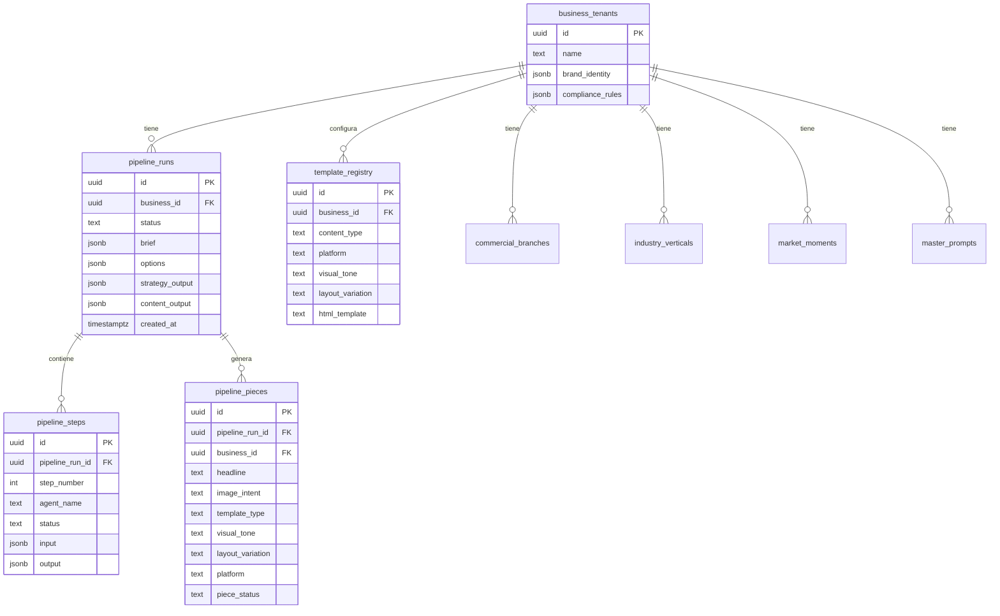

## Correctness Properties

*Una propiedad es una característica o comportamiento que debe mantenerse verdadero en todas las ejecuciones válidas del sistema — esencialmente, una declaración formal sobre lo que el sistema debe hacer. Las propiedades sirven como puente entre especificaciones legibles por humanos y garantías de corrección verificables por máquina.*

### Property 1: Aislamiento de tenant

*Para todo* `pipeline_run` R y todo `business_id` B, si R.business_id ≠ B entonces ningún usuario de B puede leer ni modificar R. Esto aplica igualmente a pipeline_steps, pipeline_pieces, creative_profiles, learning_deltas, y asset_snapshots.

**Validates: Requirements 1.1, 1.2, 1.4, 1.5**

### Property 2: Integridad de estado

*Para todo* `pipeline_run` R, R.status siempre pertenece al conjunto de 14 estados válidos definidos en la state machine, y toda transición de estado sigue una arista válida del diagrama de estados. Cualquier intento de transición inválida es rechazado sin modificar el estado actual.

**Validates: Requirements 2.1, 2.2, 2.3, 2.4**

### Property 3: Idempotencia de pasos

*Para todo* `pipeline_step` S con input determinístico, ejecutar `retryStep(S)` produce el mismo resultado que la primera ejecución exitosa (los agentes son funciones puras sobre su input).

**Validates: Requirements 3.1, 3.2**

### Property 4: Preservación de resultados

*Para todo* `pipeline_run` R con paso N fallido, los outputs de pasos 1..N-1 permanecen intactos, accesibles, y sin modificación después del fallo. Cada output se persiste inmediatamente tras completación exitosa.

**Validates: Requirements 4.1, 4.2, 4.3, 4.4**

### Property 5: Consistencia de templates

*Para toda* combinación válida de `(content_type, platform, visual_tone, layout_variation)`, el Template Engine produce un HTML con dimensiones exactas `PLATFORM_DIMENSIONS[platform]` y todos los placeholders requeridos reemplazados.

**Validates: Requirements 5.1, 5.3, 5.5**

### Property 6: Compliance gate

*Para toda* `pipeline_piece` que alcanza `piece_status = 'rendered'`, existe un registro de validación del Claim_Validator con `riskLevel ≠ 'high'`. Ninguna pieza puede saltarse la validación de compliance en su camino al renderizado.

**Validates: Requirements 6.1, 6.2, 6.4**

### Property 7: Brand isolation en templates

*Para todo* template hydratado con `TemplateData` de business B, el HTML resultante solo contiene assets (logo, colores, fonts, disclaimer) de B — nunca de otro business. Igualmente, el Prompt_Composer solo inyecta datos del creative_profile de B.

**Validates: Requirements 7.1, 7.2, 7.3, 7.4**

### Property 8: Límite de iteraciones

*Para toda* imagen en `pipeline_pieces`, `image_iterations.length ≤ max_iterations` (configurado en `PipelineOptions`, default: 3). Toda solicitud de iteración que exceda el límite es rechazada.

**Validates: Requirements 8.1, 8.2, 8.3, 8.4**

### Property 9: Completitud de pipeline

*Para todo* `pipeline_run` con status `completed`, existe al menos una `pipeline_piece` con `piece_status = 'rendered'` y `png_storage_path IS NOT NULL`. El sistema no permite transicionar a completed sin esta condición.

**Validates: Requirements 9.1, 9.2, 9.3**

### Property 10: Backward compatibility

*Para toda* Edge Function migrada, invocarla con parámetros en formato legacy produce un output con la misma estructura que antes de la migración. Las funciones operan de forma independiente sin requerir el Pipeline_Orchestrator.

**Validates: Requirements 10.1, 10.2, 10.3**

## Error Handling

### Estrategia de Reintentos

| Agente | Tipo de Error | Acción | Max Reintentos |
|--------|---------------|--------|----------------|
| Strategy | API timeout | Retry con backoff | 3 |
| Content | Rate limit (429) | Esperar `retryAfter` + retry | 3 |
| Content | Content policy | Marcar idea, continuar con otras | 0 |
| Image (prompts) | API error | Retry | 2 |
| Image (generate) | Content policy | Regenerar con prompt modificado | 2 |
| Claim Validator | API error | Retry | 2 |
| Claim Validator | High risk | Pausar pipeline, notificar usuario | 0 |
| HTML Assembly | Parse error | Retry con temperature más baja | 2 |
| Render | Service unavailable | Queue + retry cuando disponible | 5 |
| Render | Timeout | Retry con HTML simplificado | 2 |

### Error Scenarios

**Escenario 1: Claim Validator detecta riesgo alto**
- **Condición**: `riskLevel === 'high'` en alguna idea
- **Respuesta**: Pipeline se pausa en `awaiting_idea_approval` con las ideas marcadas
- **Recuperación**: Usuario puede editar la idea manualmente o descartarla

**Escenario 2: Render Service no disponible**
- **Condición**: `RENDER_SERVICE_URL` no responde o no está configurado
- **Respuesta**: Pipeline se pausa en `running_render` con error `render_service_unavailable`
- **Recuperación**: 
  1. Reintentar cuando el servicio esté disponible
  2. Fallback: guardar HTML y permitir render local con `npm run render`

**Escenario 3: Image generation rechazada por content policy**
- **Condición**: OpenAI rechaza el prompt por política de contenido
- **Respuesta**: Image Agent modifica el prompt (elimina términos problemáticos) y reintenta
- **Recuperación**: Si falla 2 veces, pausa para que el usuario modifique el imageIntent

**Escenario 4: Pipeline parcialmente completado**
- **Condición**: Fallo en paso N después de que pasos 1..N-1 completaron
- **Respuesta**: Los resultados previos se preservan en `pipeline_steps`
- **Recuperación**: `retryStep(runId, stepId)` reintenta solo el paso fallido sin re-ejecutar los anteriores

## Testing Strategy

### Unit Testing

- **Pipeline State Machine**: Verificar todas las transiciones válidas e inválidas
- **Template Engine**: Verificar hydration correcta de todos los slots
- **Brand Registry**: Verificar resolución de identidad con datos completos e incompletos
- **Image Iteration**: Verificar que el prompt refinado mantiene coherencia con el original

### Integration Testing

- **Pipeline E2E (mock)**: Ejecutar pipeline completo con agentes mockeados
- **Template Rendering**: Verificar que cada combinación (tipo × plataforma × tono × layout) genera HTML válido
- **Multi-tenant isolation**: Verificar que un business no puede acceder a pipeline_runs de otro

### Property-Based Testing

**Librería**: fast-check (ya disponible en el ecosistema TypeScript)

- **Propiedad 1**: Para cualquier `BriefInput` válido, `startPipeline` siempre crea un `pipeline_run` con status `initialized`
- **Propiedad 2**: Para cualquier combinación de `TemplateParams`, `getTemplate` siempre retorna un `CompiledTemplate` con dimensiones correctas para la plataforma
- **Propiedad 3**: Para cualquier `ResumeAction` en un estado incompatible, el orquestador rechaza con error descriptivo (nunca corrompe el estado)

## Performance Considerations

### Tiempos Estimados por Agente

| Agente | Tiempo Típico | Timeout |
|--------|---------------|---------|
| Strategy | 3-5s | 30s |
| Content (4 ideas) | 5-8s | 60s |
| Claim Validator | 3-5s | 30s |
| Image Prompts | 4-6s | 30s |
| Image Generation (GPT) | 15-30s | 60s |
| HTML Assembly | 5-10s | 120s |
| Render (Puppeteer) | 2-5s | 30s |

**Pipeline completo (1 idea, 1 plataforma)**: ~45-90 segundos
**Pipeline completo (4 ideas, 3 plataformas)**: ~5-8 minutos

### Optimizaciones

1. **Paralelización de Image Prompts**: Generar prompts para todas las ideas aprobadas en paralelo
2. **Batch Rendering**: Enviar múltiples HTMLs al render service en un solo request
3. **Template Caching**: Cachear templates compilados en memoria del Edge Function
4. **Polling optimizado**: Frontend usa polling con intervalo adaptativo (1s durante ejecución, 5s en espera)

## Security Considerations

### Aislamiento Multi-Tenant

- Todas las tablas nuevas (`pipeline_runs`, `pipeline_steps`, `pipeline_pieces`, `template_registry`) tienen RLS habilitado
- Las políticas RLS verifican membresía via `user_business_memberships`
- El orquestador valida `business_id` en cada paso antes de ejecutar
- Los resultados de un pipeline nunca se mezclan entre businesses

### API Keys y Secrets

- `OPENAI_API_KEY`: En Supabase secrets (único proveedor de AI — texto e imágenes)
- `RENDER_SERVICE_URL`: En Supabase secrets (URL del servicio de render)
- `RENDER_SERVICE_TOKEN`: Token de autenticación para el render service (previene uso no autorizado)

### Rate Limiting

- Máximo 5 pipeline runs concurrentes por business
- Máximo 20 image generations por hora por business
- Máximo 100 render requests por hora por business
- Backoff exponencial en caso de 429 de APIs externas

## Dependencies

### Existentes (no requieren instalación)
- Supabase Edge Functions (Deno)
- Supabase PostgreSQL + RLS
- Supabase Storage
- OpenAI API (`gpt-5.4-mini` para texto, `gpt-image-2` para imágenes)
- Puppeteer (en renderer/)

### Nuevas (requieren evaluación)
- **Render Service hosting**: Fly.io, Railway, o Cloud Run para el servicio Puppeteer
- **fast-check**: Para property-based testing (dev dependency)
- No se requieren nuevas dependencias en el frontend — se usa la infraestructura existente (Zustand, TanStack Query, Supabase client)

## Decisiones de Diseño

### Proveedor de AI: OpenAI unificado

Todos los agentes usan **OpenAI** como único proveedor. Esto simplifica la arquitectura (una sola API key, un solo formato de request) y aprovecha que `generate-ideas` y `generate-design-image` ya están migrados.

| Agente | Modelo | Uso |
|--------|--------|-----|
| Strategy | `gpt-5.4-mini` | Generar config estratégica desde brief |
| Content | `gpt-5.4-mini` | Generar ideas de copy con imageIntent |
| Image (prompts) | `gpt-5.4-mini` | Traducir imageIntent a prompts técnicos |
| Image (generación) | `gpt-image-2` | Generar imágenes finales |
| Claim Validator | `gpt-5.4-mini` | Validar compliance de piezas |
| Variant | `gpt-5.4-mini` | Generar variantes de copy |
| HTML Assembly | **Sin LLM** | Template engine parametrizado |
| Render | **Sin LLM** | Puppeteer (HTML → PNG) |

> **Nota de migración**: Las Edge Functions `generate-strategy`, `generate-variants`, `generate-design-html`, y `refine-branch` actualmente usan Anthropic Claude. Como parte de la Fase 1, se migrarán a OpenAI `gpt-5.4-mini` para unificar el proveedor.

### ¿Por qué un Orquestador centralizado vs. encadenamiento directo?

**Opción descartada**: Cada Edge Function llama a la siguiente directamente.
- ❌ No permite pausas para aprobación del usuario
- ❌ Si un paso falla, se pierde todo el contexto
- ❌ No hay visibilidad del progreso
- ❌ Difícil de reintentar pasos individuales

**Opción elegida**: Orquestador central con state machine.
- ✅ Soporta pausas y reanudaciones
- ✅ Estado persistido en DB — sobrevive a timeouts de Edge Functions
- ✅ Frontend puede mostrar progreso en tiempo real
- ✅ Reintentos granulares por paso
- ✅ Fácil de extender con nuevos agentes

### ¿Por qué templates parametrizados vs. LLM para HTML?

**Estado actual**: `generate-design-html` usa LLM para generar HTML completo.
- ❌ Inconsistente — cada generación produce HTML diferente
- ❌ Costoso en tokens (8000 tokens por pieza)
- ❌ Lento (5-10s por pieza)
- ❌ Difícil de mantener brand consistency

**Propuesta**: Sistema híbrido.
- Templates parametrizados para el 80% de los casos (rápido, consistente, sin costo de API)
- LLM como fallback para templates custom o creatividad especial
- El `floating-element` sigue siendo generado por LLM (es la parte creativa)

### ¿Por qué variantes visuales (tone × layout) en vez de más templates?

- 5 tipos × 5 plataformas × 3 tonos × 3 layouts = 225 combinaciones
- Crear 225 archivos HTML es inmantenible
- Un sistema de **CSS variables + layout modifiers** genera todas las variantes desde un template base por tipo/plataforma
- Cada template base tiene slots fijos; las variantes solo cambian colores, fondos, y disposición

## Compatibilidad con Sistema Existente

### Lo que NO cambia
- Edge Functions existentes siguen funcionando individualmente
- El frontend actual puede seguir invocando agentes uno por uno
- Los templates HTML en `renderer/templates/` siguen siendo válidos
- El `designStore.ts` mantiene su API actual
- Las tablas existentes (`design_campaigns`, `design_pieces`) no se modifican

### Lo que se AGREGA
- Nueva Edge Function: `pipeline-orchestrator`
- Nueva Edge Function: `validate-claim`
- Nuevas tablas: `pipeline_runs`, `pipeline_steps`, `pipeline_pieces`, `template_registry`
- Nuevo store: `pipelineStore.ts` (separado del `designStore`)
- Render service deployable (evolución del `render-server.js` existente)

### Modelo de Uso: Agencia Creativa

SCORY Design es una herramienta interna para una agencia creativa que atiende múltiples clientes. El objetivo es que 1-2 personas generen en minutos lo que hoy toma horas o semanas con equipos de diseñadores y copywriters.

**Operador**: El equipo de la agencia (no el cliente final)
**Clientes**: Cada cliente es un `business_tenant` con su propia marca, reglas, y memoria
**Valor**: Reducir el ciclo creativo de semanas → minutos manteniendo calidad y consistencia de marca

### Análisis Competitivo

| Plataforma | Qué hace | Qué NO hace (y SCORY sí) |
|-----------|----------|--------------------------|
| **Google Pomelli** | Escanea web → genera social media on-brand (gratis) | No aprende, no itera, no versiona, no tiene triggers reactivos, no genera PNG final |
| **Jasper AI** ($69/user/mes) | Brand IQ + copy multi-canal + compliance | No genera imágenes, no tiene templates HTML/PNG, no aprende de feedback, solo texto |
| **Adobe GenStudio** (enterprise) | Brand guidelines + variantes copy/imagen/video + templates locked | No aprende de feedback, no tiene triggers reactivos, no evoluciona, pricing enterprise |
| **Canva Enterprise** | Brand Kit + Magic Write + resize automático | No tiene pipeline de agentes, no aprende, no tiene estrategia, no compliance inteligente |

**Diferenciador SCORY Design**:
1. Pipeline completo hasta PNG (idea → copy → imagen → HTML → PNG)
2. Memoria evolutiva que aprende de cada interacción
3. Triggers reactivos (contenido en 60 segundos)
4. Versionado con rollback (como Lovable)
5. Estructura estratégica (categorías, ramas, verticales, momentos)
6. Multi-marca desde una sola interfaz (modelo agencia)

### Migración gradual (reestructurada)
1. **Fase 1**: Pipeline conectado end-to-end (orquestador + migraciones OpenAI + claim validator)
2. **Fase 2**: Versioned Memory Core (snapshots, creative profiles, learning deltas, interaction log)
3. **Fase 3**: Intelligence Layer (prompt composer + feedback interpreter + template selector inteligente)
4. **Fase 4**: Quick Fire + Image Iteration con memoria + Render Service cloud
5. **Fase 5**: Onboarding conversacional + Brand Intelligence Agent

---

## Creative Intelligence Layer

### Filosofía

El sistema NO es un generador. Es un **Creative Intelligence Workflow** donde:
- La IA observa, interpreta, pregunta, escucha, aprende, confirma, avanza por etapas
- El usuario NO configura — conversa, muestra referencias, aprueba, corrige, enseña gustos
- El sistema interpreta, estructura, aprende, propone, guarda, versiona

El usuario está **entrenando un Creative Brain**, no configurando prompts.

### Principio de Interacción

```
IA analiza
  ↓
IA propone interpretación
  ↓
Usuario confirma o corrige
  ↓
IA aprende (learning delta)
  ↓
IA avanza
```

La IA SIEMPRE debe:
1. Confirmar su interpretación
2. Pedir feedback
3. Explicar qué entendió
4. Explicar qué va a cambiar
5. Esperar confirmación antes de avanzar

---

### Componente 7: Conversational Onboarding Engine

**Propósito**: Reemplazar el wizard rígido por una conversación guiada que analiza la marca progresivamente.

**Flujo conversacional**:
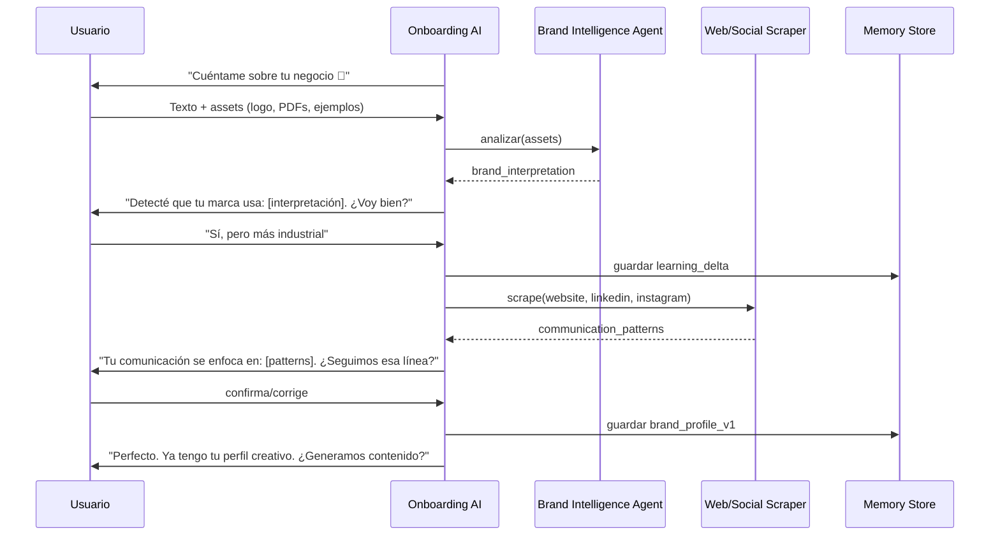

**Interface**:
```typescript
interface ConversationalOnboarding {
  // Iniciar sesión de onboarding
  startOnboarding(businessId: string): Promise<OnboardingSession>
  
  // Procesar mensaje del usuario (texto + assets)
  processMessage(sessionId: string, input: OnboardingInput): Promise<OnboardingResponse>
  
  // Obtener estado actual del onboarding
  getProgress(sessionId: string): Promise<OnboardingProgress>
}

interface OnboardingInput {
  text?: string
  assets?: UploadedAsset[]      // Logos, PDFs, screenshots, referencias
  urls?: string[]               // Sitio web, LinkedIn, Instagram
  confirmation?: boolean        // Respuesta a pregunta de confirmación
  correction?: string           // Corrección a interpretación de la IA
}

interface OnboardingResponse {
  message: string               // Respuesta conversacional de la IA
  interpretation?: BrandInterpretation  // Lo que la IA entendió
  questions?: string[]          // Preguntas de seguimiento
  progress: OnboardingProgress
  next_action: 'await_input' | 'await_confirmation' | 'complete'
}

interface OnboardingProgress {
  phase: 'identity' | 'visual_analysis' | 'communication_analysis' | 'preferences' | 'complete'
  completion_percentage: number
  layers_populated: string[]    // Qué capas de memoria ya tienen datos
}

interface UploadedAsset {
  type: 'logo' | 'brand_manual' | 'visual_reference' | 'screenshot' | 'post_example' | 'pdf'
  url: string
  analysis?: AssetAnalysis      // Resultado del Brand Intelligence Agent
}
```

**Inputs que acepta el usuario**:
- Branding oficial (logo, manual, tipografías, paleta)
- Ejemplos visuales (anuncios que le gustan, diseños anteriores, screenshots, referencias externas, posts favoritos)
- URLs (sitio web, LinkedIn, Instagram)
- Texto libre conversacional

---

### Componente 8: Brand Intelligence Agent

**Propósito**: Analizar assets visuales y detectar patrones de estilo, tono, composición, y estética.

**Edge Function**: `analyze-brand-assets`
**Modelo**: `gpt-5.4-mini` (con vision para análisis de imágenes)

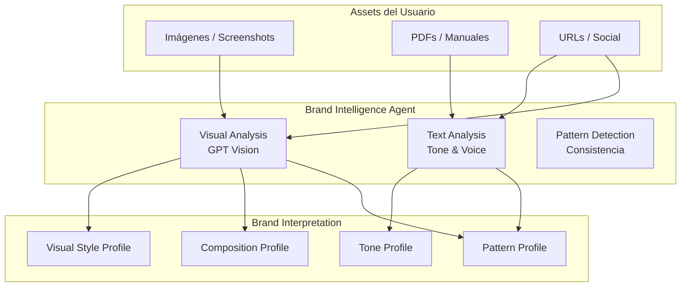

**Interface**:
```typescript
interface BrandIntelligenceAgent {
  // Analizar un conjunto de assets visuales
  analyzeVisuals(assets: UploadedAsset[]): Promise<VisualAnalysis>
  
  // Analizar comunicación (web, social, textos)
  analyzeCommunication(urls: string[], texts?: string[]): Promise<CommunicationAnalysis>
  
  // Generar interpretación consolidada
  consolidate(visual: VisualAnalysis, comm: CommunicationAnalysis): Promise<BrandInterpretation>
}

interface VisualAnalysis {
  dominant_colors: string[]
  aesthetic: string[]           // "dark corporate", "minimal", "industrial"
  composition_patterns: string[] // "centered", "split", "hero-image"
  density: 'minimal' | 'moderate' | 'dense'
  typography_style: string[]    // "serif executive", "sans modern"
  visual_elements: string[]     // "glow", "gradients", "flat", "photography"
  detected_dont: string[]       // Cosas que NO usa la marca
}

interface CommunicationAnalysis {
  tone: string[]                // "ejecutivo", "directo", "provocador"
  topics: string[]              // "riesgo", "compliance", "velocidad"
  audience_signals: string[]    // "CFOs", "tesoreros", "exportadores"
  positioning: string           // Resumen de posicionamiento detectado
  headline_patterns: string[]   // Patrones de headlines encontrados
  cta_patterns: string[]        // Patrones de CTAs
}

interface BrandInterpretation {
  summary: string               // Resumen en lenguaje natural
  visual_style: VisualAnalysis
  communication: CommunicationAnalysis
  confidence: number            // 0-1, qué tan segura está la IA
  questions: string[]           // Preguntas para confirmar/refinar
}
```

---

### Componente 9: Versioned Memory System

**Propósito**: Mantener la memoria creativa en capas versionadas. Nunca overwrite — siempre learning deltas.

**Arquitectura de capas**:
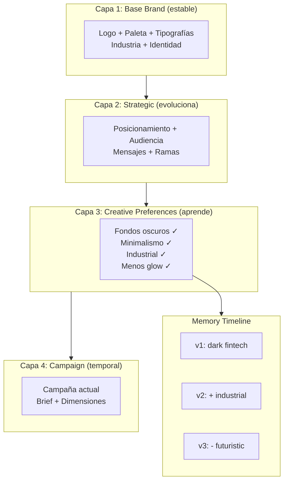

**Data Model**:
```sql
-- Perfil creativo versionado (NUNCA se hace UPDATE, siempre INSERT)
CREATE TABLE creative_profiles (
  id UUID PRIMARY KEY DEFAULT gen_random_uuid(),
  business_id UUID NOT NULL REFERENCES business_tenants(id),
  version INTEGER NOT NULL,
  
  -- Capa 1: Base Brand
  base_brand JSONB NOT NULL,
  
  -- Capa 2: Strategic
  strategic_layer JSONB NOT NULL,
  
  -- Capa 3: Creative Preferences (scoring evolutivo)
  preferences JSONB NOT NULL,
  -- Ejemplo: { "dark_backgrounds": 0.91, "minimalism": 0.87, "industrial": 0.75 }
  
  -- Metadata
  created_at TIMESTAMPTZ DEFAULT now(),
  created_by TEXT,              -- 'onboarding' | 'feedback' | 'manual'
  
  CONSTRAINT unique_version_per_business UNIQUE (business_id, version)
);

-- Learning deltas (cada cambio es un delta, nunca overwrite)
CREATE TABLE learning_deltas (
  id UUID PRIMARY KEY DEFAULT gen_random_uuid(),
  business_id UUID NOT NULL REFERENCES business_tenants(id),
  profile_version INTEGER NOT NULL,  -- Versión que generó este delta
  
  -- Qué cambió
  increase JSONB DEFAULT '[]',   -- ["industrial style", "real-world visuals"]
  decrease JSONB DEFAULT '[]',   -- ["fintech glow", "crypto aesthetics"]
  
  -- Contexto
  trigger_type TEXT NOT NULL,    -- 'user_feedback' | 'approval_pattern' | 'rejection_pattern' | 'explicit_instruction'
  trigger_context TEXT,          -- Qué dijo/hizo el usuario
  
  -- Timestamps
  created_at TIMESTAMPTZ DEFAULT now(),
  
  CONSTRAINT fk_profile FOREIGN KEY (business_id, profile_version) 
    REFERENCES creative_profiles(business_id, version)
);

-- Memory Timeline (historial legible)
CREATE TABLE memory_timeline (
  id UUID PRIMARY KEY DEFAULT gen_random_uuid(),
  business_id UUID NOT NULL REFERENCES business_tenants(id),
  
  event_type TEXT NOT NULL,      -- 'preference_change' | 'style_shift' | 'brand_update' | 'campaign_learning'
  description TEXT NOT NULL,     -- "Cliente prefirió dark fintech"
  delta_id UUID REFERENCES learning_deltas(id),
  
  created_at TIMESTAMPTZ DEFAULT now()
);

-- RLS para todas las tablas
ALTER TABLE creative_profiles ENABLE ROW LEVEL SECURITY;
ALTER TABLE learning_deltas ENABLE ROW LEVEL SECURITY;
ALTER TABLE memory_timeline ENABLE ROW LEVEL SECURITY;

CREATE POLICY "Users can manage own creative profiles"
  ON creative_profiles FOR ALL
  USING (business_id IN (
    SELECT business_id FROM user_business_memberships WHERE user_id = auth.uid()
  ));

CREATE POLICY "Users can manage own learning deltas"
  ON learning_deltas FOR ALL
  USING (business_id IN (
    SELECT business_id FROM user_business_memberships WHERE user_id = auth.uid()
  ));

CREATE POLICY "Users can view own memory timeline"
  ON memory_timeline FOR ALL
  USING (business_id IN (
    SELECT business_id FROM user_business_memberships WHERE user_id = auth.uid()
  ));
```

---

### Componente 10: Feedback Interpreter Agent

**Propósito**: Convertir feedback humano (aprobaciones, rechazos, correcciones, instrucciones) en learning deltas estructurados.

**Edge Function**: `interpret-feedback`
**Modelo**: `gpt-5.4-mini`

**Interface**:
```typescript
interface FeedbackInterpreter {
  // Interpretar feedback explícito del usuario
  interpretExplicit(input: ExplicitFeedback): Promise<LearningDelta>
  
  // Interpretar patrones de aprobación/rechazo
  interpretPatterns(input: PatternFeedback): Promise<LearningDelta>
  
  // Generar resumen de evolución
  summarizeEvolution(businessId: string): Promise<EvolutionSummary>
}

interface ExplicitFeedback {
  business_id: string
  user_message: string          // "Quiero algo más industrial"
  context: {
    current_profile_version: number
    recent_generations: GenerationRef[]
    recent_approvals: string[]
    recent_rejections: string[]
  }
}

interface PatternFeedback {
  business_id: string
  approved_pieces: PieceRef[]   // Piezas aprobadas recientemente
  rejected_pieces: PieceRef[]   // Piezas rechazadas recientemente
  time_window: string           // "last_7_days", "last_30_days"
}

interface LearningDelta {
  increase: string[]            // Atributos a aumentar
  decrease: string[]            // Atributos a reducir
  confidence: number            // 0-1
  explanation: string           // "El usuario consistentemente rechaza estilos con glow"
  trigger_type: 'user_feedback' | 'approval_pattern' | 'rejection_pattern' | 'explicit_instruction'
}

interface EvolutionSummary {
  current_style: string         // Descripción del estilo actual
  evolution_narrative: string   // "Tu marca ha evolucionado hacia..."
  key_shifts: { date: string; description: string }[]
  suggestion?: string           // "¿Quieres consolidar esta nueva línea?"
}
```

**Ejemplo de flujo**:
```
Usuario rechaza 3 piezas con glow → aprueba 2 piezas minimalistas
  ↓
Feedback Interpreter detecta patrón
  ↓
Learning Delta: { decrease: ["glow effects"], increase: ["minimal layouts"] }
  ↓
Creative Profile v1 → v2
  ↓
Próxima generación usa el nuevo perfil
```

---

### Componente 11: Web & Social Scraper Agent

**Propósito**: Analizar presencia web y social de la marca para extraer patrones de comunicación, tono, y posicionamiento.

**Edge Function**: `scrape-brand-presence`

**Interface**:
```typescript
interface WebSocialScraper {
  // Analizar sitio web
  analyzeWebsite(url: string): Promise<WebAnalysis>
  
  // Analizar perfil de LinkedIn
  analyzeLinkedIn(url: string): Promise<SocialAnalysis>
  
  // Analizar perfil de Instagram
  analyzeInstagram(url: string): Promise<SocialAnalysis>
}

interface WebAnalysis {
  brand_name: string
  tagline: string
  value_proposition: string
  tone: string[]
  topics: string[]
  audience_signals: string[]
  visual_style: string[]        // Basado en screenshots del sitio
  cta_patterns: string[]
}

interface SocialAnalysis {
  platform: 'linkedin' | 'instagram'
  posting_frequency: string
  content_themes: string[]
  engagement_patterns: string[]
  visual_consistency: number    // 0-1
  tone: string[]
  top_performing_content: string[]
}
```

---

### Cómo se conecta la Intelligence Layer con el Pipeline

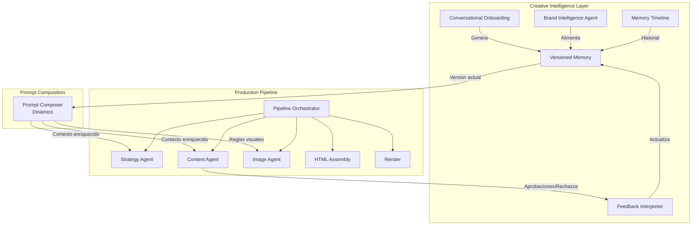

**Flujo integrado**:
1. Intelligence Layer genera/actualiza el `creative_profile` (via onboarding o feedback)
2. Cuando el pipeline se ejecuta, el **Prompt Composer** lee el perfil creativo actual
3. El Prompt Composer inyecta preferencias, restricciones, y learning deltas en los prompts de cada agente
4. Los resultados del pipeline (aprobaciones/rechazos) alimentan al Feedback Interpreter
5. El Feedback Interpreter genera learning deltas → nueva versión del perfil
6. El ciclo se repite: cada generación es mejor que la anterior

---

### Prompt Composer (Dinámico)

**Propósito**: Construir prompts dinámicamente combinando todas las capas de memoria.

**Fórmula**:
```
Prompt Final = System Prompt (rol + reglas)
             + Base Brand (identidad)
             + Strategic Layer (posicionamiento + audiencia)
             + Creative Preferences (scoring actual)
             + Learning Deltas recientes
             + Campaign Context (brief actual)
             + Compliance Rules (restricciones)
             + Negative Constraints (lo que NO hacer)
```

**Interface**:
```typescript
interface PromptComposer {
  // Componer prompt completo para un agente específico
  compose(params: ComposeParams): Promise<ComposedPrompt>
}

interface ComposeParams {
  business_id: string
  agent: 'strategy' | 'content' | 'image' | 'claim_validator' | 'variant'
  campaign_context: {
    brief: BriefInput
    dimensions: GenerationDimensions
  }
  // Opcional: override de preferencias para esta generación
  preference_overrides?: Partial<CreativePreferences>
}

interface ComposedPrompt {
  system_prompt: string
  user_prompt: string
  // Debug info
  layers_used: string[]
  profile_version: number
  total_tokens_estimate: number
}
```

---

### Componente 12: Quick Fire Mode (Reactive Content)

**Propósito**: Generar contenido instantáneo cuando hay un evento urgente (tipo de cambio se disparó, noticia viral, evento de mercado). El usuario solo provee un trigger (imagen, texto, URL) y el sistema genera piezas listas para publicar usando todo el conocimiento de marca ya aprendido.

**Casos de uso**:
- Tipo de cambio se mueve fuerte → pieza de "Breaking News" en 30 segundos
- Noticia viral relevante → contenido reactivo aprovechando el momento
- Evento de mercado (Fed, Banxico) → piezas pre-armadas con datos reales
- Meme o tendencia → adaptación on-brand instantánea

**Flujo**:
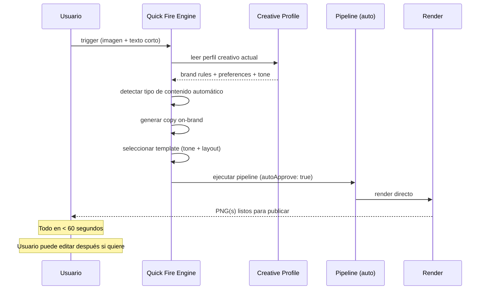

**Interface**:
```typescript
interface QuickFireEngine {
  // Generar contenido reactivo instantáneo
  fire(input: QuickFireInput): Promise<QuickFireOutput>
  
  // Listar triggers pre-configurados (ej: "Fed sube tasas")
  listTriggerTemplates(businessId: string): Promise<TriggerTemplate[]>
  
  // Crear trigger template reutilizable
  createTriggerTemplate(businessId: string, template: TriggerTemplate): Promise<void>
}

interface QuickFireInput {
  business_id: string
  // El trigger puede ser cualquiera de estos:
  image?: string                 // URL o base64 de imagen (screenshot, gráfica, meme)
  text?: string                  // Texto corto: "Dólar a 18.50" o "Fed subió tasas"
  url?: string                   // URL de noticia
  // Opciones
  platforms: PlatformFormat[]    // Default: todas las configuradas
  tone_override?: VisualTone    // Override del tono visual (default: usa perfil)
  urgency: 'instant' | 'review' // instant = sin aprobación, review = pausa para revisar
}

interface QuickFireOutput {
  pieces: QuickFirePiece[]
  generation_time_ms: number
  profile_version_used: number
}

interface QuickFirePiece {
  platform: PlatformFormat
  headline: string
  subcopy: string
  cta: string
  template_used: string
  visual_tone: VisualTone
  layout: LayoutVariation
  image_used: 'provided' | 'generated' | 'stock'
  png_url?: string              // Si urgency = 'instant'
  html_preview?: string         // Si urgency = 'review'
}

interface TriggerTemplate {
  id: string
  name: string                   // "Fed sube tasas", "Dólar se dispara"
  content_type: string           // breaking-news, market-update
  default_angle: string          // velocidad, cobertura, etc.
  copy_template: {
    headline_pattern: string     // "{{evento}} — Lo que significa para tu negocio"
    subcopy_pattern: string
    cta: string
  }
  auto_platforms: PlatformFormat[]
  // Puede tener imagen pre-asignada o generar una nueva
  image_strategy: 'use_provided' | 'generate_new' | 'use_stock'
}
```

**Cómo funciona internamente**:

1. **Detecta tipo de contenido** — Si es una gráfica de tipo de cambio → `market-update`. Si es una noticia → `breaking-news`. Si es un meme → `event-special`.
2. **Lee el perfil creativo** — Sabe el tono, los colores, el disclaimer, las restricciones, las preferencias visuales.
3. **Genera copy instantáneo** — Usa el Content Agent con `autoApprove: true` y contexto mínimo.
4. **Selecciona template automáticamente** — Basado en el tipo de contenido + preferencias del perfil.
5. **Usa la imagen provista** — Si el usuario dio una imagen, la usa directamente (no genera nueva). Si no, genera una rápida o usa stock.
6. **Renderiza directo** — Sin pausa de aprobación (modo `instant`).

**Ejemplo real**:
```
Usuario envía: [screenshot de Bloomberg con USD/MXN a 18.50] + "Dólar se disparó"

Sistema (en 30 segundos):
1. Detecta: market-update + tipo de cambio
2. Lee perfil: dark tone, minimal, Xending brand
3. Genera: "USD/MXN 18.50 — Tu margen no tiene que sufrir"
4. Template: breaking-news / dark / layout-A
5. Imagen: usa el screenshot provisto como hero
6. Render: PNG para Instagram Story + LinkedIn + Facebook

→ 3 PNGs listos para publicar
```

**Trigger Templates pre-configurados** (por marca):
| Trigger | Tipo | Ángulo | Plataformas |
|---------|------|--------|-------------|
| Fed sube/baja tasas | breaking-news | cobertura | Todas |
| Dólar se mueve >1% | market-update | velocidad | IG Story + LinkedIn |
| Banxico anuncia | breaking-news | cobertura | Todas |
| Evento de industria | event-special | confianza | LinkedIn + Facebook |
| Dato viral relevante | stat-of-the-day | ahorro | IG Story + IG Post |

---

### Correctness Properties (Intelligence Layer)

### Property 11: No-overwrite de memoria
Para todo `creative_profile` P, nunca se ejecuta UPDATE sobre P. Solo se crean nuevas versiones via INSERT.

### Property 12: Trazabilidad de aprendizaje
Para todo `learning_delta` D, existe un `trigger_context` que explica por qué se generó D. Ningún cambio de preferencia es inexplicable.

### Property 13: Reversibilidad
Para todo `creative_profile` versión N, es posible reconstruir el estado del perfil en cualquier versión anterior M (M < N) consultando la cadena de deltas.

### Property 14: Confirmación antes de aprendizaje
Ningún `learning_delta` con `trigger_type = 'explicit_instruction'` se aplica sin confirmación previa del usuario.

### Property 15: Aislamiento de memoria entre tenants
Para todo `creative_profile` CP y `learning_delta` LD, CP.business_id = LD.business_id. Nunca se mezclan aprendizajes entre marcas.
