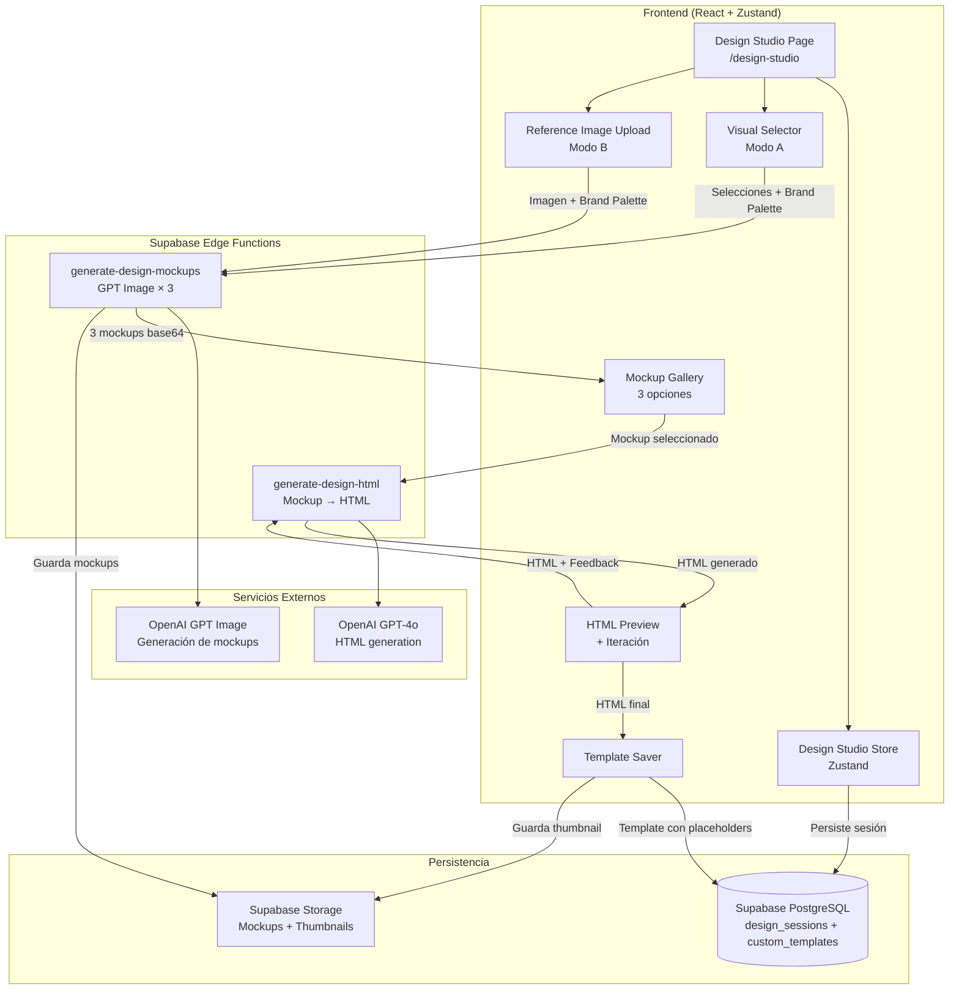
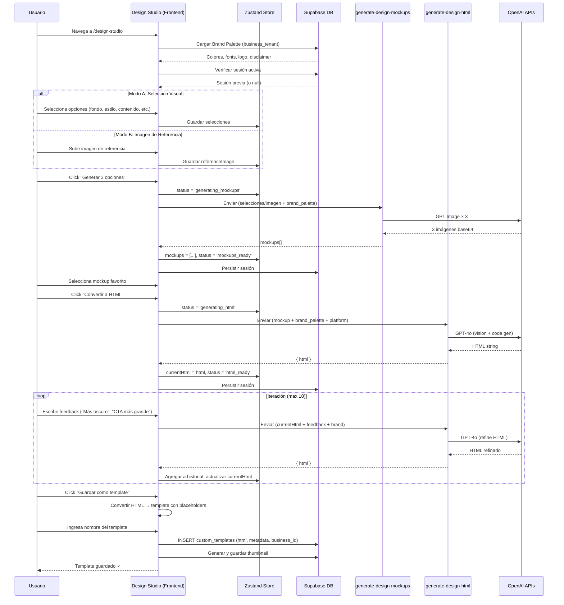
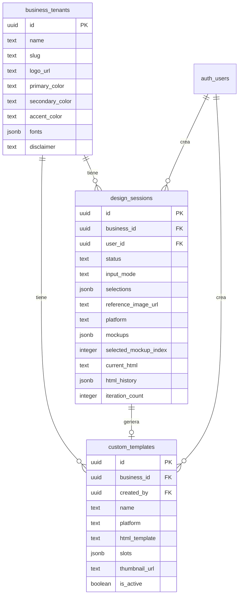

# Documento de Diseño: Design Studio

## Overview

El Design Studio es una herramienta dedicada dentro de SCORY Design que permite a los usuarios crear nuevos templates de diseño usando IA generativa. A diferencia del flujo diario (que consume templates estáticos), el Design Studio es donde **nacen** nuevos templates.

El flujo principal es:
1. El usuario configura parámetros de diseño (Modo A: selección visual, o Modo B: imagen de referencia)
2. GPT Image genera 3 mockups visuales
3. El usuario selecciona uno y lo convierte a HTML funcional
4. El usuario itera sobre el HTML con feedback en lenguaje natural
5. El HTML finalizado se guarda como template reutilizable con placeholders

La arquitectura se integra con los patrones existentes del proyecto: Zustand para estado local, React Query para operaciones asíncronas, Supabase Edge Functions para lógica de generación, y el sistema multi-tenant existente para aislamiento de datos.

## Architecture



## Flujo de Usuario — Secuencia Completa



## Components and Interfaces

### Componente 1: Design Studio Page (`/design-studio`)

**Propósito**: Página principal que orquesta el flujo completo de creación de templates. Maneja la navegación entre pasos y coordina los sub-componentes.

**Interface**:
```typescript
// Página principal — no recibe props, usa hooks internos
const DesignStudioPage: React.FC = () => { ... }

// Sub-componentes internos:
// - BrandPalettePreview: muestra colores/fonts cargados
// - ModeSelector: tabs para Modo A / Modo B
// - VisualSelector: pills/buttons para Modo A
// - ReferenceImageUploader: drag & drop para Modo B
// - MockupGallery: grid de 3 opciones generadas
// - HtmlPreviewPanel: iframe con preview + campo de iteración
// - TemplateSaveDialog: modal para nombrar y guardar
```

---

### Componente 2: Design Studio Store (Zustand)

**Propósito**: Manejar todo el estado de la sesión de diseño, incluyendo selecciones, mockups, HTML, iteraciones, y estado de carga.

**Interface**:
```typescript
interface DesignStudioState {
  // --- Sesión ---
  sessionId: string | null
  sessionStatus: DesignSessionStatus

  // --- Brand Palette (cargada automáticamente) ---
  brandPalette: BrandPalette | null

  // --- Modo de entrada ---
  inputMode: 'visual' | 'reference'

  // --- Modo A: Selecciones visuales ---
  selections: VisualSelections

  // --- Modo B: Imagen de referencia ---
  referenceImage: File | null
  referenceImagePreview: string | null
  referenceDescription: string

  // --- Plataforma ---
  selectedPlatform: PlatformFormat | null

  // --- Mockups generados ---
  mockups: GeneratedMockup[]
  selectedMockupIndex: number | null

  // --- HTML ---
  currentHtml: string | null
  htmlHistory: HtmlIteration[]
  iterationCount: number

  // --- Loading states ---
  isGeneratingMockups: boolean
  isGeneratingHtml: boolean
  isSaving: boolean
  error: string | null
}

interface DesignStudioActions {
  // Sesión
  initSession(): void
  restoreSession(session: DesignSession): void
  discardSession(): void
  markSessionCompleted(): void

  // Selecciones
  setInputMode(mode: 'visual' | 'reference'): void
  setSelection(category: SelectionCategory, value: string): void
  setCustomValue(category: SelectionCategory, value: string): void
  setPlatform(platform: PlatformFormat): void

  // Referencia
  setReferenceImage(file: File | null): void
  setReferenceDescription(desc: string): void

  // Mockups
  setMockups(mockups: GeneratedMockup[]): void
  selectMockup(index: number): void

  // HTML
  setCurrentHtml(html: string): void
  addIteration(html: string, feedback: string): void

  // Loading
  setGeneratingMockups(loading: boolean): void
  setGeneratingHtml(loading: boolean): void
  setSaving(loading: boolean): void
  setError(error: string | null): void

  // Reset
  reset(): void
}

type DesignStudioStore = DesignStudioState & DesignStudioActions
```

---

### Componente 3: Visual Selector

**Propósito**: UI de selección por categorías con pills/buttons clickeables. Construye internamente el prompt de generación combinando selecciones con la Brand Palette.

**Interface**:
```typescript
interface VisualSelectorProps {
  selections: VisualSelections
  onSelect: (category: SelectionCategory, value: string) => void
  onCustomValue: (category: SelectionCategory, value: string) => void
}

interface VisualSelections {
  background: string | null    // 'dark-navy' | 'light-cream' | 'color-turquoise' | custom
  visualStyle: string | null   // 'minimalist' | 'glassmorphism' | 'bold' | 'financial' | 'gradients' | 'hero-photo' | custom
  contentType: string | null   // 'stat' | 'news' | 'educational' | 'promo' | 'comparison' | 'event' | 'testimonial' | custom
  heroElement: string | null   // 'big-number' | 'main-photo' | 'icon' | 'floating-badge' | 'no-image' | custom
  platform: PlatformFormat | null
}

type SelectionCategory = 'background' | 'visualStyle' | 'contentType' | 'heroElement' | 'platform'

// Configuración de opciones por categoría
interface CategoryConfig {
  id: SelectionCategory
  label: string
  options: SelectionOption[]
  allowCustom: boolean
}

interface SelectionOption {
  value: string
  label: string
  icon?: string  // Lucide icon name
  description?: string
}
```

---

### Componente 4: Mockup Generation Hook

**Propósito**: Invocar la Edge Function `generate-design-mockups` para generar 3 variantes visuales usando GPT Image.

**Interface**:
```typescript
interface GenerateMockupsRequest {
  business_id: string
  brand_palette: BrandPalette
  mode: 'visual' | 'reference'
  // Modo A
  selections?: VisualSelections
  // Modo B
  reference_image_base64?: string
  reference_description?: string
  // Común
  platform: PlatformFormat
  count: 3
}

interface GenerateMockupsResponse {
  mockups: GeneratedMockup[]
}

interface GeneratedMockup {
  index: number
  image_base64: string
  prompt_used: string
}

// Hook
function useGenerateMockups() {
  return useMutation<GenerateMockupsResponse, Error, GenerateMockupsRequest>({
    mutationFn: generateMockups,
    mutationKey: ['generate-design-mockups'],
  })
}
```

---

### Componente 5: HTML Generation & Iteration Hook

**Propósito**: Reutilizar y extender el hook existente `useGenerateDesignHtml` para soportar el flujo de conversión mockup→HTML y las iteraciones con feedback.

**Interface**:
```typescript
interface DesignHtmlFromMockupRequest {
  business_id: string
  brand_palette: BrandPalette
  mockup_image_base64: string
  platform: PlatformFormat
  // Para iteraciones
  current_html?: string
  iteration_feedback?: string
}

interface DesignHtmlResponse {
  html: string
}

// Hook extendido
function useGenerateDesignHtml() {
  return useMutation<DesignHtmlResponse, Error, DesignHtmlFromMockupRequest>({
    mutationFn: generateDesignHtml,
    mutationKey: ['generate-design-html'],
  })
}
```

---

### Componente 6: Template Converter

**Propósito**: Transformar HTML finalizado en un template reutilizable reemplazando contenido dinámico con placeholders estándar.

**Interface**:
```typescript
interface TemplateConverterInput {
  html: string
  brand_palette: BrandPalette
}

interface TemplateConverterOutput {
  template_html: string          // HTML con {{placeholders}}
  detected_slots: TemplateSlot[] // Slots detectados
}

interface TemplateSlot {
  name: string                   // 'headline' | 'subcopy' | 'cta' | 'imageUrl' | 'disclaimer'
  type: 'text' | 'image'
  required: boolean
}

// Función pura — se ejecuta en el frontend
function convertToTemplate(input: TemplateConverterInput): TemplateConverterOutput
```

---

### Componente 7: Template Persistence Hook

**Propósito**: Guardar el template convertido en la base de datos con metadata y generar thumbnail de preview.

**Interface**:
```typescript
interface SaveTemplateRequest {
  name: string
  business_id: string
  template_html: string
  platform: PlatformFormat
  slots: TemplateSlot[]
  source_mockup_url?: string
  thumbnail_base64?: string
}

interface SaveTemplateResponse {
  id: string
  name: string
  created_at: string
}

function useSaveTemplate() {
  return useMutation<SaveTemplateResponse, Error, SaveTemplateRequest>({
    mutationFn: saveTemplate,
    mutationKey: ['save-custom-template'],
  })
}
```

---

### Componente 8: Session Persistence Hook

**Propósito**: Persistir y restaurar el estado de la Design Session para que el usuario no pierda progreso al navegar.

**Interface**:
```typescript
interface DesignSession {
  id: string
  business_id: string
  status: DesignSessionStatus
  input_mode: 'visual' | 'reference'
  selections: VisualSelections | null
  reference_image_url: string | null
  reference_description: string | null
  platform: PlatformFormat | null
  mockups: GeneratedMockup[]
  selected_mockup_index: number | null
  current_html: string | null
  html_history: HtmlIteration[]
  iteration_count: number
  created_at: string
  updated_at: string
}

type DesignSessionStatus = 'active' | 'completed' | 'discarded'

interface HtmlIteration {
  version: number
  html: string
  feedback: string | null  // null para la primera versión
  created_at: string
}

function useDesignSession() {
  return {
    // Cargar sesión activa del usuario
    activeSession: useQuery(...)
    // Persistir estado actual
    persistSession: useMutation(...)
    // Marcar como completada
    completeSession: useMutation(...)
    // Descartar sesión
    discardSession: useMutation(...)
  }
}
```

## Data Models

### Modelo 1: design_sessions

```sql
CREATE TABLE design_sessions (
  id UUID PRIMARY KEY DEFAULT gen_random_uuid(),
  business_id UUID NOT NULL REFERENCES business_tenants(id),
  user_id UUID NOT NULL REFERENCES auth.users(id),
  status TEXT NOT NULL DEFAULT 'active',

  -- Input configuration
  input_mode TEXT NOT NULL DEFAULT 'visual',
  selections JSONB,                    -- VisualSelections (Modo A)
  reference_image_url TEXT,            -- Storage path (Modo B)
  reference_description TEXT,
  platform TEXT,

  -- Generated mockups
  mockups JSONB DEFAULT '[]',          -- GeneratedMockup[]
  selected_mockup_index INTEGER,

  -- HTML state
  current_html TEXT,
  html_history JSONB DEFAULT '[]',     -- HtmlIteration[]
  iteration_count INTEGER DEFAULT 0,

  -- Timestamps
  created_at TIMESTAMPTZ DEFAULT now(),
  updated_at TIMESTAMPTZ DEFAULT now(),

  CONSTRAINT valid_session_status CHECK (status IN ('active', 'completed', 'discarded')),
  CONSTRAINT valid_input_mode CHECK (input_mode IN ('visual', 'reference')),
  CONSTRAINT max_iterations CHECK (iteration_count <= 10)
);

-- RLS: usuarios solo ven sus propias sesiones del business activo
ALTER TABLE design_sessions ENABLE ROW LEVEL SECURITY;

CREATE POLICY "Users can manage own design sessions"
  ON design_sessions FOR ALL
  USING (
    business_id IN (
      SELECT business_id FROM user_business_memberships
      WHERE user_id = auth.uid()
    )
    AND user_id = auth.uid()
  );

-- Índice para buscar sesión activa rápidamente
CREATE INDEX idx_design_sessions_active
  ON design_sessions (business_id, user_id, status)
  WHERE status = 'active';
```

### Modelo 2: custom_templates

```sql
CREATE TABLE custom_templates (
  id UUID PRIMARY KEY DEFAULT gen_random_uuid(),
  business_id UUID NOT NULL REFERENCES business_tenants(id),
  created_by UUID NOT NULL REFERENCES auth.users(id),

  -- Identificación
  name TEXT NOT NULL,
  platform TEXT NOT NULL,

  -- Template content
  html_template TEXT NOT NULL,         -- HTML con {{placeholders}}
  slots JSONB NOT NULL DEFAULT '[]',   -- TemplateSlot[]

  -- Preview
  thumbnail_url TEXT,                  -- Storage path del thumbnail

  -- Source tracking
  source_session_id UUID REFERENCES design_sessions(id),
  source_mockup_url TEXT,

  -- Status
  is_active BOOLEAN DEFAULT true,

  -- Timestamps
  created_at TIMESTAMPTZ DEFAULT now(),
  updated_at TIMESTAMPTZ DEFAULT now(),

  CONSTRAINT valid_platform CHECK (platform IN (
    'instagram-story', 'instagram-post', 'facebook-post', 'linkedin-post', 'banner'
  ))
);

-- RLS: aislamiento multi-tenant estricto
ALTER TABLE custom_templates ENABLE ROW LEVEL SECURITY;

CREATE POLICY "Users can manage own business templates"
  ON custom_templates FOR ALL
  USING (
    business_id IN (
      SELECT business_id FROM user_business_memberships
      WHERE user_id = auth.uid()
    )
  );

-- Índice para listar templates por business
CREATE INDEX idx_custom_templates_business
  ON custom_templates (business_id, is_active, platform)
  WHERE is_active = true;
```

### Diagrama de Relaciones




## Correctness Properties

*Una propiedad es una característica o comportamiento que debe mantenerse verdadero en todas las ejecuciones válidas del sistema — esencialmente, una declaración formal sobre lo que el sistema debe hacer. Las propiedades sirven como puente entre especificaciones legibles por humanos y garantías de corrección verificables por máquina.*

### Property 1: Validación de Brand Palette detecta campos faltantes

*Para cualquier* objeto BrandPalette con campos arbitrariamente presentes o ausentes, la función de validación debe retornar exactamente la lista de campos requeridos faltantes (primary_color, logo_url). Si todos los campos requeridos están presentes, la validación debe pasar sin errores.

**Validates: Requirements 2.3**

### Property 2: Selección única por categoría

*Para cualquier* categoría del Visual Selector y cualquier secuencia de selecciones dentro de esa categoría, solo la última opción seleccionada debe estar marcada como activa. Seleccionar una nueva opción debe deseleccionar la anterior.

**Validates: Requirements 3.2**

### Property 3: Plataforma requerida para generación

*Para cualquier* combinación de selecciones visuales, el botón de generación debe estar habilitado si y solo si la plataforma seleccionada no es null. Ninguna otra combinación de selecciones (fondo, estilo, contenido, elemento) debe afectar la habilitación del botón sin plataforma.

**Validates: Requirements 3.4**

### Property 4: Completitud del prompt de generación

*Para cualquier* conjunto válido de VisualSelections (con al menos plataforma seleccionada) y cualquier BrandPalette completa, el prompt construido debe contener referencias a todas las selecciones no-null del usuario y a los elementos de identidad de marca (colores, tipografías, logo).

**Validates: Requirements 3.5, 5.6**

### Property 5: Validación de archivo de referencia

*Para cualquier* archivo, la validación de upload debe aceptarlo si y solo si su formato pertenece a {PNG, JPG, WEBP, PDF} Y su tamaño es ≤ 10MB. Cualquier archivo que no cumpla ambas condiciones debe ser rechazado con un mensaje de error descriptivo.

**Validates: Requirements 4.1, 4.5**

### Property 6: Dimensiones del preview coinciden con la plataforma

*Para cualquier* PlatformFormat seleccionada, el contenedor del HTML Preview debe tener dimensiones exactamente iguales a PLATFORM_DIMENSIONS[platform] (width × height). Cambiar la plataforma debe actualizar las dimensiones del preview.

**Validates: Requirements 6.3, 10.2**

### Property 7: HTML generado contiene identidad de marca

*Para cualquier* BrandPalette y cualquier HTML generado por el sistema, el HTML resultante debe contener referencias al primary_color de la paleta, al menos una de las tipografías configuradas, y el logo_url del negocio.

**Validates: Requirements 6.4**

### Property 8: Invariantes de iteración

*Para cualquier* Design Session, el iteration_count debe ser siempre ≤ 10, y el largo de html_history debe ser siempre igual a iteration_count + 1 (versión inicial + iteraciones). Toda solicitud de iteración cuando iteration_count = 10 debe ser rechazada sin modificar el estado.

**Validates: Requirements 7.4, 7.5**

### Property 9: Conversión a template produce placeholders válidos

*Para cualquier* HTML finalizado que contenga texto de contenido dinámico, la función convertToTemplate debe producir HTML donde el contenido dinámico es reemplazado por los placeholders estándar (`{{headline}}`, `{{subcopy}}`, `{{cta}}`, `{{imageUrl}}`, `{{disclaimer}}`). El HTML resultante debe ser parseable y contener al menos `{{headline}}` y `{{subcopy}}`.

**Validates: Requirements 8.1**

### Property 10: Hydratación de template es round-trip consistente

*Para cualquier* template HTML con placeholders estándar y cualquier ContentData válido, hidratar el template debe reemplazar todos los tokens `{{placeholder}}` con los valores correspondientes del ContentData. El HTML resultante no debe contener tokens `{{...}}` sin resolver para campos presentes en ContentData.

**Validates: Requirements 9.3**

### Property 11: Aislamiento multi-tenant de templates

*Para cualquier* business_id B y cualquier consulta de templates personalizados, todos los templates retornados deben tener business_id = B. Ningún template de otro business debe ser accesible, y intentar acceder a un template de otro business debe resultar en una respuesta vacía (no "forbidden").

**Validates: Requirements 9.4, 11.2, 11.4**

### Property 12: Persistencia de sesión round-trip

*Para cualquier* estado válido de DesignSession (con selecciones, mockups, HTML, historial), persistir el estado a la base de datos y luego restaurarlo debe producir un objeto de estado equivalente al original. Ningún dato debe perderse en el ciclo de persistencia/restauración.

**Validates: Requirements 12.2**

### Property 13: Controles deshabilitados durante carga

*Para cualquier* estado donde isGeneratingMockups = true O isGeneratingHtml = true, todos los controles de entrada (Visual Selector, upload, botones de acción) deben estar deshabilitados. Los controles solo se rehabilitan cuando ambos flags son false.

**Validates: Requirements 13.1**

## Error Handling

### Estrategia General

| Operación | Tipo de Error | Acción | Reintentos |
|-----------|---------------|--------|------------|
| Carga de Brand Palette | DB error | Mostrar error + enlace a config | 1 (auto) |
| Upload de imagen | Formato inválido | Mensaje descriptivo inline | 0 |
| Upload de imagen | Tamaño excedido | Mensaje con límite (10MB) | 0 |
| Generación de mockups | API timeout | Toast + botón reintentar | 2 (manual) |
| Generación de mockups | Content policy | Mensaje + sugerir cambiar selecciones | 0 |
| Generación de mockups | Rate limit (429) | Esperar + retry automático | 2 |
| Conversión a HTML | API timeout | Toast + botón reintentar | 2 (manual) |
| Conversión a HTML | Content policy | Mensaje + sugerir otro mockup | 0 |
| Iteración HTML | API error | Toast + mantener versión anterior | 1 (manual) |
| Guardar template | DB error | Toast error + reintentar | 1 (manual) |
| Guardar template | Nombre vacío | Validación inline, bloquear save | 0 |
| Persistencia de sesión | DB error | Silencioso (log), retry en background | 3 (auto) |
| Pérdida de conexión | Network error | Banner persistente + retry al reconectar | Auto |

### Escenarios de Error Detallados

**Escenario 1: Content Policy Violation en mockups**
- **Condición**: GPT Image rechaza el prompt por violación de políticas
- **Respuesta**: Mostrar mensaje "El contenido solicitado no pudo generarse. Intenta modificar tus selecciones."
- **Recuperación**: Usuario modifica selecciones y reintenta

**Escenario 2: Timeout en generación (>60s)**
- **Condición**: La Edge Function no responde en 60 segundos
- **Respuesta**: Cancelar request, mostrar "La operación tardó demasiado"
- **Recuperación**: Botón "Reintentar" que re-ejecuta la misma operación

**Escenario 3: Sesión corrupta o incompatible**
- **Condición**: La sesión restaurada tiene un schema incompatible (por actualización de la app)
- **Respuesta**: Descartar sesión silenciosamente, iniciar nueva
- **Recuperación**: Automática — el usuario ve un estado limpio

**Escenario 4: Límite de iteraciones alcanzado**
- **Condición**: iteration_count = 10
- **Respuesta**: Deshabilitar campo de feedback, mostrar mensaje "Has alcanzado el máximo de iteraciones. Guarda el template o descarta la sesión."
- **Recuperación**: Guardar template actual o descartar sesión para empezar de nuevo

**Escenario 5: Pérdida de conexión durante generación**
- **Condición**: `navigator.onLine` cambia a false o fetch falla con TypeError
- **Respuesta**: Banner fijo "Sin conexión a internet. La operación se reintentará al reconectar."
- **Recuperación**: Listener en `online` event para reintentar automáticamente

## Testing Strategy

### Enfoque Dual: Unit Tests + Property Tests

El Design Studio combina lógica pura (validación, conversión de templates, construcción de prompts) con interacciones de UI y llamadas a APIs externas. La estrategia de testing refleja esta dualidad:

### Unit Tests (Vitest)

Cubren escenarios específicos y edge cases:
- Renderizado de componentes con estados específicos (loading, error, success)
- Interacciones de UI (click en pills, upload de archivos, navegación entre pasos)
- Integración con Supabase (mocked) para persistencia
- Edge cases: sesión corrupta, campos faltantes, errores de red

### Property-Based Tests (fast-check + Vitest)

Cubren propiedades universales que deben mantenerse para todos los inputs válidos:

**Librería**: `fast-check` (ya instalada en devDependencies)
**Configuración**: Mínimo 100 iteraciones por propiedad
**Tag format**: `Feature: design-studio, Property {N}: {título}`

**Properties a implementar:**

1. **Validación de Brand Palette** — Genera BrandPalette con campos aleatorios presentes/ausentes → verifica detección correcta de faltantes
2. **Selección única por categoría** — Genera secuencias aleatorias de selecciones → verifica que solo la última está activa
3. **Plataforma requerida** — Genera combinaciones aleatorias de selecciones → verifica botón habilitado ↔ platform ≠ null
4. **Completitud del prompt** — Genera selecciones + paleta aleatorias → verifica que el prompt contiene todas las referencias
5. **Validación de archivo** — Genera archivos con formato/tamaño aleatorios → verifica accept/reject correcto
6. **Dimensiones del preview** — Para cada plataforma, verifica dimensiones exactas
7. **HTML contiene brand** — Genera paletas aleatorias → verifica presencia en HTML mock
8. **Invariantes de iteración** — Genera secuencias de iteraciones → verifica count ≤ 10 y history.length = count + 1
9. **Conversión a template** — Genera HTML con contenido aleatorio → verifica presencia de placeholders
10. **Hydratación round-trip** — Genera templates + content → verifica que no quedan tokens sin resolver
11. **Aislamiento multi-tenant** — Genera queries con business_ids aleatorios → verifica filtrado correcto
12. **Persistencia round-trip** — Genera estados de sesión aleatorios → verifica serialize/deserialize equivalencia
13. **Controles deshabilitados** — Genera estados de loading aleatorios → verifica disabled correcto

### Integration Tests

Cubren la comunicación con servicios externos (con mocks de Supabase):
- Carga de Brand Palette desde `business_tenants`
- Invocación de Edge Functions (generate-design-mockups, generate-design-html)
- Persistencia de sesiones y templates en la base de datos
- Políticas RLS (verificar aislamiento a nivel de DB)

### Estructura de Archivos de Test

```
src/
├── hooks/
│   ├── __tests__/
│   │   ├── useDesignStudioSession.test.ts
│   │   ├── useGenerateMockups.test.ts
│   │   └── useSaveTemplate.test.ts
├── components/
│   ├── design-studio/
│   │   ├── __tests__/
│   │   │   ├── VisualSelector.test.tsx
│   │   │   ├── MockupGallery.test.tsx
│   │   │   ├── HtmlPreviewPanel.test.tsx
│   │   │   └── TemplateSaveDialog.test.tsx
├── utils/
│   ├── design-studio/
│   │   ├── __tests__/
│   │   │   ├── promptBuilder.test.ts
│   │   │   ├── promptBuilder.property.test.ts
│   │   │   ├── templateConverter.test.ts
│   │   │   ├── templateConverter.property.test.ts
│   │   │   ├── fileValidator.test.ts
│   │   │   ├── fileValidator.property.test.ts
│   │   │   ├── brandPaletteValidator.test.ts
│   │   │   ├── brandPaletteValidator.property.test.ts
│   │   │   └── sessionSerializer.property.test.ts
```
