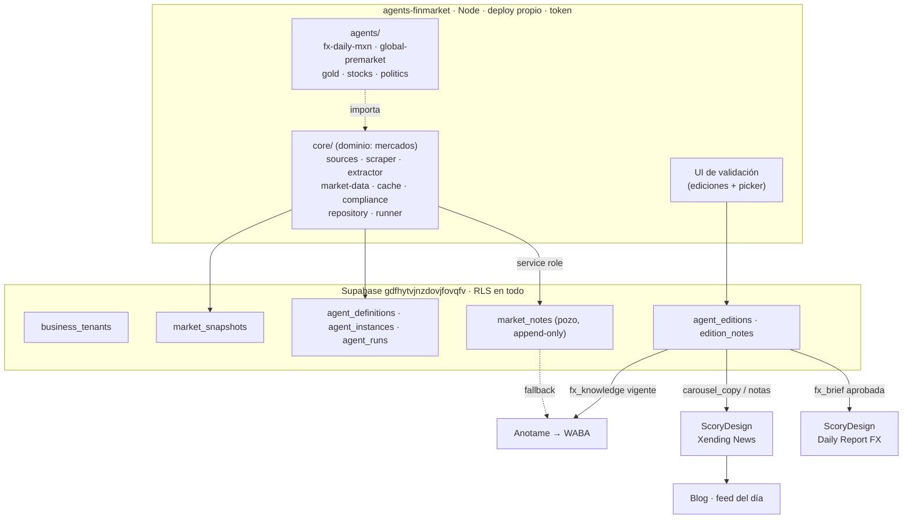

# Agents-Finmarket — Plan de implementación

## 1. Contexto: qué existe hoy

### ScoryDesign (`F:\ScoryDesign`)

Aplicación Vite + React + TypeScript, multi-tenant.

| Pieza | Detalle |
|---|---|
| Tenencia | `business_tenants` + `user_business_memberships` (migración `20260501`), RLS por membresía |
| Arranque | `AuthGate` → `useInitActiveBusiness` → rutas |
| Modo | `VITE_DEPLOYMENT_MODE` = `single` \| `multi` |
| Edge functions | 32, entre ellas `generate-fx-daily`, `generate-news-plan`, `generate-news-visuals`, `generate-carousel-plan`, `generate-carousel-script`, `validate-claim`, `compliance-wizard` |
| Sidecar | `renderer/scripts/render-server.js`, puerto 3333, Puppeteer HTML→PNG/PDF, auth por `RENDER_SERVICE_TOKEN` |
| Design Studio | 3 pestañas: Estudio · Xending News · Daily Report FX |

Dos módulos editoriales **deliberadamente separados**, según el header de `_shared/news/news-types.ts`:

- **Xending News** — carrusel de noticias. `news_editions` (`raw_input`, `input_format`, `normalized`, `slide_plan`, `visual_plan`, `slides`). `NewsDomain` cubre `fx`, `rates`, `commodities`, `geopolitics`, `equities`, `central_bank`. `NewsInputFormat` acepta `'markdown' | 'json' | 'paste' | 'morning_brief'`.
- **Carrusel comercial** — `CarouselPanel.tsx`, `generate-carousel-plan`. Rutas narrativas, preflight, crítico, `computeCarouselFx`, `MARKUP_PCT`, montos ilustrativos. Para vender coberturas.

Puntos de inserción del feed:

- `src/components/design-studio/FxDailyPanel.tsx:184` — `<Textarea>` sobre `fx.rawInput`
- `src/components/design-studio/NewsPanel.tsx:303` — `<Textarea>` sobre `news.rawInput`

### MarketXending (`E:\MarketXending`)

Monolito con CRM, KYC, Monex, PLD, Forwards, Holding Accounts, y una copia vieja de Xending Design. **Queda atrás.**

Los agentes viven en `fx-pdf-generator/`, un Express en el puerto 3002:

| Archivo | Función |
|---|---|
| `AnalysisService.js` | Daily FX Agent (USD/MXN) |
| `NewsAgentService.js` | Mexico News Agent / Morning Brief |
| `NewsScraperV2.js` | Scraper híbrido, `constructor(scope='mx'\|'global')` |
| `StoryAgentService.js` | Story picker + Carousel Agent |
| `MarketDataService.js` | Spot, calendario, vision sobre gráficas |
| `MarketDataCache.js` | Caché de scraping |
| `SupabaseRepository.js` | `daily_fx_reports`, `market_data_snapshots`, bucket `market-screenshots` |

Salidas en disco local: `reports/drafts`, `reports/daily`, `reports/mexico-news`. `DailyFxReportsPage.tsx` es solo un cliente HTTP a `localhost:3002`.

### Supabase compartido

Ambos repos linkeados a `gdfhytvjnzdovjfovqfv`. Nueve edge functions con nombre duplicado entre repos: `adapt-channel`, `generate-design-copy`, `generate-design-html`, `generate-design-image`, `generate-ideas`, `generate-strategy`, `generate-variants`, `refine-branch`, `render-design-png`. El último deploy gana.

### El flujo manual de hoy

```
MarketXending :3002
  corré agente → draft .md en disco → editás en UI → aprobás → PDF
                                    ↓
                            Ctrl+C el markdown
                                    ↓
ScoryDesign Design Studio
  Ctrl+V en el textarea → generate-fx-daily → imagen del día
```

Lo mismo para el carrusel: `story_picker_*.md` con checkboxes → `carrusel_*.md` → Ctrl+C → Xending News → imágenes.

---

## 2. El problema

1. Los agentes están presos en un repo que se abandona, escribiendo a disco de una sola PC.
2. Sus salidas son documentos terminales. No se puede preguntar "todas las notas sobre Banxico de septiembre".
3. No hay trazabilidad de una afirmación a su fuente.
4. Llegar a diseño exige copiar y pegar entre proyectos.
5. No hay base consultable para alimentar un agente de WhatsApp ni un blog.

---

## 3. Decisiones de arquitectura

### 3.1 Los agentes salen de ScoryDesign, no entran

ScoryDesign es un agente de diseño. Su contrato con el mundo ya es genérico: "dame texto crudo, yo lo convierto en diseño". No sabe qué es Banxico ni scrapea.

Lo que hoy vive ahí con nombre FX (`_shared/fx-daily/`, `generate-fx-daily`, `buildFxDailyHtml`) son **plantillas y adaptadores de formato**, que es trabajo de diseño legítimo. Lo que está en MarketXending (`NewsScraperV2`, `MarketDataService`, vision sobre gráficas) es **obtención de datos de un dominio**, y eso sí contaminaría.

**Decisión:** repo nuevo `agents-finmarket`. ScoryDesign no gana ni una línea de lógica financiera.

### 3.2 Un `core/` compartido, acotado a mercados financieros

No es un core universal de agentes. Es el core de agentes que leen notas, gráficos y precios de mercados. Otro dominio (legal, salud) sería otro core.

### 3.3 Configuración, no clones

`NewsScraperV2` ya lo demuestra: `scope='mx'|'global'` corre el mismo pipeline contra distinta lista de fuentes. La única diferencia son dos arrays hardcodeados.

Un agente nuevo (oro, euro, política, acciones) es una carpeta con config y prompts. Cero código duplicado.

### 3.4 Aislamiento verificable por lint

| Import | Permitido |
|---|---|
| `agents/*` → `core/` | sí |
| `core/` → `agents/*` | **nunca** |
| `agents/a` → `agents/b` | **nunca** |

Se fuerza con ESLint `no-restricted-imports`. No depende de disciplina.

**Test para decidir dónde va algo:** si para soportar oro tuvieras que escribir `if (agentType === 'gold')` dentro de `core/`, eso va en la config del agente.

### 3.5 El pozo es acumulativo, las ediciones son fotos fechadas

`market_notes` es append-only. A las 8:30 hay 15 notas, a las 10:30 hay 19, a las 14:00 hay 23. Nada se borra ni se corrige. Siempre está al día por construcción.

Una edición es un snapshot con hora. La de 8:30 dice "esto se sabía a las 8:30". No queda desactualizada cuando entran notas nuevas, porque nunca pretendió estar actualizada.

Esto elimina la pregunta "¿esta edición está al día?".

### 3.6 Tres tipos de edición con reglas distintas

| `edition_type` | Forma | Validación humana | Se versiona | Consumidor |
|---|---|---|---|---|
| `fx_brief` | corta, resumida, como hoy | **sí** | no, foto de las 8:30 | Daily Report FX |
| `fx_knowledge` | larga, estructurada, sin resumir | no | **sí, cada 2-3h** | Anotame / WhatsApp / blog / página |
| `carousel_copy` | copy por nota | sí | no | Xending News |

### 3.7 La edición de conocimiento se versiona, no se reescribe

Cada regeneración crea una versión nueva que reemplaza a la anterior como vigente, con `supersedes_id` apuntando atrás.

**Por qué:** si el agente contesta algo raro en WhatsApp a las 14:00, podés ver exactamente qué tenía enfrente. Reescribir en su lugar te quita eso para siempre.

**Cómo queda un solo archivo al final del día:** con retención, no con reescritura.

- La consulta "el conocimiento de tal día" devuelve **una fila**: la final.
- Las intermedias existen con `status='superseded'` y ninguna UI las lista.
- Solo aparecen si preguntás explícitamente por el historial.
- Un job de limpieza las borra a los 7 días. Queda la final para siempre.
- La final del día es el insumo del recuento del sábado.

Nunca ves cinco archivos casi iguales.

### 3.8 Para que no invente: estructura, no volumen

Prosa larga no baja la alucinación. Lo que la baja es que cada dato venga con su fuente pegada.

`agent_editions` lleva `markdown` **y** `structured jsonb`, donde cada cifra y cada afirmación tiene su `source_url` al lado. El agente conversacional lee el JSON. Es el mismo principio de `news_editions.normalized`.

### 3.9 Dos fechas por nota

- `note_date` — cuándo pasó o se publicó el hecho
- `first_seen_at` — cuándo lo vimos nosotros

La composición **no** filtra por `note_date = hoy`, filtra por "notas no cubiertas desde la última edición". Así la edición de la mañana abarca todo desde el cierre anterior, cruzando medianoche sin lógica especial. La nota de las 8:30 sobre la decisión de la Fed de ayer entra correctamente.

### 3.10 El anti-repetición es una query, no un prompt

`edition_notes` registra qué notas usó cada edición. Al componer la #2 del día se excluyen las ya cubiertas. El modelo recibe solo material nuevo y no tiene nada que recordar.

Es el patrón que ya existe en `generate-carousel-plan` con `excludeRouteIds` y `priorPlanDigests`: el código saca opciones del catálogo antes de llamar al modelo, en vez de rogarle que no repita.

### 3.11 La validación humana va en las ediciones publicables, no en el pozo

El pozo se llena solo. El camino conversacional consulta directo y siempre tiene lo más fresco sin esperar a nadie.

**Consecuencia a cubrir:** información financiera generada sin humano en el medio, con la regla "solo información, no asesoría". Eso tiene que estar forzado en código, no en el prompt. Se reutiliza `business_tenants.compliance_rules`, `forbidden_terms` y el concepto de `validate-claim`.

### 3.12 El picker son dos campos

- `market_notes.suggested` — lo que el agente propone por default
- `market_notes.status` — tu decisión

Agrupado por `agent_instance_id`, así con FX, global, política, oro y acciones no ves 60 notas revueltas. Se selecciona por agente o cruzando, como hoy hace el carrusel combinando FX + Global.

### 3.13 El carrusel de noticias es Xending News, no el carrusel comercial

Corrección importante. Son productos distintos, y `news-types.ts` lo declara: *"Son DELIBERADAMENTE independientes de los tipos del carrusel comercial… News comparte la plomería, nunca el ADN."*

El carrusel de noticias que se hace hoy ya lo hace **Xending News**. MarketXending solo produce el *copy*. **El carrusel no cambia.** Lo único que cambia es de dónde llega el copy.

### 3.14 Cadencia partida

| Etapa | Frecuencia | Por qué |
|---|---|---|
| Ingesta (portadas → notas → dedupe) | cada 2-3h | barato, `content_hash` filtra lo repetido |
| Deep scrape (artículo completo) | solo notas nuevas `impact=high` | ya funciona así en `NewsScraperV2` |
| Composición | 1x/día o on-demand | es lo caro, no gana nada 3 veces |

Regla que lo hace escalable: **la ingesta no depende de la composición, y la composición no reescribe nada.** Se pueden agregar oro y acciones al ciclo de ingesta sin tocar el de composición.

### 3.15 Multi-tenant sobre un id canónico

Tres modelos de tenencia van a coexistir. Si no reconcilian en un solo id, terminás con tablas de mapeo entre tres sistemas.

| Sistema | Tenencia |
|---|---|
| ScoryDesign | `business_tenants` + `user_business_memberships` |
| Anotame | ruteo por número de WABA |
| Agents-Finmarket | `agent_instances.business_id` |

`business_tenants.id` es el id canónico. Aldea Nómada es una fila ahí. "Aldea Nómada quiere daily FX, noticias políticas, diseño y WhatsApp" son cuatro filas, no cuatro integraciones.

*Deuda conocida, no bloqueante:* `business_tenants` hoy tiene `logo_url`, `primary_color`, `fonts`, `disclaimer`, `compliance_rules`. Es 60% config de marca, peso muerto para agentes y WhatsApp. En algún momento se parte en identidad + perfil de marca.

### 3.16 Seguridad desde el primer commit

- Todos los endpoints exigen Bearer token. `/health` no expone datos.
- CORS por allowlist, nunca `*`.
- Rate limit global, no solo en un endpoint.
- RLS en todas las tablas.
- `SUPABASE_SERVICE_ROLE_KEY` solo en variables de entorno, nunca en código.

**Razón:** el servicio escribe en nombre de varios tenants. Hoy `fx-pdf-generator/server.js` tiene `cors()` abierto y rate limit solo en la generación de PDF. Desplegado así, cualquiera con la URL dispara corridas y lee drafts.

### 3.17 Nada en disco como registro

Todo a Supabase. `MarketDataCache` sigue siendo local porque es optimización de costo de scraping, no almacén de verdad.

---

## 4. Arquitectura objetivo



---

## 5. Modelo de datos

Nombres, columnas y valores de enum en inglés snake_case. Labels en la UI en español.

### `agent_definitions` — catálogo de tipos

| Columna | Tipo | Notas |
|---|---|---|
| `id` | uuid PK | |
| `agent_type` | text UNIQUE | `news_scraper`, `market_analyzer` |
| `name` | text | |
| `default_config` | jsonb | fuentes, keywords, instrumento |
| `edition_types` | text[] | qué produce |
| `requires_approval` | jsonb | por tipo de edición |
| `is_versioned` | jsonb | por tipo de edición |

### `agent_instances` — un agente configurado para un tenant

| Columna | Tipo | Notas |
|---|---|---|
| `id` | uuid PK | |
| `business_id` | uuid FK → `business_tenants` | |
| `agent_type` | text FK → `agent_definitions` | |
| `name` | text | "Daily FX México" |
| `config` | jsonb | sobreescribe `default_config` |
| `schedule` | text | expresión cron |
| `enabled` | boolean | |

### `agent_runs` — bitácora

| Columna | Tipo | Notas |
|---|---|---|
| `id` | uuid PK | |
| `agent_instance_id` | uuid FK | |
| `business_id` | uuid FK | |
| `run_type` | text | `ingest` \| `compose` |
| `started_at` / `finished_at` | timestamptz | |
| `status` | text | `running` \| `success` \| `failed` \| `partial` |
| `stats` | jsonb | notas nuevas, descartadas, fuentes leídas, tokens, costo |
| `error` | text | |

### `market_notes` — el pozo (fuente de verdad)

| Columna | Tipo | Notas |
|---|---|---|
| `id` | uuid PK | |
| `business_id` | uuid FK | |
| `agent_instance_id` | uuid FK | para agrupar el picker |
| `run_id` | uuid FK | |
| `headline` | text | |
| `subhead` | text | |
| `body` | text | prosa limpia, cap `NEWS_ARTICLE_MAX_CHARS` |
| `summary` | text | |
| `source_name` | text | |
| `source_url` | text NOT NULL | trazabilidad |
| `note_date` | date | cuándo pasó el hecho |
| `first_seen_at` | timestamptz | cuándo lo vimos |
| `impact` | text | `high` \| `medium` \| `low` |
| `tags` | text[] | |
| `language` | text | |
| `content_hash` | text | dedupe |
| `suggested` | boolean | propuesta del agente |
| `status` | text | `new` \| `selected` \| `discarded` \| `published` |

Índice único `(business_id, content_hash)`. **Append-only:** el repositorio nunca hace UPDATE sobre contenido, solo sobre `status`.

### `agent_editions` — documentos compuestos

| Columna | Tipo | Notas |
|---|---|---|
| `id` | uuid PK | |
| `business_id` | uuid FK | |
| `agent_instance_id` | uuid FK | |
| `edition_type` | text | `fx_brief` \| `fx_knowledge` \| `carousel_copy` |
| `edition_date` | date | |
| `version` | int | 1, 2, 3… |
| `supersedes_id` | uuid FK self | |
| `title` | text | |
| `markdown` | text | |
| `structured` | jsonb | cada dato con su `source_url` |
| `status` | text | `draft` \| `approved` \| `superseded` \| `final` \| `discarded` |
| `approved_by` / `approved_at` | uuid / timestamptz | |

Índice parcial para "la vigente de hoy". Una `approved` o `final` no se modifica.

### `edition_notes` — trazabilidad y anti-repetición

| Columna | Tipo |
|---|---|
| `edition_id` | uuid FK |
| `note_id` | uuid FK |
| `position` | int |

PK compuesta `(edition_id, note_id)`.

### `market_snapshots` — precios y series

| Columna | Tipo | Notas |
|---|---|---|
| `id` | uuid PK | |
| `business_id` | uuid FK | |
| `instrument` | text | `USDMXN`, `XAUUSD` |
| `snapshot_date` | date | |
| `snapshot_time` | timestamptz | |
| `data_type` | text | `spot` \| `calendar` \| `chart_meta` \| `vision` |
| `data` | jsonb | |
| `source` | text | |

RLS por `business_id` en las seis tablas. Worker con service role, consumidores con RLS.

---

## 6. Estructura del repo

```
agents-finmarket/
├── package.json
├── .env.example
├── eslint.config.js          ← no-restricted-imports: la frontera
├── server.js                 ← HTTP, token obligatorio, CORS allowlist
│
├── core/                     ← dominio: mercados financieros. Nunca importa de agents/
│   ├── sources/
│   │   ├── investing.js
│   │   ├── banxico.js
│   │   ├── eleconomista.js
│   │   ├── elfinanciero.js
│   │   ├── bloomberglinea.js
│   │   ├── expansion.js
│   │   ├── milenio.js
│   │   └── index.js          ← registry de adaptadores
│   ├── scraper.js            ← NewsScraperV2 sin los arrays
│   ├── extractor.js          ← LLM: markdown → items
│   ├── market-data.js        ← precios/series por instrumento
│   ├── cache.js              ← MarketDataCache tal cual
│   ├── compliance.js         ← forbidden_terms + compliance_rules
│   ├── repository.js         ← escribe el sobre genérico
│   └── runner.js             ← cron, retry, logging, tenant
│
├── agents/                   ← una carpeta cada uno. Cero imports entre hermanos
│   ├── fx-daily-mxn/
│   │   ├── config.js         ← sources, keywords, instrument, edition_types
│   │   └── prompts/
│   ├── global-premarket/
│   ├── gold/                 ← futuro
│   ├── stocks/               ← futuro
│   └── politics/             ← futuro
│
├── ui/                       ← validación: corridas, picker, ediciones
└── tests/
    └── fixtures/             ← HTML/markdown guardados por adaptador
```

---

## 7. El día operativo

```
06:00 ─ ingesta: 8 portadas → extractor → notas nuevas al pozo
        deep scrape de las high nuevas (3 a 7 según el día)
08:00 ─ compose fx_knowledge v1  (larga, estructurada, sin validar)
08:30 ─ compose fx_brief draft   (corta, espera validación humana)

  ↓ en la UI de agentes
        revisás el brief, lo editás, lo aprobás
        ajustás el picker (vienen las suggested premarcadas)

  ↓ ScoryDesign · Design Studio
        pestaña Daily Report FX → "Traer del feed" → "Apertura de hoy"
        → generate-fx-daily → kit de objetos → imagen del día
        pestaña Xending News → "Traer del feed" → notas seleccionadas
        → generate-news-plan → generate-news-visuals → carrusel

  ↓ blog
        imagen + encabezado + nota + link a la fuente, feed cronológico

10:30 ─ ingesta → fx_knowledge v2 (reemplaza v1 como vigente)
13:00 ─ ingesta → fx_knowledge v3
15:30 ─ ingesta → fx_knowledge v4
cierre ─ la última se marca final; las intermedias quedan superseded
         y salen de toda consulta salvo historial (borradas a los 7 días)

sábado ─ recuento semanal sobre las 5 finales de la semana (futuro)
```

En paralelo y sin esperar validación: Anotame consulta la `fx_knowledge` vigente y contesta por WhatsApp con `source_url` en mano.

---

## 8. Tareas

### Fase 1 — El pozo

**Task 1: Bootstrap de `agents-finmarket` con aislamiento y seguridad verificables**

*Objetivo:* repo funcionando con la frontera arquitectónica y la puerta de seguridad puestas antes de escribir lógica.

*Guía:* `package.json` con dependencias pinneadas (express, puppeteer-extra + stealth, openai, @anthropic-ai/sdk, @supabase/supabase-js, node-cron, dotenv), `.env.example` sin un solo secreto real, árbol `core/` + `agents/`. `server.js` donde todos los endpoints exigen Bearer token y `/health` no expone datos. CORS por allowlist. Rate limit global. ESLint `no-restricted-imports` prohibiendo `agents/* → agents/*` y `core/* → agents/*`.

*Tests:* import agente→agente falla el lint; agente→core pasa; petición sin token da 401; origen no permitido rechazado.

*Demo:* `npm run dev` levanta, cualquier endpoint sin token da 401, y `npm run lint` se pone rojo si se escribe un import prohibido. La no contaminación y la seguridad quedan mecánicas.

**Task 2: Schema del pozo y las ediciones, con RLS**

*Objetivo:* la fuente de verdad existe, aislada por tenant, con inmutabilidad y versionado forzados por la base.

*Guía:* migración con las seis tablas de la sección 5. Índice único `(business_id, content_hash)`. Índice parcial para la vigente de `fx_knowledge`. Reglas por tipo de edición en `agent_definitions.requires_approval` e `is_versioned`. RLS por `business_id` en todas. Política de retención de `superseded` a 7 días. Inglés snake_case en DB.

*Tests:* nota duplicada falla; un tenant no ve al otro; `note_date` distinto de `first_seen_at`; una `fx_brief` aprobada no se puede modificar; una versión nueva de `fx_knowledge` marca `supersedes_id` y la query de vigente devuelve una sola fila.

*Demo:* seed con Xending y una instancia `fx-daily-mxn`. Las queries "notas no cubiertas desde la última edición" y "conocimiento vigente de hoy" corren y devuelven vacío.

**Task 3: Portar `core/sources`, `core/scraper`, `core/cache`**

*Objetivo:* el pipeline de scraping sobrevive la mudanza y queda parametrizado por fuente.

*Guía:* `NewsScraperV2.js` → `core/scraper.js` sin `mxSources` ni `globalSources`: recibe las fuentes por argumento. Un adaptador por sitio en `core/sources/`, preservando limpieza de boilerplate, `NEWS_ARTICLE_MIN_CHARS` y el rechazo de paywalls y soft-404. `MarketDataCache.js` → `core/cache.js` sin cambios.

*Tests:* fixtures por adaptador incluyendo un paywall que debe rechazarse; scraper con dos fuentes mock devuelve markdown limpio sin tocar la red.

*Demo:* `npm run scrape -- --sources=mx` escupe el markdown de las 8 fuentes a stdout. Sin LLM, sin DB, sin costo de tokens.

**Task 4: `core/extractor` + pozo append-only con dedupe**

*Objetivo:* las notas del día quedan en la base con su fuente, y correr dos veces no duplica.

*Guía:* extracción con LLM (markdown → items con encabezado, snippet, impacto, fuente, `suggested`). Escritura vía `core/repository.js` con `content_hash` sobre título normalizado + fuente. Deep scrape de las `high` con los límites existentes (`deepScrapeMax`, `deepScrapeMin`). El repositorio solo inserta contenido.

*Tests:* dos corridas sobre la misma fixture insertan N y luego 0; cambio solo de snippet no duplica; `source_url` siempre presente; un UPDATE de contenido falla.

*Demo:* corrida real. En Supabase se ven las notas del día con encabezado, cuerpo, URL de origen y marca de sugerida. Segunda corrida: cero duplicados.

**Task 5: `agents/fx-daily-mxn/` como pura configuración**

*Objetivo:* probar que un agente es config, y que un tenant puede tener la suya.

*Guía:* carpeta con solo `config.js` (fuentes, keywords de impacto, instrumento, idioma, `edition_types`) y los prompts. Cero código de scraping. `agent_instances.config` sobreescribe los defaults, que es el mecanismo para vender el servicio con otras fuentes.

*Tests:* la definición resuelve a los mismos 8 adaptadores que `scope='mx'`; una fuente extra en `agent_instances.config` se agrega sin tocar el agente; dos tenants con configs distintas del mismo tipo no se pisan.

*Demo:* `npm run agent fx-daily-mxn` corre la ingesta completa. Comparar las notas contra el `story_picker_<hoy>.md` de MarketXending del mismo día: mismas notas, ahora en la base, con fuente, y multi-tenant.

### Fase 2 — Ediciones, picker y validación

**Task 6: `core/runner` con la cadencia partida**

*Objetivo:* los agentes corren solos, con bitácora, y los dos ciclos quedan desacoplados.

*Guía:* scheduler que lee `agent_instances.schedule`, registra cada corrida en `agent_runs` con stats, duración, notas nuevas, descartadas, costo y error. Ingesta cada 2-3h; composición en su propio ciclo.

*Tests:* reloj inyectado ejecuta y escribe `agent_runs`; fallo del scraper queda `failed` sin tumbar el proceso; dos instancias del mismo tipo corren independientes; la ingesta corre sin composición configurada.

*Demo:* unas horas corriendo y se ven 3-4 corridas de ingesta, notas acumulándose sin duplicados, y ninguna composición disparada.

**Task 7: `core/market-data` por instrumento**

*Objetivo:* los precios y series dejan de estar atados a USD/MXN.

*Guía:* `MarketDataService.js` generalizado, instrumento desde config. Escribe a `market_snapshots`. La vision sobre gráficas queda como capacidad opcional de un adaptador, no del core.

*Tests:* fixture de spot parsea; instrumento desconocido falla con mensaje claro en vez de silencio; dos instrumentos del mismo día no colisionan.

*Demo:* spot y calendario del día en `market_snapshots`, consultables por instrumento y fecha.

**Task 8: Edición de conocimiento — larga, estructurada, versionada, con cierre de día**

*Objetivo:* la base de conocimiento del día contra la que va a hablar el agente, auditable hora por hora y consolidada a una sola al cierre.

*Guía:* composer de `fx_knowledge` que lee **todas** las notas del ciclo (es la base completa, no el delta), las ordena por `first_seen_at`, y produce markdown más `structured jsonb` donde cada dato lleva su `source_url`. Cada corrida crea versión nueva con `supersedes_id`; la anterior pasa a `superseded`. Sin validación humana. Job de cierre que marca la última como `final`. Job de limpieza que borra `superseded` a los 7 días.

*Tests:* la v2 contiene todo lo de la v1 más lo nuevo; la query de vigente devuelve una sola fila; cada entrada del `structured` tiene `source_url` no nulo; el orden cronológico se respeta al cruzar medianoche; el cierre deja exactamente una `final` por día; la limpieza no toca `final`.

*Demo:* ingesta de las 8:00 → conocimiento v1. Notas a las 10:30 → v2 como vigente, con v1 en historial. Al cierre queda una sola.

**Task 9: Edición corta `fx_brief` + guardrail de compliance**

*Objetivo:* el análisis resumido, con fuentes rastreables, y la puerta de compliance forzada en código.

*Guía:* portar `AnalysisService` y `NewsAgentService` como composers: leen notas no cubiertas vía `edition_notes`, producen markdown, guardan como `draft`. `core/compliance.js` aplica `forbidden_terms` y `compliance_rules` del tenant sobre todo texto generado, reutilizando el concepto de `validate-claim`. **Se aplica también a `fx_knowledge`**, que no pasa por humano.

*Tests:* el brief cita todas sus fuentes; una segunda edición del día no repite notas de la primera; sin notas nuevas falla con mensaje accionable en vez de documento vacío; un término prohibido bloquea antes de `draft`; el guardrail corre sobre `fx_knowledge`.

*Demo:* se compone el brief de la mañana con fuentes rastreables. Un término prohibido en la config del tenant detiene la composición.

**Task 10: Picker — sugerencia automática y selección humana, agrupado por agente**

*Objetivo:* reemplazar los checkboxes del `.md` por selección consultable que escala a N agentes.

*Guía:* endpoints para listar notas del día con su `suggested`, agrupadas por `agent_instance_id`, y para marcar `selected` / `discarded`. Selección por agente o cruzando. Registrar quién y cuándo.

*Tests:* el default trae las `suggested` premarcadas; seleccionar cambia `status` y queda auditado; la selección de un tenant no afecta al otro; se puede filtrar por agente o ver todo junto; con tres agentes las notas vienen agrupadas, no revueltas.

*Demo:* las notas de hoy vienen agrupadas por agente con las sugeridas ya marcadas. Listo para política, oro y acciones.

**Task 11: UI de validación**

*Objetivo:* el flujo de revisión actual, sin archivos ni disco.

*Guía:* portar `DailyFxReportsPage.tsx` al modelo nuevo: corridas recientes, notas del día con fuente y checkbox del picker agrupadas por agente, ediciones con tipo y versión, editor del draft del brief, aprobar. La validación es sobre ediciones publicables; el pozo no se edita desde la UI. La `fx_knowledge` se muestra pero no se edita. Labels en español, todo con token y bajo RLS del tenant activo.

*Tests:* aprobar el brief lo vuelve inmutable; editar el markdown persiste antes de aprobar; la `fx_knowledge` es de solo lectura; un tenant no ve lo ajeno.

*Demo:* se ven las notas de hoy con fuente y sugeridas marcadas, se ajusta la selección, se edita y aprueba el brief de las 8:30, y se ve el conocimiento vigente con su versión.

### Fase 3 — Consumo, segundo agente y cierre

**Task 12a: `fx_brief` alimenta el Daily Report FX**

*Objetivo:* matar el Ctrl+C / Ctrl+V entre proyectos para la pieza del día.

*Guía:* hook `useAgentFeed` y selector "Traer del feed" junto al `<Textarea>` de `FxDailyPanel.tsx:184`. Llena `rawInput` con `input_format='markdown'`. Lista por default las `fx_brief` con `status='approved'` del tenant activo, con un interruptor "incluir borradores" que los muestra marcados como tal. El resto del camino (kit de objetos, `generate-fx-daily`, imagen, validación de la pieza) no se toca. Cero lógica financiera nueva en ScoryDesign.

*Tests:* el hook solo lista ediciones del `business_id` activo; sin el interruptor no aparecen borradores; con feed vacío el textarea funciona igual que hoy; el pegado manual sigue funcionando.

*Demo:* en la pestaña Daily Report FX se elige "Apertura de hoy" del dropdown, se llena solo, y sale la pieza igual que hoy. Desaparecen tres pasos del flujo.

**Task 12b: las notas seleccionadas alimentan Xending News**

*Objetivo:* mismo ahorro para el carrusel de noticias, sin que el carrusel cambie.

*Guía:* selector "Traer del feed" junto al `<Textarea>` de `NewsPanel.tsx:303`. Probar dos caminos con las notas del mismo día real:

- **Camino A** — portar el composer de copy: produce `carousel_copy` con la misma forma de hoy (Dato / Headline / Subcopy / Fuente / Plantilla), se trae con `input_format='morning_brief'`. Cero riesgo, replica lo actual.
- **Camino B** — las notas seleccionadas van como JSON directo con `input_format='json'` y `generate-news-plan` hace el trabajo editorial. Un LLM menos en la cadena.

Comparar los titulares y quedarse con el que aguante. B es el objetivo; A es la red. Para el usuario son los mismos clics en ambos casos.

*Tests:* el camino elegido produce un `NewsNormalizedEdition` válido; el pegado manual sigue funcionando; con feed vacío nada se rompe; el `source_url` de cada nota sobrevive hasta el slide.

*Demo:* se eligen las notas del día en el picker, se traen a Xending News, y salen las mismas imágenes que hoy. El carrusel no cambió.

**Task 13: Segundo agente `global-premarket`**

*Objetivo:* probar si la abstracción sirve, antes de multiplicarla por cinco.

*Guía:* carpeta con solo config y prompts, usando las fuentes que hoy están en `globalSources`. **Cero líneas nuevas en `core/`.**

*Tests:* deduplica contra el agente de México cuando ambos levantan la misma nota de Investing.com y no cuando difieren; el lint sigue verde; ambos escriben al mismo pozo sin pisarse; el picker los muestra agrupados y permite combinarlos.

*Demo:* dos agentes con horarios distintos escribiendo al mismo pozo, sin core duplicado. Si agregar el segundo pidió tocar `core/`, hay una fuga y se arregla acá, antes de oro y acciones.

**Task 14: Deploy seguro y apagar MarketXending**

*Objetivo:* los agentes corren en la nube y el repo viejo deja de ser un riesgo.

*Guía:* desplegar en Fly.io o Railway siguiendo el molde de `renderer/`, con token de auth y `SUPABASE_SERVICE_ROLE_KEY` en variables de entorno. Correr `supabase functions list` para saber qué está deployado de las 9 functions duplicadas. Documentar en el README de MarketXending que no se deploya nada desde ahí, para que un `supabase functions deploy` no pise las versiones de ScoryDesign con código viejo.

*Tests:* smoke test contra el servicio desplegado con token; petición sin token rechazada en producción; las 9 edge functions de ScoryDesign responden con su versión actual.

*Demo:* los agentes corren por cron en la nube, la validación es desde la UI, ScoryDesign consume el feed, MarketXending apagado. Nada accesible sin token.

### Fase 4 — Blog y página de servicios (esbozo, necesita su propio plan)

**Task 15: Feed del blog**

*Objetivo:* que lo aprobado en Xending News aparezca solo en el blog, con su fuente.

*Guía:* tabla que une nota + imagen diseñada + encabezado + `source_url`, poblada al aprobar una pieza en Xending News. El blog la lee como feed cronológico descendente del día, empujando hacia abajo. El recuento del sábado se arma después sobre las `fx_knowledge` `final` de la semana.

*Demo:* se aprueba "el peso se aprecia" en Xending News y aparece en el feed del blog con su imagen, encabezado y link a la fuente.

**Task 16: Página de servicios con pestañas**

*Objetivo:* una sola puerta de entrada a todo.

*Guía:* shell con pestañas — Reportes FX, Xending Design, Agentes, Alimentador del blog — y el reflejo embebido en la página de Xending Global. Con todos apuntando al mismo Supabase y al mismo dominio, la sesión se comparte sola: un reverse proxy por path (`/agents/*`, `/design/*`, `/wa/*`) da pestañas reales con cada app en su repo y su deploy. Module federation no hace falta.

*No planeable en detalle todavía:* no se vio la UI de agentes de Aldea Nómada que se quiere clonar ni la página de Xending Global. Se arma con eso enfrente.

---

## 9. Fuera de alcance, a propósito

| Qué | Por qué espera |
|---|---|
| Agentes de oro, euro, acciones, política | Después de Task 13 son una carpeta de config cada uno |
| Integración con Anotame | El schema los habilita y el pozo no los hace esperar validación. Falta ver su código |
| Recuento semanal del sábado | Sale de las `fx_knowledge` `final` de la semana, tarea chica sobre base existente |
| Partir `business_tenants` en identidad + marca | Deuda real, no bloquea nada |
| CRM, KYC, Monex, PLD de MarketXending | No se migran. Quedan en su repo |
| El agente de carrusel de MarketXending | Se apaga si gana el camino B en Task 12b |

---

## 10. Riesgos y cosas no verificadas

| Ítem | Estado | Impacto |
|---|---|---|
| Código de Anotame | **No visto** | La integración con WhatsApp queda diseñada sobre el schema, no sobre su API real |
| UI de agentes de Aldea Nómada | **No vista** | Task 16 esbozada, no planeada |
| Página de Xending Global | **No vista** | El reflejo del blog sin detalle |
| Qué está deployado de las 9 functions duplicadas | **No verificable sin correr `supabase functions list`** | Riesgo real de que un deploy desde MarketXending pise ScoryDesign. Se cierra en Task 14 |
| `FIRECRAWL_API_KEY` | Dependencia paga en la ingesta | Subir frecuencia sube costo. La cadencia partida existe para acotarlo |
| Calidad editorial del camino B | **No decidible leyendo código** | Se prueba empíricamente en Task 12b. Camino A queda como red |
| `SUPABASE_SERVICE_ROLE_KEY` en el servicio | Escribe en nombre de varios tenants | Cubierto por token + CORS allowlist + rate limit desde Task 1 |

---

## 11. Decisiones tomadas que se pueden revertir

1. **La `fx_knowledge` se versiona en lugar de reescribirse.** Cuesta filas y permite auditar qué sabía el agente a cada hora. Reescribir en su lugar es más simple y pierde el rastro.
2. **Retención de 7 días para las versiones intermedias.** Más corto ahorra espacio, más largo da más ventana de auditoría.
3. **El dropdown del feed muestra aprobadas por default**, con interruptor para incluir borradores. Se puede dejar solo aprobadas.
4. **Camino B como objetivo en Task 12b**, con A como red. Se puede ir directo a A si no se quiere el riesgo.
5. **El guardrail de compliance va dentro de Task 9**, no como tarea propia. Si debe pesar más, se separa.

---

## 12. Reglas de trabajo aplicables

- Nombres de tablas, columnas, índices, constraints y enums en inglés snake_case. Labels de UI en español.
- Secrets, API keys y tokens siempre en `.env`, nunca en código.
- Comandos de terminal se entregan como texto para que el usuario los corra, no se ejecutan salvo pedido explícito.
- Lint y type-check después de cada cambio.
- Commits con prefijo: `feat:`, `fix:`, `refactor:`, `docs:`, `style:`, `test:`, `chore:`, `perf:`.
- Nunca `git push` sin instrucción explícita.
- No instalar dependencias sin consultar.
- Logs temporales con prefijo `🔍 DEBUG-TEMP:`, limpiados antes del commit.
