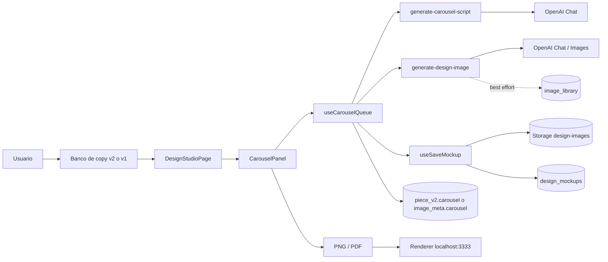
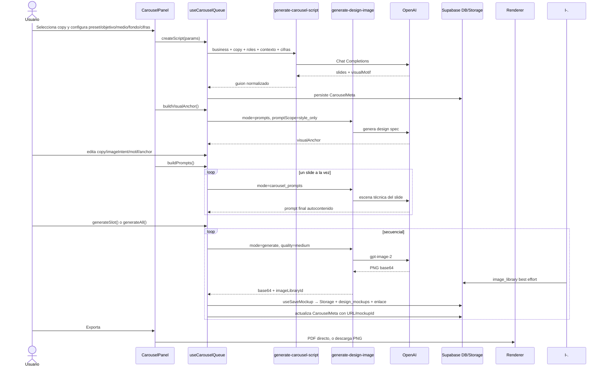
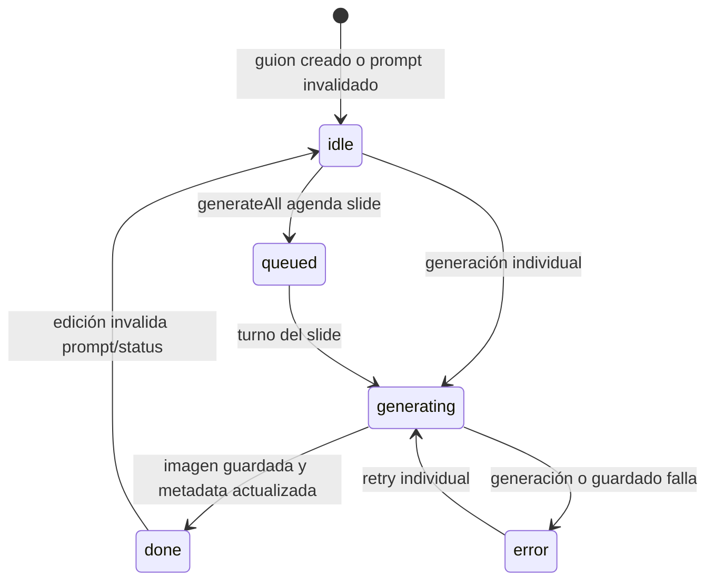

# Generación de carruseles — auditoría documental AS-IS

> Fuente de verdad técnica y funcional del flujo existente. Describe lo que hace el repositorio auditado; no propone una arquitectura futura.

## Ficha de auditoría

| Campo | Valor |
|---|---|
| Estado | AS-IS |
| Rama principal auditada | `feat/design-studio-content-modes` |
| Commit auditado | `8fb80f39cf47c6902c63a009b554429ad834238e` — `feat(carrusel): ampliar guion, cifras y exportacion` |
| Fecha documental | 2026-08-15 |
| Alcance | Selección de copy, guion, edición, prompts, imágenes, persistencia y exportación de carruseles |
| Fuera de alcance | Cambios de código, prompts, modelos, base de datos, UI, configuración y cualquier diseño TO-BE |
| Variante histórica comparada | `336b3154cf820a0265ba5e2ef595d1c9840e78ee` únicamente para la diferencia de calidad `high` |

### Convenciones de evidencia

- **CONFIRMADO**: comportamiento observado directamente en código, configuración, migración o historial Git.
- **INFERENCIA**: consecuencia razonable del código, sin prueba de ejecución productiva.
- **NO LOCALIZADO**: elemento buscado que no aparece en el repositorio o historial inspeccionado.
- Las líneas son las del commit auditado. El símbolo es la referencia estable si una edición posterior desplaza el rango.

---

## 1. Alcance funcional

**CONFIRMADO.** El flujo empieza cuando el usuario elige una fila de banco de copy en Design Studio y termina cuando las imágenes del carrusel quedan guardadas como mockups y/o se descargan como PNG o PDF. El sistema mantiene dos fuentes de copy activas: `copy_bank_items` (v2, principal) y `generated_ideas` (v1, legado todavía conectado).

**CONFIRMADO.** La responsabilidad está separada así:

- `generate-carousel-script` **inventa/escribe la historia, los copys, las escenas semánticas y los briefs**.
- `generate-design-image` **convierte el brief y copy aprobados en prompt técnico y después genera la imagen**.

No se incluye en esta auditoría una propuesta de reemplazo o mejora.

## 2. Versión realmente auditada

**CONFIRMADO.** La descripción principal corresponde exclusivamente a `feat/design-studio-content-modes` en `8fb80f39cf47c6902c63a009b554429ad834238e`.

**CONFIRMADO.** El árbol de trabajo estaba limpio al iniciar la inspección. La única modificación producida por esta auditoría es este documento.

**NO LOCALIZADO.** No existe una rama local ni remota llamada `sol` entre las ramas inspeccionadas. La mención `sol/high` no se toma como una segunda implementación vigente.

**CONFIRMADO.** El commit histórico `336b3154cf820a0265ba5e2ef595d1c9840e78ee` enviaba `imageQuality: 'high'`; el runtime auditado envía `imageQuality: 'medium'` en [`useCarouselQueue.generateSlot`](../../src/hooks/useCarouselQueue.ts#L748-L840). Véase el apéndice J.

## 3. Resumen ejecutivo

**CONFIRMADO.** El carrusel es una derivación mutable de un copy semilla. El frontend crea una identidad de grupo, pide un guion, permite corregir copy e intención, crea un ancla visual compartida, genera un prompt autocontenido por slide y renderiza los slides secuencialmente.

**CONFIRMADO.** No existe una cola asíncrona de backend: la “queue” vive en el hook React y ejecuta llamadas una a una.

**CONFIRMADO.** Cada imagen pasa por dos persistencias: primero una inserción best-effort de base64 en `image_library` desde la Edge Function y después, al guardar el mockup, un PNG en Storage `design-images` más una fila en `design_mockups`. El cliente intenta enlazar ambas filas y limpiar el base64.

**CONFIRMADO.** La metadata narrativa del carrusel se guarda sobre el copy semilla, no como una entidad relacional propia: `generated_ideas.piece_v2.carousel` en v1 o `copy_bank_items.image_meta.carousel` en v2.

## 4. Componentes y fronteras

| Capa | Componente | Responsabilidad AS-IS | Evidencia |
|---|---|---|---|
| UI | `CopyBankV2Panel` / `CopyBankPanel` | Seleccionar copy semilla | **CONFIRMADO**: [`src/components/design-studio/CopyBankV2Panel.tsx`](../../src/components/design-studio/CopyBankV2Panel.tsx) |
| Página | `DesignStudioPage` | Adaptar v2/v1 y construir props de carrusel | **CONFIRMADO**: `handleSelectBankV2`, `handleSelectCandidate`, `activeCarouselItem`, `carouselPersistMeta` en [`DesignStudioPage.tsx`](../../src/pages/DesignStudioPage.tsx) |
| UI | `CarouselPanel` | Orquestar controles, edición, generación y exportación | **CONFIRMADO**: [`CarouselPanel.tsx`](../../src/components/design-studio/CarouselPanel.tsx) |
| Estado | `useCarouselQueue` | Máquina de estados, llamadas y persistencia de metadata | **CONFIRMADO**: [`useCarouselQueue.ts`](../../src/hooks/useCarouselQueue.ts) |
| Guion | `generate-carousel-script` | Historia, copy, intención, brief y motivo | **CONFIRMADO**: [`index.ts`](../../supabase/functions/generate-carousel-script/index.ts) |
| Prompt/imagen | `generate-design-image` | Sistema visual, prompt por slide e imagen | **CONFIRMADO**: [`index.ts`](../../supabase/functions/generate-design-image/index.ts) |
| Datos | Supabase DB/Storage | Banco, biblioteca, mockups, metadata y PNG | **CONFIRMADO**: migraciones y hooks citados en §30–31 |
| Exportación | `exportCarouselPngs` / `exportCarouselPdf` | Descarga ordenada y PDF | **CONFIRMADO**: [`exportCarousel.ts`](../../src/utils/design-studio/exportCarousel.ts) |
| Renderer | `render-server.js` | HTML → capturas → PDF | **CONFIRMADO**: [`renderer/scripts/render-server.js`](../../renderer/scripts/render-server.js) |

## 5. Diagrama de contexto



Todos los enlaces continuos anteriores están **CONFIRMADOS** por llamadas directas; la flecha punteada indica persistencia best-effort.

## 6. Secuencia completa



## 7. Origen del copy semilla

**CONFIRMADO — v2 principal.** [`useCopyBankV2.ts`](../../src/hooks/useCopyBankV2.ts) consulta `copy_bank_items` con alcance por negocio, estados `seed`, `approved` y `proposed`, y límite 1000. Por ello, “aprobado” es el concepto funcional esperado, pero la selección técnica no exige exclusivamente `approved`: también puede entrar un `proposed`.

**CONFIRMADO — v1 legado activo.** [`useDesignCopyBank.ts`](../../src/hooks/useDesignCopyBank.ts) consulta `generated_ideas` y filtra en cliente los registros cuyo `piece_v2.source` es `design_studio`.

**CONFIRMADO.** El adaptador v2 construye un `CopyBankItem` temporal. Propaga `angle_label|angle_tag` a `meta.angleName` e `industry` a `meta.industryName`, pero fija `vertical_id: null`.

**NO LOCALIZADO.** No se encontró propagación de `copy_bank_items.corridor` hacia el request del carrusel. Solo sobrevive un `corridorOverride` si ya existe dentro de `image_meta`.

**NO LOCALIZADO.** `needs_legal_note` y `legal_note` de v2 no se propagan al carrusel.

## 8. Recorrido rama → ángulo → industria → banco

**CONFIRMADO.** La selección ocurre en Design Studio y conserva en la fila o metadata los identificadores/labels disponibles. `carouselBranchId` intenta resolver `branch_slug` a UUID mediante `resolveBranchForKitSlug`; si no resuelve, usa la rama activa de UI.

**CONFIRMADO.** La industria llega al guion principalmente como nombre (`industryName`) en la adaptación v2; el UUID vertical se pierde al fijarse `vertical_id: null`.

**INFERENCIA.** El contexto de industria puede seguir influyendo semánticamente por el nombre, pero no existe garantía de recuperar reglas asociadas a un vertical UUID en esa ruta v2.

## 9. Integración en `DesignStudioPage`

**CONFIRMADO.** Productores y consumidores principales:

| Símbolo | Produce | Consume |
|---|---|---|
| `handleSelectBankV2` | selección v2 activa | paneles de Design Studio |
| `handleSelectCandidate` | selección v1 activa | panel legado |
| `activeCarouselItem` | forma común `CopyBankItem` | `CarouselPanel` / `useCarouselQueue` |
| `carouselBranchId` | UUID de rama resuelto | Edge Functions vía hook |
| `carouselPersistMeta` | callback para `image_meta.carousel` | `useCarouselQueue.persist()` |

Referencia: [`src/pages/DesignStudioPage.tsx`](../../src/pages/DesignStudioPage.tsx).

## 10. Controles del panel

**CONFIRMADO.** Antes del guion, `CarouselPanel` expone estructura/preset, objetivo, medio, fondo, supuestos de cifras y guía libre. Después del guion expone copy por slide, `imageIntent`, `visualMotif`, `visualAnchor`, prompts, generación individual o completa, regeneración y exportación.

Defaults observados:

| Campo | Default |
|---|---|
| Preset | `tension-shift-risk-solution-cta` |
| Objetivo | `conectar` |
| Medio | `imageType ?? 'infografia'` |
| Fondo | `background ?? 'white-xending-v2'` |
| Tipo de cambio base | `18.20` MXN/USD |
| Monto | `USD 10,000` |

**CONFIRMADO.** Tras `createScript`, el panel llama automáticamente a `buildVisualAnchor`.

**CONFIRMADO.** Puede exportarse un carrusel parcial con los slides que ya tengan imagen.

## 11. Presets y roles

Fuente: [`CAROUSEL_PRESETS`](../../src/types/design-studio.ts#L566-L611), labels en [`CAROUSEL_ROLE_LABELS`](../../src/types/design-studio.ts#L469-L492), briefs en [`CAROUSEL_ROLE_BRIEFS`](../../src/types/design-studio.ts#L494-L522) y layout inicial en [`CAROUSEL_ROLE_LAYOUT_HINT`](../../src/types/design-studio.ts#L527-L544).

| Slug | Slides | Roles | Estado |
|---|---:|---|---|
| `tension-shift-risk-solution-cta` | 5 | `tension, shift, risk, solution, cta` | **CONFIRMADO** |
| `hook-problem-example-solution` | 4 | `hook, problem, example, solution` | **CONFIRMADO** |
| `checklist-3-senales` | 5 | `promise, signal, signal, signal, close` | **CONFIRMADO** |
| `cronologia-operacion` | 5 | `moment, moment, moment, outcome, close` | **CONFIRMADO** |

**CONFIRMADO.** `getCarouselPreset()` cae silenciosamente al primer preset ante un slug desconocido ([líneas 614–618](../../src/types/design-studio.ts#L614-L618)).

**CONFIRMADO.** `MINIMAL_TEXT` está declarado como modalidad conceptual, pero ningún preset lo usa ni se encontró una implementación equivalente. Todos los presets vigentes usan `EDITORIAL_FULL_TEXT`.

## 12. Objetivo, medio, fondo y branding

**CONFIRMADO.** Los objetivos `explicar`, `conectar` y `vender` cambian quién “posee” el cierre, si hay CTA y el presupuesto de menciones de marca en `buildSystemPrompt`.

**CONFIRMADO.** Los medios efectivos del carrusel se enrutan a `fotografia`, `infografia` o `mapa_rutas`; [`CAROUSEL_MEDIUM_SECTION`](../../supabase/functions/generate-design-image/index.ts#L965-L970) selecciona la sección correspondiente del master prompt.

**CONFIRMADO.** El sistema visual V2 resuelve estilos, entre ellos `white`, a partir del background seleccionado. V2 es el default; V1 queda como fallback por variable.

**CONFIRMADO.** `brandElementsForSlide()` coloca logo solo en portada con los presets actuales. Ningún preset asigna `disclaimer`, aunque el ensamblador sí sabe reservarle espacio.

## 13. Cifras y precisión financiera

Fuente: [`computeCarouselFx`](../../src/types/design-studio.ts#L702-L799), [`buildFigureDocuments`](../../src/types/design-studio.ts#L804-L857) y [`accumulatedFxImpact`](../../src/types/design-studio.ts#L860-L878).

**CONFIRMADO.** Default: TC base `18.20`, USD `10,000`, variaciones `[1, 2] %` contra la base, no compuestas. Cada producto se redondea a centavos.

| Momento | TC | USD fijo | MXN | Delta vs. base |
|---|---:|---:|---:|---:|
| Base | 18.20 | 10,000 | 182,000 | 0 |
| +1 % | 18.38 | 10,000 | 183,800 | 1,800 |
| +2 % | 18.56 | 10,000 | 185,600 | 3,600 |

**CONFIRMADO.** El código redondea el tipo de cambio a dos decimales **antes** de multiplicarlo por el monto USD, para que la cifra visible y el total puedan verificarse a mano. El impacto acumulado de los deltas contra la base es `5,400 MXN`.

**CONFIRMADO.** `FIGURE_SCENARIO_BY_ROLE` asigna `shift|problem → two_moment` y `risk|example → repeated_purchases`. `two_moment` produce documentos `HOY/PAGO` (días 0/60); `repeated_purchases`, `COMPRA 1/2/3` (días 0/35/70).

**CONFIRMADO.** Las cifras calculadas se pasan al agente de guion como contexto de coherencia, pero el prompt le prohíbe copiarlas en `headline`, `body`, `environmentalText` o `imageIntent`; después el código las inyecta por documento en el prompt técnico.

## 14. Modelo de datos de runtime

| Tipo | Líneas | Función |
|---|---|---|
| `CarouselSlotStatus` | [`160–166`](../../src/types/design-studio.ts#L160-L166) | Estados de render |
| `CarouselSlideBrief` | [`308–336`](../../src/types/design-studio.ts#L308-L336) | Intención, metáfora, objetos, documentos y texto ambiental |
| `CarouselSlot` | [`357–395`](../../src/types/design-studio.ts#L357-L395) | Copy + brief + prompt + imagen + persistencia |
| `CarouselMeta` | [`399–428`](../../src/types/design-studio.ts#L399-L428) | Carrusel completo colgado del copy |
| `CarouselPreset` | [`434–477`](../../src/types/design-studio.ts#L434-L477) | Estructura y reglas narrativas |

**CONFIRMADO.** `imageBase64` es runtime-only. `imageUrl` y `mockupId` sí se persisten para evitar JSONB de varios megabytes.

## 15. Hidratación y metadata

**CONFIRMADO.** Al cambiar `bankItem`, `useCarouselQueue` hidrata slots, motivo, grupo, preset, objetivo, ancla y medio desde el `CarouselMeta` existente.

**CONFIRMADO.** Carruseles antiguos sin `objective` se etiquetan como `vender`, porque el código considera que reproduce las reglas fijas históricas ([`useCarouselQueue.ts` líneas 209–214](../../src/hooks/useCarouselQueue.ts#L209-L214)). El default de un carrusel nuevo en panel es `conectar`; son defaults distintos por compatibilidad histórica.

**CONFIRMADO.** La identidad `groupId` se crea con `crypto.randomUUID()` al generar guion y se reutiliza en todos sus mockups.

## 16. Creación del guion

Fuente: [`createScript`](../../src/hooks/useCarouselQueue.ts#L260-L416).

**CONFIRMADO.** `createScript(params)`:

1. Resuelve el preset.
2. Calcula momentos FX y acumulado.
3. Construye el request con negocio, rama, copy semilla, slides/roles, reglas narrativas, objetivo, medio, cifras y guía.
4. Invoca `generate-carousel-script`.
5. Adapta la respuesta a `CarouselSlotRuntime[]`.
6. Genera `groupId`, limpia ancla y prompts anteriores y persiste `CarouselMeta`.

**CONFIRMADO.** La cantidad y los roles provienen del preset del caller; el modelo no decide libremente cuántos slides existen.

## 17. Contrato de `generate-carousel-script`

**Request efectivo, resumido** — interfaces en [`generate-carousel-script/index.ts` líneas 74–153](../../supabase/functions/generate-carousel-script/index.ts#L74-L153):

```ts
{
  businessId,
  branchId?, verticalId?, industryName?, angleName?, imageType?,
  sourceCopy: { headline, body?, cta? },
  slides: [{ role, brief, brandElements?, layoutHint? }],
  visualMode?, narrativeRules?, objective?,
  fxMoments?, fxAccumulated?, guidance?
}
```

**Response efectivo:**

```ts
{
  slides: [{
    index, role,
    copy: { headline, body, cta },
    imageIntent,
    brief: { visualIntent, visualMetaphor, primaryObjects, layout, highlights,
             environmentalText, documents }
  }],
  visualMotif
}
```

**CONFIRMADO.** El mensaje de usuario contiene el copy semilla y termina con “Escribe el guion de N slides y el motivo visual.” El system prompt contiene todas las reglas sustantivas.

## 18. Contexto que recibe el guionista

**CONFIRMADO.** El handler exige JWT y membership en `user_business_memberships`, crea después un cliente service-role y consulta:

- `business_tenants`
- `master_prompts`
- `business_channels`
- `business_angles`
- `commercial_branches`
- `industry_verticals`
- `copy_kits`

**CONFIRMADO.** `fetchBusinessContext` y `buildBranchContextBlock` ensamblan marca, compliance, rama, vertical, canal y ángulo. El guion recibe además reglas de preset y cifras precalculadas.

**CONFIRMADO.** [`buildEditorialBansBlock`](../../supabase/functions/generate-carousel-script/index.ts#L202-L240) extrae solo `banned_phrases`, `banned_openings` y `hard_business_rules` del copy kit.

**NO LOCALIZADO.** No se pasa al guionista la totalidad de `numbers_policy`, `legal_note`, ejemplos gold ni ejemplos rejected del kit.

## 19. Prompt y modelo del guionista

Fuente: [`buildSystemPrompt`](../../supabase/functions/generate-carousel-script/index.ts#L246-L588).

**CONFIRMADO.** Modelo default `gpt-5.4-mini`, `max_completion_tokens: 6000`, `temperature: 0.8`, timeout `90_000 ms`.

El prompt ordena, entre otros puntos:

- respetar el copy aprobado, especialmente la portada;
- construir continuidad narrativa según el preset;
- ajustar cierre y marca al objetivo;
- cumplir presupuesto de palabras (`headline` 15, `body` 25, CTA 6);
- generar `imageIntent`, brief y `visualMotif` sin cifras inventadas;
- respetar compliance, prohibiciones editoriales e industria;
- devolver JSON, no prosa.

**CONFIRMADO.** `carouselMechanicsExamples()` se inyecta para todos los presets. Los tres ejemplos y el contraejemplo son del dominio coberturas e incluyen la prohibición de reutilizar literalmente sus líneas.

## 20. Parseo y normalización del guion

**CONFIRMADO.** [`parseScript`](../../supabase/functions/generate-carousel-script/index.ts#L591-L693) parsea la respuesta; [`normalizeBrief`](../../supabase/functions/generate-carousel-script/index.ts#L694-L769) normaliza campos y limita la libertad del modelo.

**CONFIRMADO.** [`parseModelJson.ts`](../../supabase/functions/_shared/parseModelJson.ts) repara fences, texto externo, trailing commas, caracteres de control y saltos de línea dentro de strings. Distingue un JSON probablemente truncado por balance de cierres.

**CONFIRMADO.** La función vuelve a imponer cantidad, índices, roles, límites de palabras, CTA, layouts, highlights, documentos y texto ambiental. El modelo no es la autoridad final de esas estructuras.

## 21. Edición e invalidación

| Acción | Efecto confirmado | Persistencia |
|---|---|---|
| `updateSlideCopy` ([423–445](../../src/hooks/useCarouselQueue.ts#L423-L445)) | cambia copy, borra `prompt`, vuelve a `idle` | mediante guardado asociado; no borra URL/mockup explícitamente |
| `updateSlideImageIntent` ([452–464](../../src/hooks/useCarouselQueue.ts#L452-L464)) | cambia intención, borra `prompt`, vuelve a `idle` | metadata |
| `updateVisualMotif` ([472–486](../../src/hooks/useCarouselQueue.ts#L472-L486)) | invalida prompts/status de todos | metadata |
| `updateVisualAnchor` ([582–595](../../src/hooks/useCarouselQueue.ts#L582-L595)) | invalida prompts/status de todos | metadata |
| `updateSlotPrompt` ([732–737](../../src/hooks/useCarouselQueue.ts#L732-L737)) | cambia solo el prompt en memoria, vuelve a `idle` | **no llama `persist`** |
| `reset` ([878–888](../../src/hooks/useCarouselQueue.ts#L878-L888)) | limpia estado en memoria | **no elimina metadata persistida** |

**INFERENCIA.** Editar copy después de haber generado una imagen puede dejar en metadata una URL/mockup previo junto a un prompt invalidado, porque la invalidación no elimina explícitamente esos campos.

## 22. Ancla visual compartida

Fuente: [`buildVisualAnchor`](../../src/hooks/useCarouselQueue.ts#L510-L579).

**CONFIRMADO.** El hook llama `generate-design-image` con `mode='prompts'`, `promptScope='style_only'` y versión explícita del master prompt. El resultado es un bloque de sistema visual sin sujeto ni escena.

**CONFIRMADO.** El ancla se muestra y puede editarse. Una edición invalida todos los prompts derivados.

**CONFIRMADO.** La finalidad codificada es reutilizar literalmente el mismo design block en cada slide para fijar paleta, luz, cámara, fondo y familia material sin repetir el mismo objeto.

## 23. Construcción de prompts por slide

Fuente: [`buildPrompts`](../../src/hooks/useCarouselQueue.ts#L600-L734).

**CONFIRMADO.** El frontend procesa slides en secuencia. Con ancla existente, cada llamada solicita solo la escena del slide y ensambla el resultado con el mismo bloque visual; sin ancla, el presupuesto de tokens permite crear también un design block.

**CONFIRMADO.** El request usa `mode='carousel_prompts'` y aporta slide, total, motivo, ancla, copy, brief, brand elements, medio, background y contexto.

**CONFIRMADO.** La persistencia del conjunto ocurre al final. Una respuesta lenta o fallida antes del final puede impedir que queden persistidos los prompts construidos hasta ese punto, aunque el estado React haya avanzado.

## 24. Ensamblaje técnico del prompt final

Fuente: [`assembleCarouselSlidePrompt`](../../supabase/functions/generate-design-image/index.ts#L1256-L1360).

Orden efectivo **CONFIRMADO**:

1. identificación del slide y la serie;
2. `motifLine`;
3. `DESIGN SPEC` compartido;
4. `SCENE FOR THIS SLIDE`;
5. `TEXT LAYOUT`, si aplica;
6. `briefBlock`;
7. habilitación de texto;
8. lenguaje cromático de marca;
9. `documentDataBlock`;
10. copy exacto y tipografía de marca;
11. `environmentalTextBlock`;
12. reglas de texto de carrusel;
13. `NO BRANDING`;
14. `reservedSpaceBlock`;
15. canvas;
16. AVOID y negativas.

**CONFIRMADO.** El prompt final es autocontenido: cada generación de imagen no depende de memoria conversacional ni del prompt del slide anterior.

## 25. Coherencia y variedad entre slides

**CONFIRMADO.** [`CAROUSEL_SCENE_VARIETY`](../../supabase/functions/generate-design-image/index.ts#L923-L963) obliga a:

- hacer vivir el dato en una superficie real, no flotante;
- usar un protagonista y máximo tres objetos;
- traducir visualmente la línea específica;
- usar el sujeto recurrente como “paréntesis” en apertura/cierre;
- variar escala, encuadre y registro entre slides;
- renderizar cifras del brief legibles y no inventar cifras adicionales.

**CONFIRMADO.** La coherencia se obtiene por ancla idéntica + motivo recurrente + reglas de medio; no por image-to-image ni por memoria entre generaciones.

## 26. Generación de imagen

Fuente: [`generateSlot`](../../src/hooks/useCarouselQueue.ts#L748-L840) y handler `mode='generate'` de [`generate-design-image`](../../supabase/functions/generate-design-image/index.ts).

**CONFIRMADO.** Request principal:

```ts
{
  mode: 'generate',
  businessId,
  imagePrompt: slot.prompt,
  imageSize: '1024x1024',
  imageQuality: 'medium',
  imageCount: 1
}
```

**CONFIRMADO.** La Edge Function llama `/v1/images/generations` con `model: 'gpt-image-2'`, `n: 1`, tamaño `1024x1024` y calidad `medium` enviada por el carrusel.

**CONFIRMADO.** El resultado base64 se guarda solo durante el ciclo de guardado; la metadata final conserva URL y IDs.

## 27. Cola, concurrencia y cancelación

Fuente: [`generateAll`](../../src/hooks/useCarouselQueue.ts#L848-L872).

**CONFIRMADO.** La cola es secuencial y local al navegador. `slotsRef` evita closures obsoletos durante el loop.

**CONFIRMADO.** `generateAll()` toma slots cuyo estado no sea `done`, genera uno por uno y se detiene en el primer fallo.

**CONFIRMADO.** `cancelRef` solo se consulta entre slides. No aborta una llamada de imagen ya enviada.

**NO LOCALIZADO.** No existe job persistente, worker ni cola asíncrona de backend para carruseles o para calidad `high`.

## 28. Errores, timeouts y reintentos

**CONFIRMADO.** Para imágenes, `fetchWithRetry` usa timeout `110_000 ms`; reintenta una sola vez errores de red no causados por abort, pero no reintenta un timeout abortado. Se mapean explícitamente rate limit, content policy y autenticación.

**CONFIRMADO.** Para chat, [`callOpenAI.ts`](../../supabase/functions/_shared/callOpenAI.ts#L68-L198) reintenta una vez errores de red/timeout; el guion configura 90 segundos.

**CONFIRMADO.** `generateAll` aísla el fallo por slide porque la regeneración individual usa exactamente `generateSlot`, no un segundo camino.

**CONFIRMADO — contradicción técnica.** El camino no-stream de `callOpenAI` incluye siempre `temperature` en el body, aunque el mismo archivo documenta mediante `supportsCustomTemperature()`/el camino stream que modelos `gpt-5*` no admiten temperatura custom. No se verificó mediante ejecución si el endpoint actualmente la tolera.

## 29. Autenticación, autorización y aislamiento

| Función | `verify_jwt` | Validación interna | Resultado |
|---|---:|---|---|
| `generate-carousel-script` | `true` | JWT + membership de `businessId` | **CONFIRMADO**: tenant verificado |
| `generate-design-image` | `false` | usa service role; confía en `business_id`/`businessId` del body | **CONFIRMADO**: no valida membership en el handler auditado |

Fuente: [`supabase/config.toml`](../../supabase/config.toml) y handlers respectivos.

**INFERENCIA DE RIESGO.** Si `generate-design-image` es invocable fuera de una capa que imponga autenticación, el aislamiento por negocio depende de un identificador controlado por el caller. La auditoría no afirma exposición pública efectiva; solo documenta la ausencia de la comprobación dentro de esa función.

## 30. Persistencia de la imagen

**CONFIRMADO.** Secuencia:

1. `generate-design-image` intenta insertar `image_base64` y metadata en `image_library` y devuelve `imageLibraryId`. El fallo de esta inserción no invalida necesariamente la generación.
2. [`useSaveMockup`](../../src/hooks/useDesignMockups.ts) convierte/sube PNG al bucket público `design-images`.
3. Inserta `design_mockups` con `carousel_group_id` y `carousel_index`.
4. Si existe `imageLibraryId`, actualiza `image_library.mockup_id`, copia la URL y limpia base64 best-effort.

**CONFIRMADO.** [`20260813_image_library_mockup_link.sql`](../../supabase/migrations/20260813_image_library_mockup_link.sql) agrega FK `image_library.mockup_id → design_mockups.id ON DELETE CASCADE`. Filas antiguas quedan sin backfill.

**CONFIRMADO.** Regenerar un slide crea otro mockup; el camino auditado no elimina automáticamente el anterior.

## 31. Persistencia del carrusel

| Fuente semilla | Ubicación de `CarouselMeta` | Productor | Consumidor |
|---|---|---|---|
| v1 | `generated_ideas.piece_v2.carousel` | `updateBankMeta` | `useCarouselQueue` al hidratar |
| v2 | `copy_bank_items.image_meta.carousel` | `carouselPersistMeta` | `activeCarouselItem` / hook |

`CarouselMeta` conserva preset, objetivo, ancla, motivo, modo visual, `groupId`, medio, slots y fecha.

**CONFIRMADO.** [`20260802_carousel_group_on_mockups.sql`](../../supabase/migrations/20260802_carousel_group_on_mockups.sql) agrega las columnas de grupo/índice, check “ambos o ninguno” e índice parcial. El índice no es `UNIQUE`.

**NO LOCALIZADO.** No se encontró una query productiva que reconstruya un carrusel desde `design_mockups.carousel_group_id`; [`useSavedMockups`](../../src/hooks/useDesignMockups.ts) deliberadamente no selecciona esas columnas.

## 32. Regeneración, reemplazo y borrado

**CONFIRMADO.** Un slide puede regenerarse con su prompt actual; si se cambia copy/intención/ancla/motivo, primero se invalida el prompt correspondiente.

**CONFIRMADO.** La regeneración no reemplaza transaccionalmente el mockup anterior ni elimina su archivo; crea una nueva persistencia y actualiza la referencia del slot.

**CONFIRMADO.** Borrar un `design_mockup` enlazado elimina por cascade su fila `image_library`, pero esta semántica no equivale a borrar el conjunto.

**NO LOCALIZADO.** No existe endpoint o acción para borrar un carrusel completo, todos sus mockups, Storage y metadata como una sola operación.

## 33. Exportación PNG

Fuente: [`exportCarouselPngs`](../../src/utils/design-studio/exportCarousel.ts).

**CONFIRMADO.** Filtra slides con URL, ordena por `index`, hace `fetch`, crea enlaces de descarga y usa nombres `<prefix>-01.png`, `<prefix>-02.png`, etc. Introduce una pausa de 300 ms entre descargas.

**CONFIRMADO.** Puede exportar un subconjunto; no exige que todos los slots estén `done`.

**CONFIRMADO.** El export directo descarga la imagen ya guardada. No monta por sí mismo logo ni disclaimer.

## 34. Exportación PDF

**CONFIRMADO.** `exportCarouselPdf` construye HTML con una página 1024×1024 por imagen y hace `POST http://localhost:3333/render-pdf` sin token desde [`canvasRenderer.ts`](../../src/utils/xendingDesign/canvasRenderer.ts).

**CONFIRMADO.** El renderer usa Puppeteer para renderizar páginas a PNG y componer el PDF en [`renderer/scripts/render-server.js`](../../renderer/scripts/render-server.js).

**CONFIRMADO — flujo distinto.** [`CarouselPdfComposer.tsx`](../../src/components/design-studio/CarouselPdfComposer.tsx) permite elegir mockups ya brandizados y ordenarlos manualmente; no es el mismo camino que el export directo del panel.

**CONFIRMADO — discrepancia.** `.env.example` declara `RENDER_SERVICE_URL` y `RENDER_SERVICE_TOKEN`, pero el cliente auditado hardcodea localhost y no usa el token.

## 35. Configuración, flags y fallbacks

| Variable | Uso confirmado |
|---|---|
| `OPENAI_API_KEY` | Chat e imágenes |
| `SUPABASE_URL`, `SUPABASE_ANON_KEY`, `SUPABASE_SERVICE_ROLE_KEY` | Clientes Supabase de Edge Functions |
| `MASTER_IMAGE_PROMPT_VERSION` | `v2` default; `v1` si vale exactamente `v1` |
| `MASTER_IMAGE_PROMPT_SOURCE` | `code` default; `database` opt-in |
| `COPY_KIT_SOURCE` | código default; `database` opt-in |
| `RENDER_SERVICE_URL`, `RENDER_SERVICE_TOKEN` | declaradas, no consumidas por el export directo auditado |
| `PORT`, `MAX_CONCURRENT`, `PUPPETEER_EXECUTABLE_PATH` | renderer |

**CONFIRMADO.** El carrusel envía versión explícita del master prompt; esto evita que un override DB/global cambie silenciosamente ese request.

**CONFIRMADO.** `copyKitRegistry.ts` tiene kits runtime modernos para `velocidad`, `costos-ahorro` y `coberturas`. Con fuente DB opt-in, hay fallback a código.

**CONFIRMADO.** El seed contiene seis ramas: `velocidad-mismo-dia`, `ahorro-costos-ocultos`, `cuenta-multidivisa`, `cobertura-cambiaria`, `pagos-con-orden` y `banco-vs-xending`. Solo velocidad/costos/coberturas resuelven kits editoriales modernos; las demás dependen de `commercial_branches.prompt_kit` o `strategic_config` fallback.

**CONFIRMADO — discrepancia nominal.** El seed usa `pagos-con-orden`, con nombre “Pagos con Orden”; documentación de arquitectura menciona `control-operativo-pagos`.

## 36. Pruebas, legado, contradicciones y cierre AS-IS

Pruebas directamente relacionadas localizadas:

- [`src/types/__tests__/carousel-presets.test.ts`](../../src/types/__tests__/carousel-presets.test.ts)
- [`src/types/__tests__/carousel-fx.test.ts`](../../src/types/__tests__/carousel-fx.test.ts)
- [`src/types/__tests__/copy-bank.test.ts`](../../src/types/__tests__/copy-bank.test.ts)
- [`supabase/functions/_shared/__tests__/parseModelJson.test.ts`](../../supabase/functions/_shared/__tests__/parseModelJson.test.ts)

**NO LOCALIZADO.** No hay pruebas directas de `useCarouselQueue`, `CarouselPanel`, Edge Functions end-to-end, persistencia completa, exportación PNG/PDF o reconstrucción por grupo.

**CONFIRMADO.** Existe image-to-image mediante `referenceImageBase64` y `/v1/images/edits` en el flujo legado/Stock Studio, pero el carrusel no lo usa.

Contradicciones AS-IS confirmadas:

1. `buildCarouselUserMessage` dice que el texto va siempre arriba; `layoutRule` permite `split_photo` con copy a la izquierda.
2. El copy exacto puede contener “Xending”; el bloque `NO BRANDING` prohíbe nombres de marca, incluido Xending.
3. `callOpenAI` no-stream envía temperatura a `gpt-5*`, aunque el helper reconoce que no debería.
4. `.env.example` declara URL/token de renderer, pero el export usa localhost sin token.
5. El panel inicia nuevos carruseles como `conectar`; metadata antigua sin objetivo se interpreta como `vender`.
6. `MINIMAL_TEXT` existe como declaración, no como comportamiento de presets.

---

# Apéndice A. Prompt efectivo de guion

## A.1 Bloques y procedencia

| Bloque | Productor | Contenido |
|---|---|---|
| Marca/compliance | `fetchBusinessContext` | nombre, términos prohibidos, qualifiers, máximos |
| Rama/vertical | `buildBranchContextBlock` | propuesta, pains, keywords y contexto comercial |
| Prohibiciones | `buildEditorialBansBlock` | frases, aperturas y reglas duras |
| Estructura | preset frontend | roles, briefs, layouts, reglas narrativas |
| Objetivo | panel | `explicar`, `conectar` o `vender` |
| Cifras | funciones puras frontend | momentos FX y acumulado |
| Ejemplos | `carouselMechanicsExamples()` | ejemplos/contraejemplo de mecánica, no copy reusable |
| Copy aprobado | request | headline, body y CTA semilla |

## A.2 Autoridad de instrucciones

**CONFIRMADO.** El prompt declara como no negociables compliance, bans y copy aprobado. Las reglas de objetivo gobiernan marca/CTA; las reglas narrativas gobiernan continuidad; los roles fijan el trabajo de cada slide.

<details>
<summary>Forma abreviada del mensaje de usuario</summary>

```text
Copy semilla aprobado por el usuario:
- Headline: "..."
- Body: "..."        # opcional
- CTA: "..."         # opcional

Escribe el guion de N slides y el motivo visual.
```

La literalidad completa vive en [`generate-carousel-script/index.ts`](../../supabase/functions/generate-carousel-script/index.ts), símbolos `buildSystemPrompt` y handler.
</details>

# Apéndice B. Prompt técnico efectivo de imagen

## B.1 Etapas

1. `mode='prompts', promptScope='style_only'`: crea el `visualAnchor`.
2. `mode='carousel_prompts'`: crea `sceneBlock` y negativas por slide.
3. `assembleCarouselSlidePrompt`: concatena ancla, escena, brief, datos y copy.
4. `mode='generate'`: envía el texto resultante a `gpt-image-2`.

## B.2 Parámetros del escritor de prompts

**CONFIRMADO.** `buildCarouselPrompts` usa `gpt-5.4-mini`, temperatura `0.7` y tokens `(anchor ? 2000 : 3000) + slides * 700`.

## B.3 Reglas relevantes

- Copy exacto, sin traducción ni texto inventado.
- Datos exactos por documento.
- Un único motivo recurrente, sin convertirlo en el mismo hero en todos los slides.
- Espacio negativo solo si habrá logo/disclaimer.
- Sin logos generados: branding se compone fuera de la imagen cuando ese flujo se usa.
- Prompt en inglés, aun cuando copy y labels exactos estén en español.

La fuente literal es `MASTER_IMAGE_PROMPT_V2` en [`generate-design-image/index.ts`](../../supabase/functions/generate-design-image/index.ts); `MASTER_IMAGE_PROMPT_V1` es fallback, no default.

# Apéndice C. Router y recetas visuales

**CONFIRMADO.** Estas son instrucciones activas del master prompt, no seis imágenes de referencia externas.

| Familia/router | Clasificación | Selección |
|---|---|---|
| Corporate Professional Photography | receta fotográfica | credibilidad, treasury, FX, pagos, oficina, dashboard/documento |
| Shipping / Ports / Global Trade Photography | receta fotográfica | puerto, almacén, contenedor, import/export |
| Operational Detail Photography | receta fotográfica | manos, documentos, equipo, mercancía o dispositivo |
| Premium 3D Iconography | receta infográfica default | servicio, beneficio, estado, proceso, FX, pagos, logística |
| Product / Dashboard Mockup | receta infográfica | cuenta multidivisa, balance, treasury, beneficiario, plataforma |
| Hybrid Corporate Visual | receta infográfica excepcional | foto + elemento gráfico pequeño |
| Global Map / Globe | router `mapa_rutas` | países/corredor explícito |
| Operational Route Diorama | router `mapa_rutas` | espera, embarque, aduana, bloqueo sin inventar corredor |

Familias temáticas V2 disponibles: trade/logistics, status/waiting (golden recipe), operational route, globe/corridor, FX/currency, invoice/payment, treasury/product y liquidity/credit. Se elige una principal y como máximo una secundaria.

# Apéndice D. Contratos y esquemas persistidos

## D.1 `CarouselMeta`

```ts
{
  presetSlug,
  objective,
  visualAnchor,
  visualMotif,
  visualMode,
  groupId,
  imageType,
  slots: [{
    id, index, role, copy, imageIntent, brief?, prompt,
    brandElements, status, imageUrl?, mockupId?, error?
  }],
  createdAt
}
```

## D.2 Relación de imágenes

```text
copy semilla
  └─ JSONB.carousel
      └─ slot.imageUrl + slot.mockupId

design_mockups
  ├─ carousel_group_id
  └─ carousel_index
       ▲
image_library.mockup_id ── FK ON DELETE CASCADE
```

**CONFIRMADO.** No hay FK entre el JSONB del copy y `design_mockups`; la asociación depende de IDs/URLs guardados y del `groupId` compartido.

# Apéndice E. Ejemplo end-to-end

> **EJEMPLO ILUSTRATIVO DERIVADO DEL CÓDIGO.** No es una ejecución real ni una respuesta capturada del modelo. Los payloads omiten IDs y campos no esenciales.

## E.1 Entrada seleccionada

```json
{
  "source": "copy_bank_items",
  "status": "approved",
  "headline": "Cada motor también mueve tus costos",
  "body": "El tipo de cambio puede modificar el costo final entre la compra y el pago.",
  "cta": "",
  "branch_slug": "ahorro-costos-ocultos",
  "industry": "Motores y equipo industrial"
}
```

Configuración de UI:

```json
{
  "presetSlug": "tension-shift-risk-solution-cta",
  "objective": "conectar",
  "imageType": "infografia",
  "background": "white-xending-v2",
  "fx": { "baseRate": 18.2, "amountUsd": 10000, "driftPct": [1, 2] }
}
```

## E.2 Request abreviado de guion

```json
{
  "sourceCopy": {
    "headline": "Cada motor también mueve tus costos",
    "body": "El tipo de cambio puede modificar el costo final entre la compra y el pago.",
    "cta": ""
  },
  "objective": "conectar",
  "imageType": "infografia",
  "slides": [
    { "role": "tension", "layoutHint": "editorial_top" },
    { "role": "shift", "layoutHint": "split_photo" },
    { "role": "risk" },
    { "role": "solution" },
    { "role": "cta" }
  ],
  "fxMoments": [
    { "label": "HOY", "rate": "18.20", "usd": "USD 10,000", "mxn": "MXN 182,000", "delta": "MXN 0", "pct": "" },
    { "label": "+1%", "rate": "18.38", "usd": "USD 10,000", "mxn": "MXN 183,800", "delta": "MXN 1,800", "pct": "+1.0%" },
    { "label": "+2%", "rate": "18.56", "usd": "USD 10,000", "mxn": "MXN 185,600", "delta": "MXN 3,600", "pct": "+2.0%" }
  ]
}
```

## E.3 Respuesta ilustrativa de guion

```json
{
  "visualMotif": "El mismo motor industrial reaparece como apertura y cierre; documentos de compra muestran el cambio entre momentos",
  "slides": [
    {
      "index": 0,
      "role": "tension",
      "copy": { "headline": "Cada motor\ntambién mueve\ntus costos", "body": "Una compra en dólares sigue cambiando hasta que llega el momento del pago", "cta": "" },
      "imageIntent": "motor industrial junto a la orden donde vive su costo",
      "brief": { "visualIntent": "hacer visible que el equipo y su costo están unidos", "primaryObjects": ["motor industrial", "orden de compra"] }
    },
    {
      "index": 1,
      "role": "shift",
      "copy": { "headline": "Entre comprar y pagar, el tipo de cambio puede moverse", "body": "El monto en dólares permanece; su equivalente en pesos no necesariamente", "cta": "" },
      "imageIntent": "dos estados de la misma orden con fechas y totales distintos"
    },
    {
      "index": 2,
      "role": "risk",
      "copy": { "headline": "Y la diferencia se acumula en cada compra", "body": "Un movimiento pequeño repetido puede modificar el presupuesto de la operación", "cta": "" },
      "imageIntent": "tres documentos sucesivos de compras equivalentes"
    },
    {
      "index": 3,
      "role": "solution",
      "copy": { "headline": "Definir el costo antes ayuda a planear la operación", "body": "Una estrategia cambiaria puede dar claridad antes de la fecha de pago", "cta": "" },
      "imageIntent": "operación ordenada con un documento de costo definido"
    },
    {
      "index": 4,
      "role": "cta",
      "copy": { "headline": "Revisa tu exposición cambiaria", "body": "", "cta": "" },
      "imageIntent": "motor industrial en escena limpia de cierre"
    }
  ]
}
```

Todo el contenido de E.3 es **INFERENCIA ILUSTRATIVA** compatible con las reglas; no se atribuye al modelo real.

## E.4 Documentos y ancla

El frontend asignaría documentos `HOY/PAGO` al rol `shift` y `COMPRA 1/2/3` al rol `risk`, usando el mismo USD y variando TC/MXN. Después pediría un ancla `style_only` para infografía White Xending V2: fondo blanco, estructura navy, acentos teal, coral limitado a tensión, cámara/material/luz consistentes y sin sujeto fijo. Esto es **CONFIRMADO como procedimiento**; el texto concreto del ancla sería respuesta de modelo y por tanto aquí no se inventa.

## E.5 Prompt técnico ilustrativo de slide 2

```text
SLIDE 2 OF 5 — shift
[VISUAL MOTIF shared by the set]
DESIGN SPEC
[the exact visualAnchor returned by style_only]
SCENE FOR THIS SLIDE
Two versions of the same industrial motor purchase order side by side, with different date stamps and visibly different MXN totals...
ART DIRECTION FOR THIS SLIDE
- What this image must make evident: the USD obligation is unchanged while its MXN cost moves
DOCUMENT DATA
HOY ... USD 10,000 ... TC 18.20 ... MXN 182,000
PAGO ... USD 10,000 ... TC 18.38 ... MXN 183,800
EXACT COPY
Entre comprar y pagar, el tipo de cambio puede moverse
...
NO BRANDING
KEEP CLEAR / full frame according to brandElements
CANVAS 1024x1024
AVOID ...
```

El orden de bloques es **CONFIRMADO**; la redacción de la escena en inglés es **INFERENCIA ILUSTRATIVA**.

## E.6 Generación, guardado y exportación

1. `generateSlot(1)` envía `mode=generate`, `gpt-image-2`, `1024x1024`, `medium`.
2. La función puede devolver `{ imageBase64, imageLibraryId }`.
3. `useSaveMockup` sube el PNG, crea `design_mockups(groupId, index=1)` y enlaza biblioteca.
4. El slot persiste `{ imageUrl, mockupId, status: 'done' }` dentro de `CarouselMeta`.
5. PNG se descarga como `<prefix>-02.png`; PDF usa el orden por índice.

Estos cinco pasos están **CONFIRMADOS** por el código.

# Apéndice F. Inventario de archivos inspeccionados

## Frontend y tipos

- `src/hooks/useCarouselQueue.ts`
- `src/components/design-studio/CarouselPanel.tsx`
- `src/pages/DesignStudioPage.tsx`
- `src/types/design-studio.ts`
- `src/types/copy-bank.ts`
- `src/hooks/useDesignCopyBank.ts`
- `src/hooks/useCopyBankV2.ts`
- `src/hooks/useDesignMockups.ts`
- `src/components/design-studio/CopyBankV2Panel.tsx`
- `src/components/design-studio/CarouselPdfComposer.tsx`
- `src/utils/design-studio/exportCarousel.ts`
- `src/utils/design-studio/masterImagePrompt.ts`
- `src/utils/design-studio/buildBrandLayerHtml.ts`
- `src/utils/xendingDesign/canvasRenderer.ts`

## Edge Functions y contexto

- `supabase/functions/generate-carousel-script/index.ts`
- `supabase/functions/generate-design-image/index.ts`
- `supabase/functions/_shared/carouselExamples.ts`
- `supabase/functions/_shared/callOpenAI.ts`
- `supabase/functions/_shared/parseModelJson.ts`
- `supabase/functions/_shared/fetchBusinessContext.ts`
- `supabase/functions/_shared/buildBranchContextBlock.ts`
- `supabase/functions/_shared/copyKitRegistry.ts`
- `supabase/functions/_shared/copy-kits/velocidad.json`
- `supabase/functions/_shared/copy-kits/costos-ahorro.json`
- `supabase/functions/_shared/copy-kits/coberturas.json`
- `supabase/config.toml`

## Datos, renderer, documentación y pruebas

- `supabase/migrations/20260802_carousel_group_on_mockups.sql`
- `supabase/migrations/20260806_copy_bank_v2.sql`
- `supabase/migrations/20260807_copy_bank_usage.sql`
- `supabase/migrations/20260813_image_library_mockup_link.sql`
- `supabase/migrations/seed_20260501_xending_tenant.sql`
- `docs/prompts/masterImagePrompt.md`
- `docs/BRANCH_PROMPT_KIT_ARCHITECTURE.md`
- `renderer/scripts/render-server.js`
- `package.json`
- `renderer/package.json`
- `.env.example`
- pruebas enumeradas en §36

# Apéndice G. Matriz productor → consumidor

| Dato | Productor | Consumidor | Persistencia |
|---|---|---|---|
| Copy semilla | banco v2/v1 | `createScript` | tabla de origen |
| Roles/layouts | `CAROUSEL_PRESETS` | guionista y slots | `CarouselMeta` |
| Cifras FX | `computeCarouselFx` | guionista y briefs/documentos | `CarouselMeta.brief` |
| Copy por slide | guionista + usuario | escritor de prompts | `CarouselMeta.slots[].copy` |
| `imageIntent`/brief | guionista + usuario | `carousel_prompts` | slot |
| `visualMotif` | guionista + usuario | todos los prompts | metadata |
| `visualAnchor` | `mode=prompts/style_only` + usuario | todos los prompts | metadata |
| Prompt final | `carousel_prompts` + ensamblador | `mode=generate` | slot, salvo edición solo memoria antes de persistir |
| Base64 | `gpt-image-2` | biblioteca + guardado mockup | temporal / `image_library` best effort |
| URL/mockup ID | `useSaveMockup` | UI/export/hidratación | slot + DB |
| Orden | `slot.index` | queue/export | slot + `carousel_index` |

# Apéndice H. Máquina de estados y fallbacks



**CONFIRMADO.** Los estados declarados están en `CarouselSlotStatus`; la UI también deriva flags agregados (`isScripting`, `isBuildingPrompts`, `isGeneratingAll`, etc.) fuera del status de cada slot.

Fallbacks activos:

- preset desconocido → primer preset;
- objetivo ausente en metadata antigua → `vender`;
- master prompt → V2/código salvo flags explícitos;
- copy kit DB → código si no resuelve;
- contexto de ramas sin kit moderno → `prompt_kit`/`strategic_config`;
- persistencia `image_library` → best effort, sin bloquear necesariamente la imagen.

# Apéndice I. Elementos NO LOCALIZADOS

1. Rama Git local o remota `sol`.
2. Job/cola asíncrona para generación de carrusel o calidad `high`.
3. Endpoint transaccional para borrar un carrusel completo.
4. Query productiva que reconstruya grupos por `carousel_group_id`.
5. Propagación de `copy_bank_items.corridor` al carrusel.
6. Propagación de `needs_legal_note`/`legal_note` v2.
7. Pruebas end-to-end del pipeline completo.
8. Pruebas directas de exportación PNG/PDF.
9. Implementación efectiva de un preset `MINIMAL_TEXT`.
10. Image-to-image dentro del flujo de carrusel.
11. Constraint único `(carousel_group_id, carousel_index)`.
12. Montaje automático de logo/disclaimer dentro del export directo.

# Apéndice J. Diferencias entre rama actual y variante sol/high

| Aspecto | Runtime auditado | Variante histórica | Evidencia |
|---|---|---|---|
| Rama | `feat/design-studio-content-modes` | **NO LOCALIZADO** como rama `sol` | `git branch --all` inspeccionado |
| Commit | `8fb80f39cf47c6902c63a009b554429ad834238e` | `336b3154cf820a0265ba5e2ef595d1c9840e78ee` | `git log` / `git show` |
| Calidad enviada por carrusel | `medium` | `high` | historial de `src/hooks/useCarouselQueue.ts` |
| Camino | síncrono, cliente espera respuesta | síncrono según código histórico inspeccionado | diff histórico |
| Timeout de imágenes | 110 s en Edge Function actual | no se identificó una cola separada | código/historial |
| Estado normativo de esta auditoría | descripción principal | solo referencia comparativa | alcance solicitado |

**CONFIRMADO.** El cambio relevante localizado entre ambas revisiones es el valor efectivo de calidad enviado por el hook. No se mezcla el comportamiento histórico `high` con la descripción principal.

**NO LOCALIZADO.** No hay evidencia de que “sol” sea el nombre de esa revisión, ni de un pipeline paralelo actualmente seleccionable, ni de una cola especial para `high`.

---

## Conclusión documental

El AS-IS es un pipeline orquestado desde React, con guion y prompt técnico separados, generación secuencial por slide, coherencia basada en ancla textual compartida y persistencia distribuida entre JSONB del copy, `image_library`, Storage y `design_mockups`. Las diferencias históricas, contradicciones y ausencias están registradas como evidencia, sin convertirlas en propuestas TO-BE.
