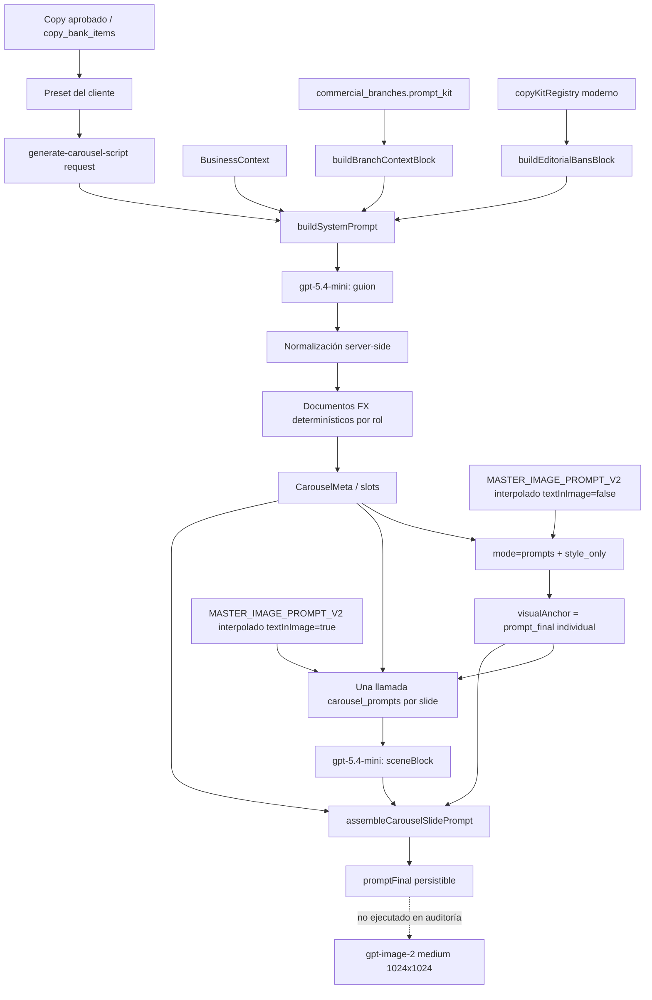

# Carousel Prompt Stack AS-IS

> Auditoría independiente del prompt stack, inyecciones, precedencia, pérdida de contexto y outputs reales del carrusel. Este documento complementa —no reemplaza ni reduce— `CAROUSEL_GENERATION_AS_IS.md`.

## 1. Alcance y respuesta corta

Esta auditoría cubre exclusivamente el recorrido que convierte un copy aprobado en: guion de carrusel, ancla visual, escenas por slide, prompts finales y request de render. Se auditó el runtime AS-IS; no contiene diseño TO-BE ni propuestas de contenido para ramas.

Conclusiones principales:

1. El runtime activo usa `imageQuality: 'medium'`; `high` existe solo en historia Git y no está activo.
2. El guionista y el agente visual no comparten el mismo contexto comercial. El primero recibe `commercial_branches.prompt_kit`, branch context y, para tres familias, prohibiciones del copy kit moderno; el segundo recibe principalmente `strategic_config.guia_visual`, compliance del tenant y los outputs ya normalizados del guion.
3. Cada slide visual se procesa en una llamada separada. Conoce su propio copy/brief, el motivo, el ancla y el tamaño total; no conoce copies, escenas, prompts, imágenes ni feedback de sus hermanos.
4. El prompt final contiene contradicciones literales observables: `textInImage=false` heredado del ancla frente a `TEXT IS ENABLED`; motivo reservado a portada/cierre frente al motor pedido en slides intermedios; y copy exacto con “Xending” frente a `NO BRANDING ... including "Xending"`.
5. Se ejecutaron 7 llamadas `style_only` y 35 llamadas `carousel_prompts`: todas respondieron HTTP 200 y produjeron 35 prompts finales. No se ejecutó ningún render.
6. Las completions raw de OpenAI no son observables desde este runtime. Sus artefactos se marcan literalmente `NO CAPTURADO EN RUNTIME`.

Manifiesto de ejecución: [`_global/00-audit-manifest.json`](carousel-prompt-dumps/_global/00-audit-manifest.json).

## 2. Snapshot auditado

| Campo | Valor comprobado |
|---|---|
| Worktree | `F:/ScoryDesign` |
| Branch | `feat/design-studio-content-modes` |
| Commit | `8fb80f39cf47c6902c63a009b554429ad834238e` |
| Worktrees | Uno |
| Runtime de carrusel | `src/hooks/useCarouselQueue.ts` |
| Calidad efectiva | `medium` |
| Modelo guionista | `gpt-5.4-mini` |
| Modelo de escenas/prompts | `gpt-5.4-mini` |
| Modelo de render documentado | `gpt-image-2` |
| Master visual explícito | V2, fuente `code-v2-request` |
| Fondo auditado | `white` |
| Canvas | `1:1`, `1024x1024` |

La evidencia de calidad y commits históricos está en [`runtime-quality.json`](carousel-prompt-dumps/_global/runtime-quality.json). `high` se localizó en `336b3154cf820a0265ba5e2ef595d1c9840e78ee` y `bca6643`; ambos son históricos. El runtime auditado pide `medium` porque el render síncrono `high` a 1024² no regresaba de forma confiable antes del límite de 110 s.

Los hashes SHA-256 de los builders exactos evaluados están en [`source-hashes.json`](carousel-prompt-dumps/_global/source-hashes.json).

## 3. Método y niveles de evidencia

Se utilizaron cuatro clases de evidencia, siempre identificadas en los dumps:

| Clase | Significado |
|---|---|
| **Persistido real** | Objeto recuperado por GET desde producción, por ejemplo `copy_bank_items.image_meta.carousel`. |
| **Ejecutado real** | Respuesta obtenida de la Edge Function desplegada durante esta auditoría en `prompts/style_only` o `carousel_prompts`. |
| **Reconstruido exacto** | Texto producido con los builders del commit auditado, cargados directamente desde source mediante `typescript.transpileModule` + `vm`; no es una completion. |
| **Fixture controlado** | Input downstream creado para poder ejecutar el agente visual cuando el guionista no era invocable; nunca se presenta como output del guionista. |
| **NO CAPTURADO EN RUNTIME** | Raw o snapshot que el sistema no devuelve, no persiste o no fue accesible con autenticación válida. |

La base se consultó solo con `GET`. La service-role se obtuvo desde la CLI y permaneció en memoria. No se escribió en archivos. Se invocaron únicamente modos que construyen texto; `mode=generate` no se ejecutó porque genera imagen e inserta `image_library`.

El caso A combina un guion normalizado persistido real con un override controlado de cifras `18.20 / USD 10,000 / +1% / +2%`. Los casos B–D usan copy/contexto productivo y fixture de guion explícito. El caso E reutiliza el mismo guion controlado de A en tres medios.

## 4. Prompt stack completo



Hay dos sistemas distintos dentro del agente visual:

- El ancla nace como un `prompt_final` del flujo individual con `promptScope=style_only` y `textInImage=false`.
- Cada slide vuelve a interpolar el master V2 con `textInImage=true`, pide solo una escena y ensambla el ancla previa dentro del prompt final.

## 5. Contratos efectivos

### 5.1 Guionista

Request real:

```text
business_id, branch_id?, vertical_id?, seedCopy,
slides[], visualMode?, objective?, narrativeRules?,
angleName?, industryName?, imageType?,
fxMoments?, fxAccumulated?, guidance?
```

Response real:

```text
{
  slides: [{ role, headline, body, cta?, imageIntent, brief }],
  visualMotif
}
```

No devuelve `index` ni un objeto `copy`. Los roles y la cantidad provienen del caller, y el servidor vuelve a imponerlos después de la completion.

### 5.2 Agente visual

`mode=prompts`, `promptScope=style_only` devuelve `prompts[variant].prompt_final`, `negative_instructions`, metadatos y, para `mapa_rutas`, `corridor_analysis`.

`mode=carousel_prompts` recibe normalmente un solo elemento en `carouselSlides[]` y devuelve:

```text
carousel.designBlock
carousel.visualMotif
carousel.imageType
carousel.slides[0].{ index, role, promptFinal, negativeInstructions }
promptMeta
```

`mode=generate` recibiría `promptFinal` verbatim y llama `gpt-image-2`; sus requests quedaron documentados en los archivos `27-*`, con `executionStatus: DOCUMENTADO, NO EJECUTADO`.

## 6. Stack del guionista

`buildSystemPrompt()` compone un único system prompt; el user prompt solo identifica el copy semilla y solicita N slides. Ejemplo literal del caso A:

- system completo: [`07-create-script-system-prompt.txt`](carousel-prompt-dumps/cobertura-motor-infografia/07-create-script-system-prompt.txt)
- user completo: [`08-create-script-user-prompt.txt`](carousel-prompt-dumps/cobertura-motor-infografia/08-create-script-user-prompt.txt)
- request OpenAI reconstruido: [`09-create-script-openai-request.json`](carousel-prompt-dumps/cobertura-motor-infografia/09-create-script-openai-request.json)

Configuración efectiva:

| Parámetro | Valor |
|---|---|
| Modelo | `gpt-5.4-mini` |
| `max_completion_tokens` | `6000` |
| `temperature` | `0.8` |
| Timeout | `90_000 ms` |

El user prompt tiene esta forma exacta:

```text
Copy semilla aprobado por el usuario:
- Headline: "..."
- Body: "..."
- CTA: "..."

Escribe el guion de 5 slides y el motivo visual.
```

Todo el control complejo —mecánica, cumplimiento, rama, industria, cifras, objetivo, longitud y schema— vive en el system prompt.

## 7. Inyecciones comerciales y seis ramas

Existen dos rutas paralelas; no forman una sola cadena fallback:

1. **Contexto narrativo de DB:** `buildBranchContextBlock()` usa primero `commercial_branches.prompt_kit`; solo si está vacío usa `strategic_config`.
2. **Prohibiciones editoriales modernas:** `getCopyKit()` resuelve únicamente kits de código `velocidad`, `costos-ahorro` y `coberturas`; `buildEditorialBansBlock()` toma `banned_phrases`, `banned_openings` y `hard_business_rules`.

| Rama conceptual | Rama activa | `prompt_kit` DB | Kit moderno | Bans |
|---|---|---:|---|---:|
| ahorro-costos-ocultos | ahorro-costos-ocultos | Sí | costos-ahorro | 1,951 chars |
| banco-vs-xending | banco-vs-xending | Sí | No resuelve | vacío |
| cobertura-cambiaria | cobertura-cambiaria | Sí | coberturas | 2,072 chars |
| cuenta-multidivisa | cuenta-multidivisa | Sí | No resuelve | vacío |
| velocidad-mismo-dia | velocidad-mismo-dia | Sí | velocidad | 1,193 chars |
| pagos-con-orden | **control-operativo-pagos** | Sí | No resuelve | vacío |

Evidencia completa: [`six-branches/00-summary.json`](carousel-prompt-dumps/_global/six-branches/00-summary.json).

- [Ahorro / Costos Ocultos](carousel-prompt-dumps/_global/six-branches/ahorro-costos-ocultos/)
- [Banco vs Xending](carousel-prompt-dumps/_global/six-branches/banco-vs-xending/)
- [Cobertura Cambiaria](carousel-prompt-dumps/_global/six-branches/cobertura-cambiaria/)
- [Cuenta Multidivisa](carousel-prompt-dumps/_global/six-branches/cuenta-multidivisa/)
- [Velocidad — Mismo Día](carousel-prompt-dumps/_global/six-branches/velocidad-mismo-dia/)
- [pagos-con-orden ausente → Control Operativo de Pagos activo](carousel-prompt-dumps/_global/six-branches/pagos-con-orden__resolved-to-control-operativo-pagos/)

La DB activa no contiene `pagos-con-orden`; no se falseó su existencia. La rama observada es `control-operativo-pagos`.

## 8. Orden literal de `buildSystemPrompt`

El orden efectivo es:

1. Rol del agente.
2. `QUÉ ESTÁS DISEÑANDO`.
3. Estructura solicitada, roles, briefs, brand elements y layout sugerido.
4. `narrativeRules` del preset.
5. Reglas globales.
6. Cierre y presencia de marca según `objective`.
7. Longitudes.
8. Few-shot `carouselMechanicsExamples()`.
9. Jerarquía tipográfica.
10. Highlights y lenguaje de color.
11. Variedad de composición.
12. Reglas de `imageIntent`.
13. Bloque FX o prohibición de cifras.
14. `visualMotif`.
15. Medio visual.
16. Compliance del tenant.
17. Prohibiciones editoriales del kit moderno.
18. Branch context de DB.
19. Industria + keywords.
20. Ángulo.
21. Guidance del usuario, etiquetado como prioritario.
22. Schema de salida.

El orden físico no basta por sí solo para resolver precedencia; varias secciones declaran explícitamente que “mandan” sobre otras. El system literal permite verificarlo sin resumen en los archivos `07-*` de cada caso.

## 9. Normalización, cifras y persistencia del guion

Después de OpenAI, código determinístico:

- restaura exactamente la cantidad y roles pedidos;
- descarta slides extra;
- limita palabras de headline/body/CTA;
- vacía body en role `cta`;
- solo permite CTA para objetivo `vender` y en el slot autorizado;
- normaliza brief, layout, objetos, environmental text y highlights.

Después, el cliente adjunta documentos FX por rol. El modelo no elige cifras ni su documento. En el caso controlado:

| Momento | TC | USD | MXN | Variación |
|---|---:|---:|---:|---:|
| Base | 18.20 | 10,000.00 | 182,000.00 | — |
| Compra 2 | 18.38 | 10,000.00 | 183,800.00 | +1.0% |
| Pago / compra 3 | 18.56 | 10,000.00 | 185,600.00 | +2.0% |
| Impacto acumulado | — | — | +5,400.00 | — |

El carrusel persistido histórico del mismo copy usa otra corrida real: 17.30 → 17.65 y acumulado +MXN 5,200. El contraste está en [`11-create-script-normalized-response.json`](carousel-prompt-dumps/cobertura-motor-infografia/11-create-script-normalized-response.json): `persistedResponse` conserva el histórico y `controlledAuditInput` contiene 18.20.

Persistido real completo y sanitizado:

- [copy-bank row](carousel-prompt-dumps/_global/persisted-real-carousel/01-copy-bank-row.json)
- [CarouselMeta](carousel-prompt-dumps/_global/persisted-real-carousel/02-carousel-meta.json)
- [sceneBlocks extraídos](carousel-prompt-dumps/_global/persisted-real-carousel/03-extracted-scenes.json)
- [prompts finales persistidos](carousel-prompt-dumps/_global/persisted-real-carousel/04-final-prompts.txt)
- [`generated_ideas.piece_v2` inspeccionado](carousel-prompt-dumps/_global/persisted-real-carousel/05-generated-ideas-piece-v2-carousels.json)

## 10. Ancla visual: individual vs carrusel

El carrusel “toma prestado” el flujo individual, pero no una imagen:

1. Ejecuta `mode=prompts` para un solo medio.
2. Pasa `promptScope=style_only`.
3. El system es master V2 interpolado con `textInImage=false`.
4. El user añade una prohibición explícita de sujeto, objeto, producto o escena concreta.
5. Guarda `prompts[variant].prompt_final` como `visualAnchor`.
6. Inserta ese texto verbatim como `carouselDesignBlock` en todas las llamadas por slide.

No hay referencia pixel a pixel ni `referenceImageBase64`. Evidencia: [`reference-visual-analysis.json`](carousel-prompt-dumps/_global/reference-visual-analysis.json).

Se ejecutó además una comparación `promptScope=full` con el caso A:

- [request individual full](carousel-prompt-dumps/_global/individual-vs-carousel/01-individual-full-request.json)
- [response real HTTP 200](carousel-prompt-dumps/_global/individual-vs-carousel/02-individual-full-response.json)
- [comparación de contratos](carousel-prompt-dumps/_global/individual-vs-carousel/03-comparison.json)

El individual full sí devuelve motor + cotización + escena concreta. `style_only` devuelve materialidad, cámara, paleta, densidad y restricciones reutilizables. El carrusel agrega después una escena distinta por slide.

## 11. Interpolación del master visual V2

Con versión explícita `v2`, el runtime selecciona `MASTER_IMAGE_PROMPT_V2` de código y evita que una fila DB o una variable global cambien ese request. Las variables interpoladas son:

```text
imageIntent, headline, body, cta, footer, angle, funnelStage,
format, brandColors, visualStyle, visualRestrictions,
backgroundStyle, textInImage,
corridorMode, corridorFlowType, corridorOrigin, corridorDestination
```

Fuentes relevantes:

- `brandColors`: identidad del tenant.
- `visualStyle`: request o `commercial_branches.strategic_config.guia_visual`.
- `visualRestrictions`: `businessCtx.complianceRules.forbidden_terms`.
- `textInImage`: `false` en `style_only`; `true` en `carousel_prompts`.

No se inyectan al master visual el `commercial_branches.prompt_kit`, el branch context completo ni el bloque moderno de prohibiciones editoriales. Por eso una prohibición efectiva durante copy puede perderse antes de dirección visual. Ejemplo observado: el kit moderno de costos prohíbe “costos ocultos” y ataques al banco, pero el output individual full habla de “opacity from the bank side” y el ancla fotográfica de “opaque legacy banking”.

Prompts completos del caso A:

- master V2 interpolado para `style_only`: [`13-master-image-system-prompt.txt`](carousel-prompt-dumps/cobertura-motor-infografia/13-master-image-system-prompt.txt)
- user `style_only`: [`14-style-only-user-prompt.txt`](carousel-prompt-dumps/cobertura-motor-infografia/14-style-only-user-prompt.txt)
- request OpenAI reconstruido: [`15-style-only-openai-request.json`](carousel-prompt-dumps/cobertura-motor-infografia/15-style-only-openai-request.json)
- respuesta Edge real y anchor: [`17-visual-anchor-response.json`](carousel-prompt-dumps/cobertura-motor-infografia/17-visual-anchor-response.json)

## 12. Construcción por slide y prompt final

El cliente llama `carousel_prompts` una vez por slide. Con ancla existente, el modelo solo escribe `sceneBlock` y `negativeInstructions`.

Configuración efectiva por request auditado:

| Parámetro | Valor |
|---|---|
| Modelo | `gpt-5.4-mini` |
| `max_completion_tokens` | `2000 + 1×700 = 2700` |
| `temperature` | `0.7` |
| Timeout | `110 s` |
| `carouselSlides.length` | 1 |

`assembleCarouselSlidePrompt()` concatena, en este orden:

1. Identidad del slide, total y rol.
2. Regla del motivo: protagonista solo en primero/último; silencio explícito en medios.
3. `DESIGN SPEC` compartido verbatim.
4. Regla que neutraliza cualquier escena concreta del spec.
5. `SCENE FOR THIS SLIDE`.
6. Reglas de layout textual si aplican.
7. Art-direction brief.
8. Override `TEXT IS ENABLED`.
9. Sistema de color.
10. Document data determinístico.
11. Copy exacto y tipografía.
12. Environmental text.
13. Layout y highlights.
14. `NO BRANDING`.
15. Espacios reservados.
16. Canvas.
17. Lista `AVOID` + negativos del modelo.

Evidencia literal del caso A:

- [cinco requests Edge](carousel-prompt-dumps/cobertura-motor-infografia/18-carousel-prompts-request.json)
- [cinco system prompts](carousel-prompt-dumps/cobertura-motor-infografia/19-carousel-prompts-system-prompt.txt)
- [cinco user prompts](carousel-prompt-dumps/cobertura-motor-infografia/20-carousel-prompts-user-prompt.txt)
- [cinco requests OpenAI reconstruidos](carousel-prompt-dumps/cobertura-motor-infografia/21-carousel-prompts-openai-request.json)
- [sceneBlocks extraídos de outputs reales](carousel-prompt-dumps/cobertura-motor-infografia/23-scene-blocks.json)
- [cinco respuestas Edge reales](carousel-prompt-dumps/cobertura-motor-infografia/24-carousel-prompts-response.json)
- [cinco prompts finales completos](carousel-prompt-dumps/cobertura-motor-infografia/25-final-slide-prompts.txt)

## 13. Contexto hermano

Cada llamada conoce:

- índice absoluto y rol del slide actual;
- headline/body/cta del slide actual;
- `imageIntent`, brief, documents y brand elements propios;
- `visualMotif`;
- `carouselDesignBlock` compartido byte a byte;
- headline/body/imageIntent/angle semilla interpolados en el master;
- número total de slides.

No conoce:

- copy, rol o brief de otros slides;
- escenas o negativos de otros slides;
- prompts finales de otros slides;
- imágenes generadas previamente;
- errores, feedback o decisiones del modelo en hermanos.

La unidad depende de instrucciones compartidas, no de observación mutua. Los requests literales `18-*` contienen exactamente un elemento `carouselSlides`. Matriz: [`context-sibling-analysis.json`](carousel-prompt-dumps/_global/context-sibling-analysis.json).

## 14. Precedencia efectiva

No existe una sola lista universal; la precedencia se resuelve por capa:

| Conflicto | Ganador AS-IS |
|---|---|
| Roles/cantidad del modelo vs caller | Caller; normalización los restaura. |
| CTA generado vs objetivo/slot permitido | Código de normalización. |
| `narrativeRules` vs ejemplos genéricos | `narrativeRules`, declarado explícitamente. |
| Cierre por objetivo vs cierres de few-shot | Reglas de objetivo, declaradas como superiores. |
| Editorial bans modernos vs branch context DB | Bans modernos, por instrucción textual explícita. |
| Guidance del usuario vs ángulo previo | Guidance aparece al final y se etiqueta prioritaria. |
| Master DB/global vs `masterPromptVersion: v2` | V2 explícito de código. |
| `carouselDesignBlock` caller vs designBlock del modelo | El caller; el echo del modelo se ignora. |
| Escena concreta dentro del anchor vs `sceneBlock` | `sceneBlock`, por instrucción explícita de reemplazo. |
| Cifras del modelo vs documents | Documents determinísticos, etiquetados `NON-NEGOTIABLE`. |
| Prompt rebuilding vs render | `mode=generate` usaría `promptFinal` verbatim. |
| Calidad por default vs caller de carrusel | Caller `medium`. |

Matriz fuente: [`precedence-and-loss-matrix.json`](carousel-prompt-dumps/_global/precedence-and-loss-matrix.json).

## 15. Contradicciones observadas en outputs reales

### 15.1 Ancla sin texto vs slide con texto

El ancla real incluye instrucciones como `textInImage is false`, “no readable text” y “no labels”. El prompt final la inserta completa y después declara `TEXT IS ENABLED ... Ignore any instruction ... when text in image is disabled`. Hay override explícito, pero ambas ramas permanecen físicamente en el prompt.

### 15.2 Motivo solo en extremos vs motor en slides intermedios

Para slides 2–4, el prompt final dice:

```text
Do NOT make that recurring object the subject here.
```

Sin embargo, escenas reales piden “the same industrial motor ... bridging both papers”, “motor as the shared hero object” o el motor junto al documento. El origen no es solo el scene writer: el brief persistido de esos slides incluye `motor industrial` en `primaryObjects`. La regla de bookend, el brief y la escena se contradicen.

### 15.3 Etiquetas inglesas de escena vs documents españoles

El scene writer devuelve `TODAY`, `PAY` o `PAYMENT`; el ensamblador agrega después documents autoritativos `HOY`, `PAGO`, `COMPRA 1...`. `buildCarouselUserMessage()` no muestra al scene writer el contenido de `brief.documents`, por lo que este inventa etiquetas conceptuales antes de que código inserte las exactas.

### 15.4 “Xending” exacto vs `NO BRANDING`

Slides de solución/CTA llevan headlines exactos `Xending puede ayudar...` y `Cotiza con Xending`, highlights para `Xending` y briefs que piden marca. Más abajo, el mismo prompt dice:

```text
NO BRANDING: do not render any logo, wordmark, brand name (including "Xending")...
```

No hay un arbitraje estructural que elimine una de las instrucciones. “Exact and authoritative” favorece el copy, pero `NO BRANDING` sigue siendo una contradicción literal.

### 15.5 Costos: contexto DB vs kit moderno

El branch context afirma que Xending “revela y elimina los costos ocultos que los bancos tradicionales esconden”. El kit moderno prohíbe “costos ocultos”, “lo que tu banco no te dice” y sus paráfrasis. En el guionista, el bloque de bans declara precedencia y resuelve el conflicto. En el agente visual el bloque no llega, por lo que el conflicto reaparece indirectamente desde `strategic_config.guia_visual` o el seed.

### 15.6 Banco vs Xending sin capa moderna

`banco-vs-xending` sí tiene `commercial_branches.prompt_kit`, pero no mapea a `copyKitRegistry`. Su system prompt conserva comparativas y claims de DB sin un `editorialBansBlock` moderno. Las restricciones internas de la rama son la única defensa específica adicional.

Estas contradicciones son evidencia AS-IS, no recomendaciones.

## 16. Casos A–E y outputs reales

| Caso | Copy/tema | Medio | Guion | Anchor | Prompts finales |
|---|---|---|---|---:|---:|
| A | “Cada motor también mueve tus costos”, FX base 18.20 | infografía | Persistido real + cifras controladas | HTTP 200 | 5/5 HTTP 200 |
| B | “Las autopartes pueden estar listas antes que el pago” | fotografía | Fixture controlado desde copy productivo | HTTP 200 | 5/5 HTTP 200 |
| C | Cuenta Multidivisa | financiero → `mapa_rutas` | Fixture desde branch productiva | HTTP 200 | 5/5 HTTP 200 |
| D | Banco vs Xending | infografía | Fixture desde branch productiva | HTTP 200 | 5/5 HTTP 200 |
| E | Mismo copy de A | fotografía, infografía, mapa/rutas | Mismo guion controlado | 3×HTTP 200 | 15/15 HTTP 200 |

Carpetas:

- [Caso A — cobertura-motor-infografia](carousel-prompt-dumps/cobertura-motor-infografia/)
- [Caso B — velocidad-industrial-fotografia](carousel-prompt-dumps/velocidad-industrial-fotografia/)
- [Caso C — cuenta-multidivisa-financiero](carousel-prompt-dumps/cuenta-multidivisa-financiero/)
- [Caso D — banco-vs-xending](carousel-prompt-dumps/banco-vs-xending/)
- [Caso E — same-copy-three-mediums/fotografia](carousel-prompt-dumps/same-copy-three-mediums/fotografia/)
- [Caso E — same-copy-three-mediums/infografia](carousel-prompt-dumps/same-copy-three-mediums/infografia/)
- [Caso E — same-copy-three-mediums/mapa_rutas](carousel-prompt-dumps/same-copy-three-mediums/mapa_rutas/)

La completion del guionista no se ejecutó para B–D: exige JWT de usuario y membership. Sus archivos `10-*` y `11-*` lo declaran; el fixture downstream está dentro de `11-*` para que no pueda confundirse con un output real del guionista. Las llamadas visuales sí son respuestas reales del deployment.

## 17. Comparaciones obligatorias

### 17.1 Tres medios, mismo copy

| Medio | Anchor real | Escena resultante dominante |
|---|---|---|
| Fotografía | Texturas físicas reales, cámara editorial, profundidad de campo | Motor y documentos fotografiados en estudio blanco. |
| Infografía | Iconografía 3D, cerámica/acrílico, isométrico | Motor/documentos como objetos 3D premium. |
| Mapa/rutas | Diorama operacional, ruta fina, hitos | El motor y documentos permanecen, con ruta/nodos añadidos. |

Evidencia literal:

- fotografía: [anchor](carousel-prompt-dumps/same-copy-three-mediums/fotografia/17-visual-anchor-response.json), [escenas](carousel-prompt-dumps/same-copy-three-mediums/fotografia/23-scene-blocks.json), [prompts finales](carousel-prompt-dumps/same-copy-three-mediums/fotografia/25-final-slide-prompts.txt)
- infografía: [anchor](carousel-prompt-dumps/same-copy-three-mediums/infografia/17-visual-anchor-response.json), [escenas](carousel-prompt-dumps/same-copy-three-mediums/infografia/23-scene-blocks.json), [prompts finales](carousel-prompt-dumps/same-copy-three-mediums/infografia/25-final-slide-prompts.txt)
- mapa/rutas: [anchor](carousel-prompt-dumps/same-copy-three-mediums/mapa_rutas/17-visual-anchor-response.json), [escenas](carousel-prompt-dumps/same-copy-three-mediums/mapa_rutas/23-scene-blocks.json), [prompts finales](carousel-prompt-dumps/same-copy-three-mediums/mapa_rutas/25-final-slide-prompts.txt)

El router cambia materialidad y lenguaje, pero el brief y el motif dominan lo suficiente para conservar casi la misma semántica de escena en los tres medios. `mapa_rutas` clasificó el anchor como `operational_route`, no corredor geográfico.

### 17.2 Individual vs carrusel

El individual full genera una escena final completa de una sola pieza. El carrusel primero elimina escena del anchor y luego escribe una por slide. El carrusel añade además rol, posición, motif, brief, documents, exact copy, brand spaces y negativos fijos.

### 17.3 Referencias visuales

La continuidad visual es textual. No se pasa imagen de referencia, mockup hermano ni pixels. Las imágenes previas tampoco regresan al agente de escenas.

### 17.4 Medium vs high

`medium` es la calidad real del caller y el default del endpoint. `high` no fue ejecutado en esta auditoría ni está activo en el único worktree. Los `27-image-generation-request.json` de todos los casos demuestran el valor efectivo que se enviaría.

## 18. Inventario, privacidad, límites y cierre AS-IS

Cada ejecución técnica contiene exactamente estos 27 artefactos:

| # | Archivo | Contenido |
|---:|---|---|
| 01 | `01-create-script-request.json` | Request al guionista. |
| 02 | `02-business-context-snapshot.json` | BusinessContext usado para reconstrucción. |
| 03 | `03-commercial-branch-snapshot.json` | Rama productiva sanitizada. |
| 04 | `04-copy-kit-resolution.json` | Resolución del kit moderno o error exacto. |
| 05 | `05-branch-context-block.txt` | Bloque literal de rama. |
| 06 | `06-editorial-bans-block.txt` | Bans literales; vacío cuando no hay kit moderno. |
| 07 | `07-create-script-system-prompt.txt` | System prompt literal completo. |
| 08 | `08-create-script-user-prompt.txt` | User prompt literal completo. |
| 09 | `09-create-script-openai-request.json` | Request OpenAI reconstruido. |
| 10 | `10-create-script-raw-response.txt` | `NO CAPTURADO EN RUNTIME`. |
| 11 | `11-create-script-normalized-response.json` | Persistido real o fixture identificado. |
| 12 | `12-style-only-request.json` | Request Edge real. |
| 13 | `13-master-image-system-prompt.txt` | Master V2 interpolado completo. |
| 14 | `14-style-only-user-prompt.txt` | User prompt `style_only` completo. |
| 15 | `15-style-only-openai-request.json` | Request OpenAI exacto reconstruido. |
| 16 | `16-style-only-raw-response.txt` | `NO CAPTURADO EN RUNTIME`. |
| 17 | `17-visual-anchor-response.json` | Respuesta Edge real + anchor. |
| 18 | `18-carousel-prompts-request.json` | Cinco requests Edge, uno por slide. |
| 19 | `19-carousel-prompts-system-prompt.txt` | Cinco systems completos. |
| 20 | `20-carousel-prompts-user-prompt.txt` | Cinco users completos. |
| 21 | `21-carousel-prompts-openai-request.json` | Cinco requests OpenAI reconstruidos. |
| 22 | `22-carousel-prompts-raw-response.txt` | `NO CAPTURADO EN RUNTIME`. |
| 23 | `23-scene-blocks.json` | Escenas extraídas de promptFinal real. |
| 24 | `24-carousel-prompts-response.json` | Cinco respuestas Edge reales. |
| 25 | `25-final-slide-prompts.txt` | Cinco prompts finales literales completos. |
| 26 | `26-render-contract.json` | Contrato de render no ejecutado. |
| 27 | `27-image-generation-request.json` | Requests de render documentados, no enviados. |

No capturado en runtime:

- raw completion del guionista;
- raw completion de `style_only`;
- raw completion de `carousel_prompts`;
- usage/tokens y reparaciones exactas de parseo;
- snapshot persistido de BusinessContext, branch context, bans y variables master de la corrida histórica;
- `sceneBlock` histórico como campo independiente;
- contexto de siblings o feedback entre slides.

Privacidad: UUIDs, URLs, correos, tokens, mockup IDs y claves fueron sanitizados. La service-role nunca fue persistida. Los URLs/mockup IDs del carrusel real se reemplazaron por placeholders. Los prompts completos se conservaron porque son el objeto de la auditoría, pero no contienen credenciales.

Cierre AS-IS: el runtime separa copy, sistema visual, escena y render; impone cifras y estructura con código; y conserva continuidad por un anchor textual común. Al mismo tiempo, pierde contexto comercial entre agentes, no conserva raws y compone instrucciones contradictorias en el prompt final. Los dumps enlazados son la evidencia literal de ese comportamiento en el commit auditado.
